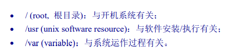
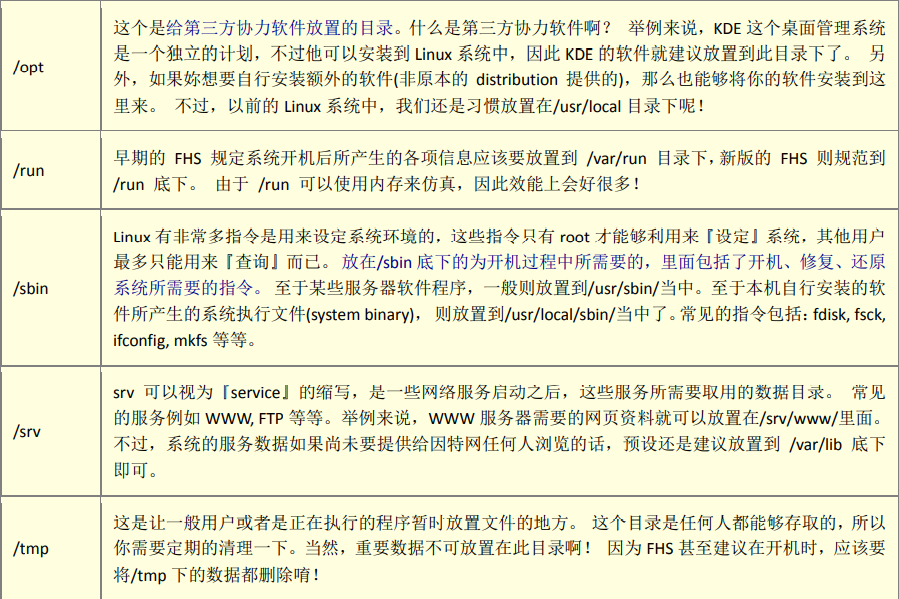
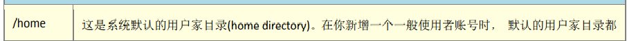

## Linux文件权限与目录配置

>#### **使用者与群组**
>
>*文件存取的身份权限*
>
>- owner
>
>  > 文件所属账号
>
>- group
>
>> 账号所属组
>
>- others
>
>> 不属于该文件所属组/账号
>
>Linux用户身份与群组记录(账号/密码/群组信息)
>
>> root相关信息记录在 /etc/password
>>
>> 其他个人信息记录 /etc/shadow
>>
>> Linux所有组名记录在 /etc/group
>
>文件操作权限
>
>- read
>- write
>- execute
>
>**Linux文件属性**
>
> 
>
>**[权限] [连结] [拥有者] [群组] [文件容量] [修改日期] [文件名]**
>
> **[权限]**
>
>- d  目录
>- `-` 文件
>- l 连结档
>- b 装置文件里面可供存储接口设备
>- c 装置文件串行端口设备(鼠标,键盘)
>
>
>
>- rwx 读写执行(三个权限位置不会改变,没有权限使用-标识)
>
>  > r 表示具有读取目录/文件权限
>  >
>  > w 表示具有新建/删除/重命名/移动文件或目录权限
>  >
>  > x 表示用户是否能进入该目录成文工作目录
>
> 
>
>**[连结]**
>
>表示有多少档名连结到此节点
>
>#### **改变文件属性与权限**
>
>charp:改变文件所属群组
>
>chown:改变文件拥有者
>
>- chown [accout]:[group] [file]  -R 递归操作
>- cp 会复制执行者的属性与权限
>
>chmod:改变文件权限
>
>- 数字类型文件权限
>
>> r:4
>>
>> w:2
>>
>> x:1
>>
>> rwx 权限为7
>
>三种身份(owner/group/others)访问规则 进行站位
>
>> owner/group/others 身份都有读写执行权限  chmod 777 test.txt
>
>#### **Linux文件名限制**
>
>> **`*` ? < > ; & ! [ ] | \ ' " ` ( ) {}** 不允许出现
>
>#### **FHS目录配置依据**
>
> 
>
>- 可分享(可以分享其他系统挂载使用的目录)
>- 不可分享(与机器上配置文件或程序相关的文件)
>- 不可变
>- 可变动的
>
> 
>
> 
>
> 
>
>
>
>**FHS二级建议目录**
>
>
>
>
>
>- **/usr目录**(Unix Software Resource) 
>
>>  
>>
>> - bin 用户指令
>> - lib 函数库
>> - local 系统管理员在本机自行安装下载软件
>> - sbin 非系统指令
>> - share 共享文件
>> - include c/c++相关依赖
>> - src源码文件
>
>- **/var 目录**(针对变动文件,Mysql数据库文件等)
>
>>  
>>
>> - cache 程序暂存档
>> - lock确保资源只能同时被一个应用程序使用
>> - log 登录文件
>> - spool 
>
>#### **linux文件目录**
>
> 
>
>

