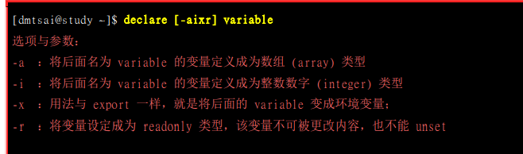
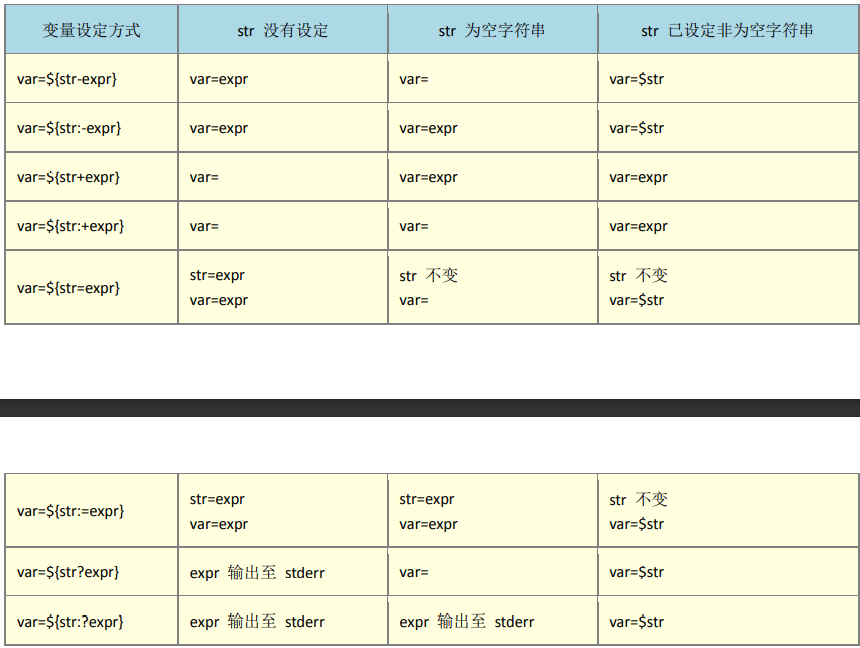
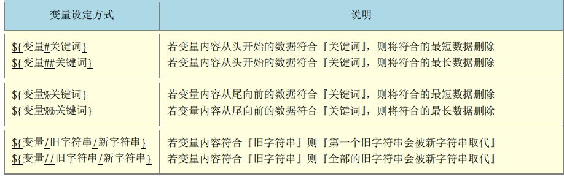
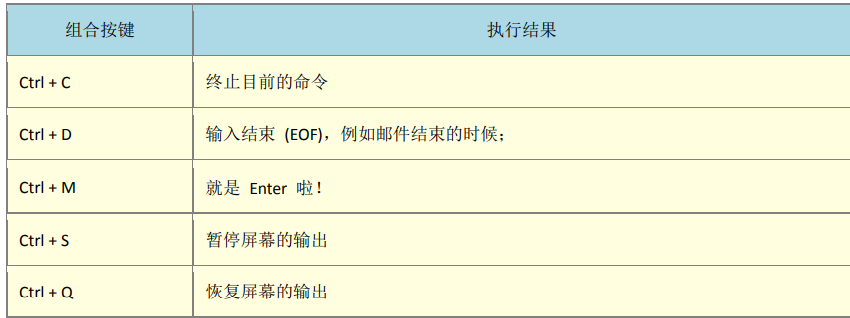
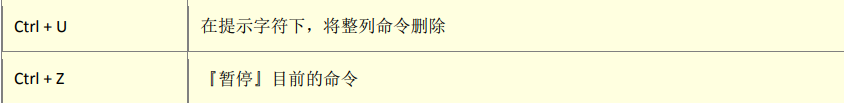
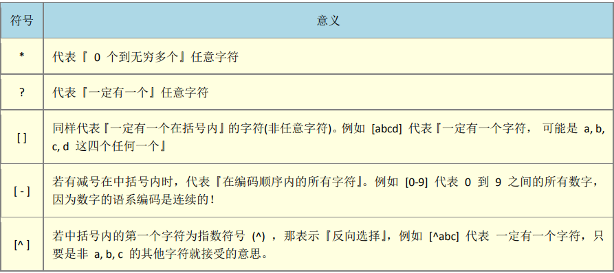
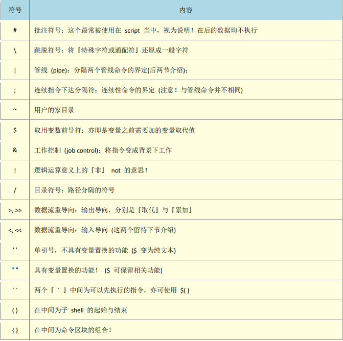

## Shell

> *Shell 是一个用 C 语言编写的程序，它是用户使用 Linux 的桥梁。Shell 既是一种命令语言，又是一种程序设计语言。*
>
> *Shell 是指一种应用程序，这个应用程序提供了一个界面，用户通过这个界面访问操作系统内核的服务。*
>
> *Ken Thompson 的 sh 是第一种 Unix Shell，Windows Explorer 是一个典型的图形界面 Shell*
>
> #### Shell变量
>
> > 变量名/变量设置规则
> >
> > - 命名只能使用英文字母，数字和下划线，首个字符不能以数字开头
> >
> > - 中间不能有空格，可以使用下划线 **_**
> >
> > - 不能使用标点符号
> >
> > - 不能使用bash里的关键字
> >
> > - 变量中存在特殊字符使用**引号双引号**表达
> >
> > - 扩展变量内容使用 "$version":/home/bin代替
> >
> > - unset取消变量内容
> >
> > - 单引号,双引号.反引号区别
> >
> >   > 单引号包含的指令表示字符
> >   >
> >   > 双引号包含的指令可以保有变量内容
> >   >
> >   > 反引号包含指令会被优先执行
> >
> > - 只读变量 readonly myUrl
> > - 删除变量 unset variable_name
> > - 获取字符长度 ${#variable_name}
> >
> > **Shell数组**
> >
> > - arr=(var var1 var2...)
> > - 读取数组 ${arr[index]} /读取所有元素  `$`{array_name[@]}
> > - 获取数组长度 $(#array_name[@])
> >
> > **多行注释**
> >
> > - :<<EOF                  EOF
>
> **键盘读取**
>
> > **read [-pt] variable**
> >
> > -p 提示字符
> >
> > -t 等待秒数
> >
> > eg read -p "Please keyin yuor name" -t 30 named
>
> **declare/typeset**
>
> > 声明变量类型 
> >
> >  
>
> **Shell设置参数**
>
> > 脚本参数
> >
> > ~~~shell
> > echo "Shell 传递参数实例！";
> > echo "执行的文件名：$0";
> > echo "第一个参数为：$1";
> > echo "第二个参数为：$2";
> > echo "第三个参数为：$3";
> > ./test.sh 1 2 3  
> > ~~~
> >
> > |                              $#                              | 传递到脚本的参数个数                                         |
> > | :----------------------------------------------------------: | ------------------------------------------------------------ |
> > | $*   | 以一个单字符串显示所有向脚本传递的参数。 如"$*"用「"」括起来的情况、以"$1 $2 … $n"的形式输出所有参数。 |                                                              |
> > |                              $$                              | 脚本运行的当前进程ID号                                       |
> > |                              $!                              | 后台运行的最后一个进程的ID号                                 |
> > | $@   | 与$*相同，但是使用时加引号，并在引号中返回每个参数。 如"$@"用「"」括起来的情况、以"$1" "$2" … "$n" 的形式输出所有参数。 |                                                              |
> > |                              $-                              | 显示Shell使用的当前选项，与[set命令](https://www.runoob.com/linux/linux-comm-set.html)功能相同。 |
> > |                              $?                              | 显示最后命令的退出状态。0表示没有错误，其他任何值表明有错误。 |
> >
> > #### **变量中 : + - ? 区别**
> >
> > **:-**  或表达式 
> >
> > **:+** 非表达式(str存在取后面)
> >
> > 
> >
> >  
>
> **Shell运算符**
>
> > - **expr 计算表达式**
> >
> > > ~~~shell
> > > # 反引号
> > > val=`expr 2 + 2`
> > > echo "两数之和为 : $val"
> > > ~~~
> >
> > - **关系表达式 [] 表达**
> >
> > > | 运算符 |                         说明                          | 举例                         |
> > > | :----- | :---------------------------------------------------: | :--------------------------- |
> > > | -eq    |          检测两个数是否相等，相等返回 true。          | [ `$a -eq $b` ] 返回 false。 |
> > > | -ne    |        检测两个数是否不相等，不相等返回 true。        | [` $a -ne $b `] 返回 true。  |
> > > | -gt    |   检测左边的数是否大于右边的，如果是，则返回 true。   | [` $a -gt $b` ] 返回 false。 |
> > > | -lt    |   检测左边的数是否小于右边的，如果是，则返回 true。   | [` $a -lt $b` ] 返回 true。  |
> > > | -ge    | 检测左边的数是否大于等于右边的，如果是，则返回 true。 | [` $a -ge $b` ] 返回 false。 |
> > > | -le    | 检测左边的数是否小于等于右边的，如果是，则返回 true。 | [ `$a -le $b` ] 返回 true。  |
> >
> > **逻辑运算符 [[]]**
> >
> > > | &&   | 逻辑的 AND | [[` $a -lt 100 && $b -gt 100` ]] 返回 false |
> > > | ---- | ---------- | ------------------------------------------- |
> > > | \|\| | 逻辑的 OR  | [[` $a -lt 100 || $b -gt 100` ]] 返回 true  |
> >
> > **字串运算符**
> >
> > > | 运算符 | 说明                                         | 举例                       |
> > > | :----- | :------------------------------------------- | :------------------------- |
> > > | =      | 检测两个字符串是否相等，相等返回 true。      | [ `$a = $b `] 返回 false。 |
> > > | !=     | 检测两个字符串是否不相等，不相等返回 true。  | [` $a != $b` ] 返回 true。 |
> > > | -z     | 检测字符串长度是否为0，为0返回 true。        | [ `-z $a `] 返回 false。   |
> > > | -n     | 检测字符串长度是否不为 0，不为 0 返回 true。 | [` -n "$a"` ] 返回 true。  |
> > > | $      | 检测字符串是否为空，不为空返回 true。        | [` $a `] 返回 true。       |
> >
> > **文件运算符**
> >
> > > | 操作符  | 说明                                                         |           举例            |
> > > | :------ | :----------------------------------------------------------- | :-----------------------: |
> > > | -b file | 检测文件是否是块设备文件，如果是，则返回 true。              | [ -b $file ] 返回 false。 |
> > > | -c file | 检测文件是否是字符设备文件，如果是，则返回 true。            | [ -c $file ] 返回 false。 |
> > > | -d file | 检测文件是否是目录，如果是，则返回 true。                    | [ -d $file ] 返回 false。 |
> > > | -f file | 检测文件是否是普通文件（既不是目录，也不是设备文件），如果是，则返回 true。 | [ -f $file ] 返回 true。  |
> > > | -g file | 检测文件是否设置了 SGID 位，如果是，则返回 true。            | [ -g $file ] 返回 false。 |
> > > | -k file | 检测文件是否设置了粘着位(Sticky Bit)，如果是，则返回 true。  | [ -k $file ] 返回 false。 |
> > > | -p file | 检测文件是否是有名管道，如果是，则返回 true。                | [ -p $file ] 返回 false。 |
> > > | -u file | 检测文件是否设置了 SUID 位，如果是，则返回 true。            | [ -u $file ] 返回 false。 |
> > > | -r file | 检测文件是否可读，如果是，则返回 true。                      | [ -r $file ] 返回 true。  |
> > > | -w file | 检测文件是否可写，如果是，则返回 true。                      | [ -w $file ] 返回 true。  |
> > > | -x file | 检测文件是否可执行，如果是，则返回 true。                    | [ -x $file ] 返回 true。  |
> > > | -s file | 检测文件是否为空（文件大小是否大于0），不为空返回 true。     | [ -s $file ] 返回 true。  |
> > > | -e file | 检测文件（包括目录）是否存在，如果是，则返回 true。          | [ -e $file ] 返回 true。  |
>
> #### **环境变量ENV**
>
> > 列出目前所有shell环境下的变量
>
> #### **export变量**
>
> > 自定义变量与环境变量->**该变量是否会被子程序所继续引用,子程序仅会继承父程序的环境变量**
> >
> > export将该变量引用到子程序中使用
>
> **变量内容替换**
>
> >  
>
> **Bash环境配置文件**
>
> > /etc/profile 整个系统的设定
> >
> > ~/.bash_profile 用户环境变量设定
> >
> > 个人账号登录环境变量读取顺序
> >
> > ~/.bash_profile
> >
> > ~/.bash_login
> >
> > ~/.profile
>
> **source sh script ./script 执行差异**
>
> **Shell下常用组合键**
>
>  
>
>  
>
> **Shell下常用通配符**
>
>  
>
> **bash环境下特殊字符**
>
>  

