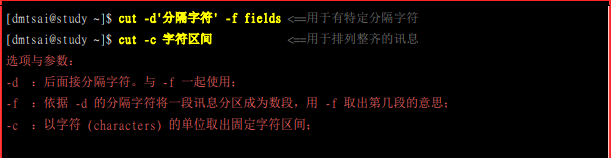
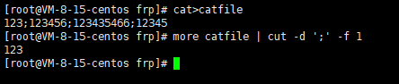
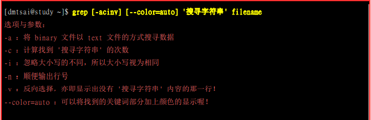
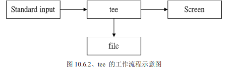
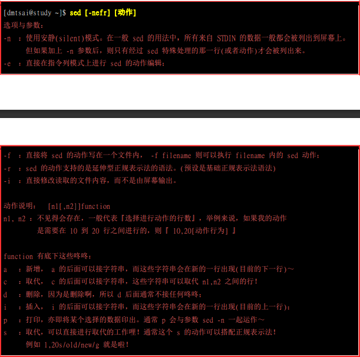

## 数据流重导向

> **standard output 与 standard error output**
>
> | 标准输入 stdin(将原本键盘输入的数据改用文件代替) | 0    | <  \|\| <<   |
> | ------------------------------------------------ | ---- | ------------ |
> | 标准输出 stdout                                  | 1    | > \|\| >>    |
> | 标准错误输出 stderr                              | 2    | 2> \|\| 2>>  |
> | 忽略错误信息输出                                 |      | 2> /dev/null |
>
> **使用输入输出流代替cp命令**
>
> **cat > filename < copyfilename**
>
> **将键盘输入写入文件**
>
> cat < filename

## 命令执行的判断依据(  ; &&  || )

> - **;**表示前面指令完成后立即执行后面的指令
> - **&&**  与 **||** 

## **管道命令pipe**

> - 管道命令仅能处理前面一个指令传来的正确信息 standard output
> - 每个管道后面必须跟定一个指令(能接受standard input的数据)
> - less more head tail
>
> **数据截取命令**
>
> > - cut 以行为切分单位
> >
> >   >  
> >   >
> >   >  
> >
> > - grep 搜索关键字符
> >
> > >  
> >
> > - 排序命令
> >
> > > sort wc uniq
>
> #### **双向重导向 tee**
>
> >  
> >
>
> #### **sed工具**(sed可以将数据取代,删除,新增,截取)
>
> > 
>
> #### **awk 数据处理工具**
>
> >  
>
> #### **diff文件对比工具**
>
> > 

