## 文件与目录管理

> . 表示此层目录
>
> .. 表示上层目录
>
> `-` 表示前一个工作目录
>
> ~ 表示当前用户工作目录
>
> ~accout 标识accout账号所在工作目录
>
> **mkdir [-mp] 目录名称**
>
> > -m 配置目录权限
> >
> > -p 递归
>
> **$PATH** 环境变量
>
> > echo $PATH
>
> **ls  文件与目录查看**
>
> 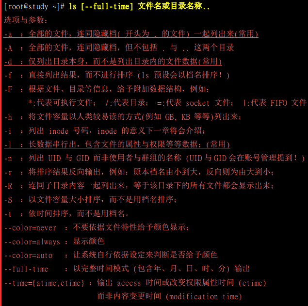 
>
> **cp **
>
> 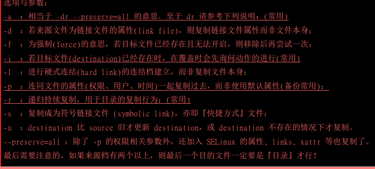 
>
> #### **文件内容查阅**
>
> > cat 由第一行查看文件内容
> >
> > tac 由最后一行查看文件内容
> >
> > nl 输出行号
> >
> > more 以页形式显示文件内容
> >
> > less 以页形式显示文件内容 向前翻页
> >
> > head 只看头几行
> >
> > tail 只看尾几行
> >
> > od
> >
> > 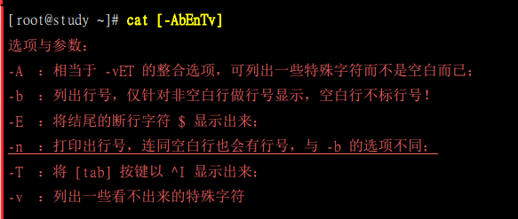 
> >
> > **more(页形式显示)**
> >
> > 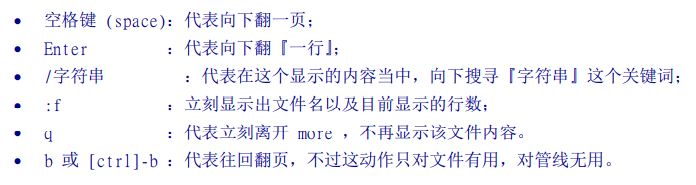 
> >
> > **less**
> >
> > 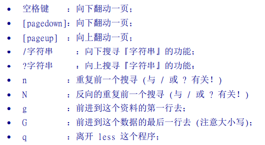 
> >
> > **touch修改文件时间或建置新档**
> >
> > 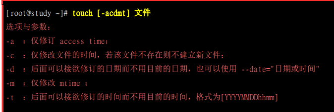 
>
> #### **指令与文件查询**
>
> > **which [-a] 查询执行档 指令**
> >
> > **whereis文件名或目录名**
> >
> > > 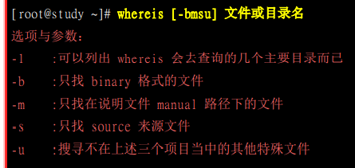 
> > >
> > > **/bin/sbin /usr/share/man 下文件查找**
> >
> > **locate部分校验文件名**
> >
> > > 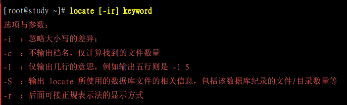 
> >
> > **find [PATH] [option] [action]**
> >
> > > 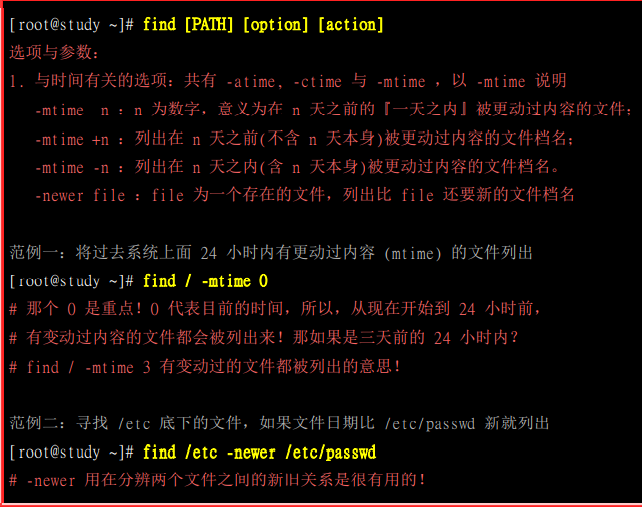 
> > >
> > > 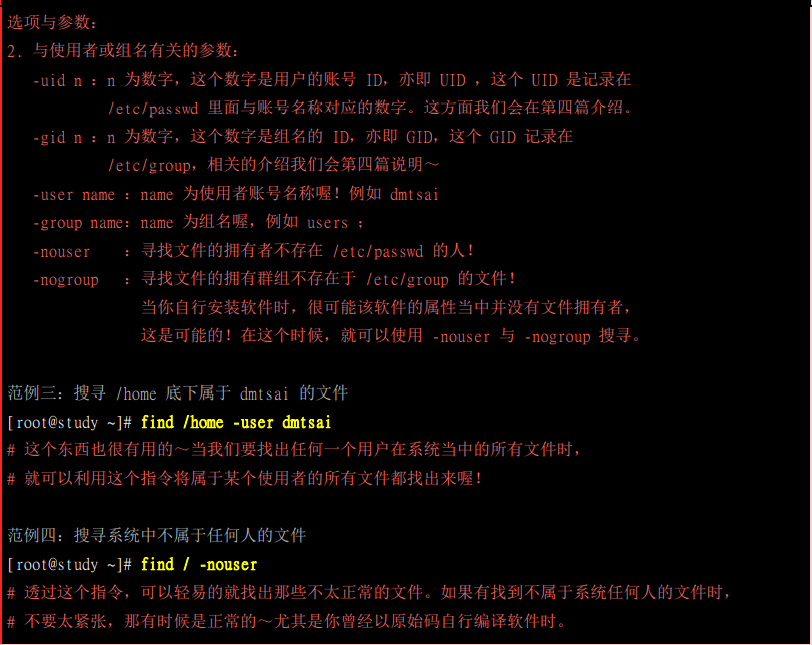 
> > >
> > > 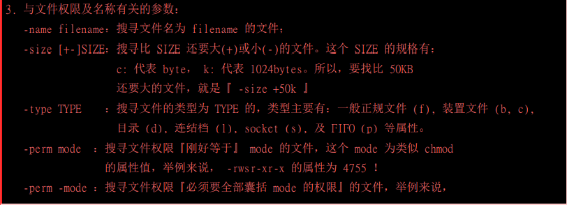 
> > >
> > > 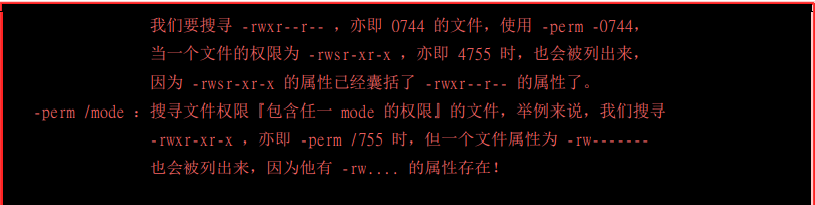 
> > >
> > > 
>
> 