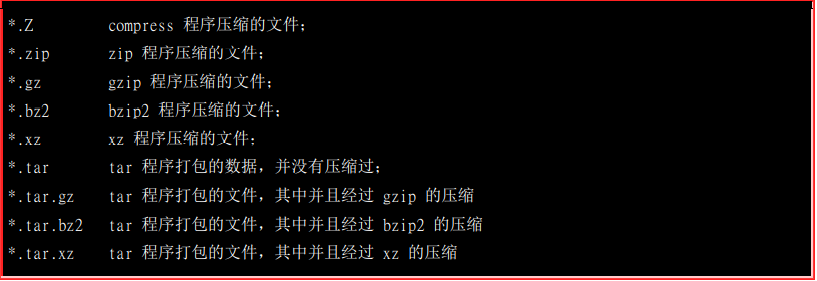
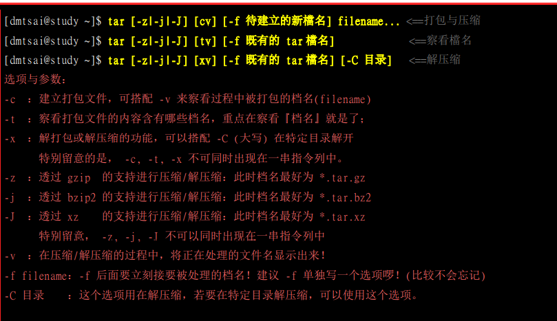
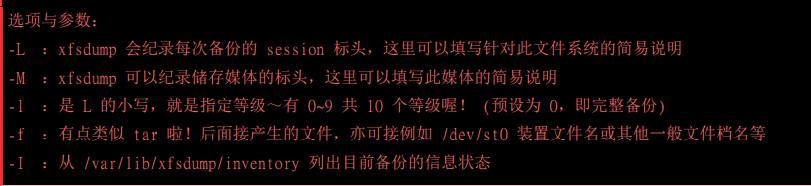

## 文件系统压缩打包与备份

> #### **Linux常见的压缩指令**
>
>  
>
> **打包指令tar**
>
> >  
> >
> > 压缩  tar -jcv -f filename.tar.bz2  压缩目录
> >
> > 解压缩 tar -jxv -f filename.tar.bz2 -C  解压目录
>
> #### **XFS文件系统备份与还原** TODO
>
> - **xfsdump [-L S_label] [-M M_label] [-l #] [-f 备份档] 待备份文件**
>
> >  
> >
> > 

