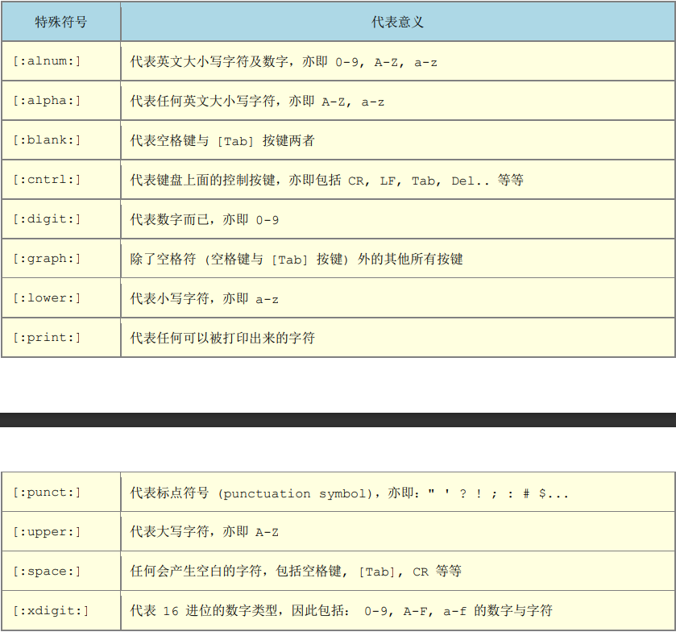
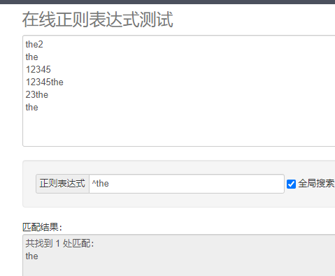
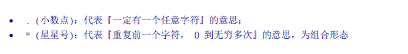
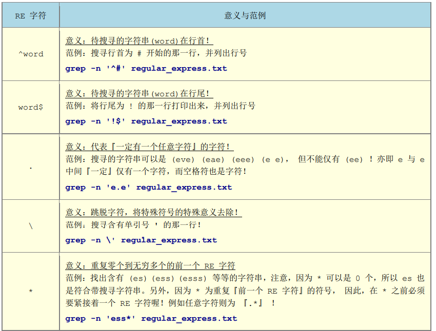
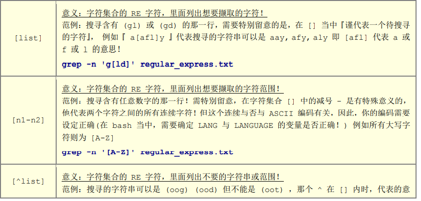
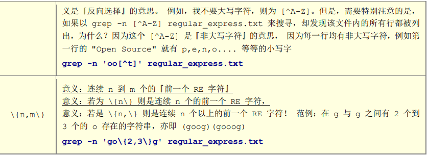
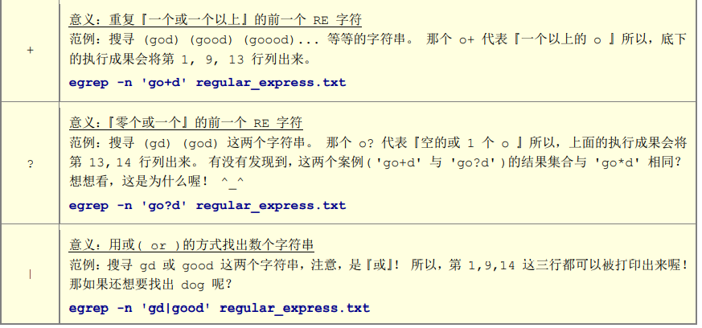
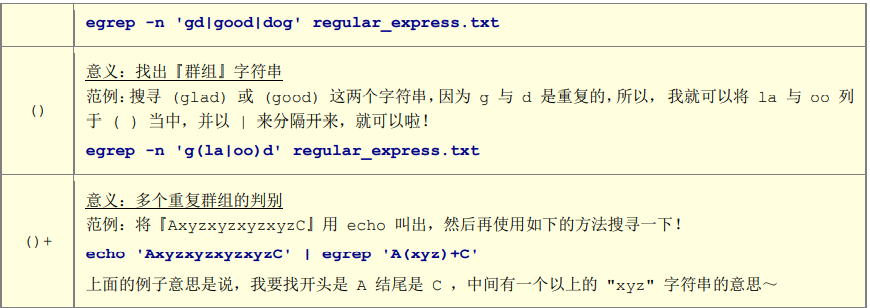
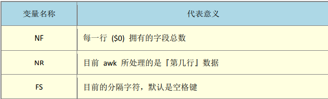

## 正则表达式(Regular Expression)

> *正则表达式(regular expression)描述了一种字符串匹配的模式（pattern），可以用来检查一个串是否含有某种子串、将匹配的子串替换或者从某个串中取出符合某个条件的子串等。**查询/删除/取代**
>
> 使用正则表达式是确定当前环境语系  echo ${LANG}  =>影响正则表达式语法
>
> #### **特殊字符代表意义**
>
> 
>
> - **[]字符集或  []中不论有几个字符,它只能代替其中一个字符**
>
> > t[ae]st => test 和 tasteeee 
>
> - **[^] 反向选择 [^]中不能包含该字符**
>
> > `t[^ae]st`  t[]st中间出现非ae字符
>
> - **[^a-z] 不能匹配包含小写字母字符**
>
> - **^ 匹配首行字符**
>
> >  
>
> - **`.与重复字符 *`** 
>
> >  
> >
> > o*表示拥有空字符或者一个以上o的字符
> >
> > **.*表示零个或多个任意字符**
>
> - **限定连续RE字符范围{}**
>
> > o\{2,5}g 表示o后面接2到5个o在匹配g
>
> - **$表示待搜寻的字符串word在行尾**
>
> > word$
>
> **基础正则表示法**
>
>  
>
>  
>
>  
>
>  
>
>  
>
> **awk数据处理工具**
>
> > awk '条件类型1 {动作1}  条件类型2  {动作2}' filename
> >
> > last -n 5 | awk '{print  `$1 "\t"  $3 `}'
> >
> >  
> >
> > 

>  

