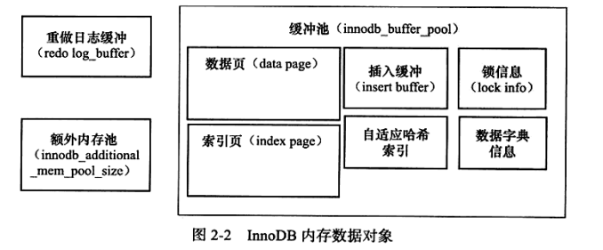
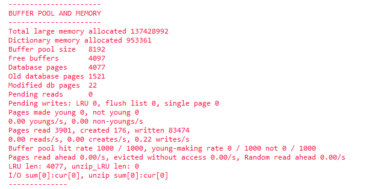
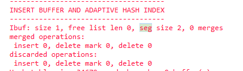
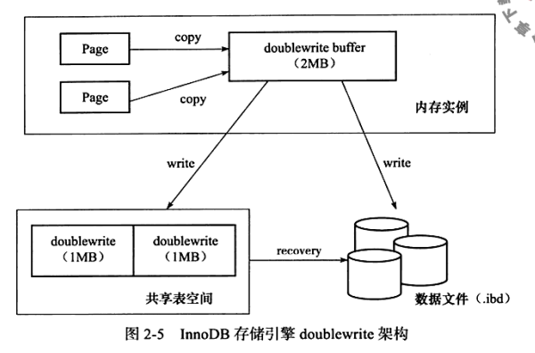

## InnoDB存储引擎

> **InnoDB体系架构**
>
> > - InnoDB存在多个内存块
> >   - 维护所有线程/进程访问多个内部数据结构
> >   - 缓存磁盘上数据，进行快速读取
> >   - redo log 日志缓存
> >
> >  
> >
> > - **后台线程**
> >
> >   > 1. Master Thread 
> >   >
> >   >    > Master Thread 主要负责将缓存池中的数据异步刷新到磁盘中（脏页刷新，合并插入缓存，undo页回收）
> >   >
> >   > 2. IO Thread 
> >   >
> >   >    > IO Thread 负责**InnoDB处理I/O请求的回调**  
> >   >    >
> >   >    > ~~~SQL
> >   >    > -- 查看Innodb 状态
> >   >    > show engine innodb status\G;
> >   >    > ~~~
> >   >
> >   > 3. Purge Thread
> >   >
> >   >    > 事务提交后，使用PurgeThread**回收已使用的undo页**
> >
> > - **内存**
> >
> >   > 1. 缓存池（Buffer pool size）
> >   >
> >   >    > ~~~sql
> >   >    > -- 查看buffer pool 内存
> >   >    > show variables like 'innodb_buffer_pool_size'\G;
> >   >    > -- 设置多个缓存实例
> >   >    > innodb_buffer_pool_instances
> >   >    > ~~~
> >   >    >
> >   >    > 缓存池中包含的数据页类型有
> >   >    >
> >   >    > * 索引
> >   >    > * 数据
> >   >    > * undo
> >   >    > * 插入缓存
> >   >    > * 自适应哈希索引
> >   >    > * 存储锁信息
> >   >    > * 数据字典信息
> >   >    >
> >   >    >  
> >   >    >
> >   >    > 
> >   >    >
> >   >
> >   > 2. **缓存更新策略**(**LRU 最近最少使用**)防止直接读盘
> >   >
> >   >    >
> >   >    >- LRU页分为new区和old区（使用midpoint控制）new区存放的是热点数据，使用参数innodb_old_block_time （时间）用于页读取到mid位置后多久加入LRU列表热端。l
> >   >    >
> >   >    >  ~~~sql
> >   >    >  -- 设置LRU列表数据不被刷出
> >   >    >  set global innodb_old_blocks_time = 1000;
> >   >    >  -- 查看midpoint位置
> >   >    >   show variables like 'innodb_old_blocks_pct';
> >   >    >  ~~~
> >   >    >
> >   >    >  show engine innodb status；参数详解（查看死锁/查看内存使用）
> >   >    >
> >   >    >  > 
> >   >    >  >
> >   >    >  > Buffer pool size 当前页数
> >   >    >  >
> >   >    >  > Free buffers 未使用页
> >   >    >  >
> >   >    >  > Database pages 数据页 （Database + free <= buffer pool)
> >   >    >  >
> >   >    >  > pages made young 显示LRU列表移动前端次数
> >   >    >  >
> >   >    >  > buffer pool hit rate 缓存命中率（1000% 缓存池运行良好，通常不小于95%，小于95%存在全表扫描引起的LRU表污染）
> >   >    >
> >   >    >LRU页数据被修改后称为脏页（缓存和磁盘数据不一致）通过Checkpoint机制将内存中数据同步到磁盘
> >   > 3. **重做日志缓存**
> >   >    >~~~sql
> >   >    >-- 默认8MB
> >   >    >show variables like 'innodb_log_buffer_size'\G;
> >   >    >~~~
> >   >    >
> >   >    > 
> >
> > - **Checkpoint 技术**
> >
> > > 在数据库系统中，写日志和写数据文件是数据库中IO消耗最大的两种操作，在这两种操作中写数据文件属于分散写，写**日志文件是顺序写**，因此为了保证数据库的性能，通常数据库都是保证在**提交完成之前要先保证日志都被写入到日志文件中**，而脏数据块则保存在数据缓存(buffer cache)中再不定期的分批写入到数据文件中。也就是说**日志写入和提交操作是同步的，而数据写入和提交操作是不同步的**。这样就存在一个问题，当一个数据库崩溃的时候并不能保证缓存里面的脏数据全部写入到数据文件中，这样在实例启动的时候就要使用日志文件进行恢复操作，将数据库恢复到崩溃之前的状态，保证数据的一致性。检查点是这个过程中的重要机制，通过它来确定，恢复时哪些重做日志应该被扫描并应用于恢复。
> > >
> > > CheckPoint 解决的问题
> > >
> > > - 缩短数据库恢复时间
> > > - 同步内存与磁盘数据
> > > - 重做日志不可用时，刷新脏页（Mysql对重做日志缓存时循环使用的）
> > >
> > > Sharp Checkpoint （数据库关闭时将所有脏页刷回磁盘） 
> > >
> > > Fuzzy Checkpoint 
> > >
> > > - Master
> > > - Flush_LRU_LIST (LRU 列表移除时，进行checkpoint)
> > > - Async/Sync FLUSH（重做日志不够时）
> > > - Dity Page too much（脏页数量多）
>
> **MASTER THREAD 工作方式**
>
> > Master Thread   
> >
> > **Loop 主循环**
> >
> > - 日志刷新到磁盘（与事务无关）
> > - **合并插入缓存**（存在）
> > - 刷新脏页到磁盘（存在）
> > - 没有用户活动，切换到backgroup loop（存在）
> >
> > **background loop**后台循环
> >
> > - 删除无用Undo（事务回滚日志）
> > - **合并插入缓存**
> > - 跳回主循环
> > - 不断刷新页（存在）
> >
> > innozadb_io_capacity 控制写入刷新百分比
>
> **InnoDB关键特性**
>
> > - 插入缓存
> > - 两次写
> > - 自适应哈希索引
> > - 异步IO
> > - 刷新邻接页
> >
> > **插入缓存**
> >
> > > InnoDB中插入数据的主键是否自增决定磁盘是否顺序读取，InnoDB对于**非聚集索引值**的插入或者更新，先判断索引页是否在缓存中，存在则直接插入（缓存），不存在，则放入Insert Buffer对象中，等待主线程对InsertBuffer和辅助索引页进行合并刷入磁盘（**在同一索引页中**，将多个插入合并到一个操作中）
> > >
> > > - 索引是辅助索引
> > > - 索引不是唯一的
> > > - seg size 表示当前Insert Buffer 大小
> > >
> > >  
> > >
> > > Insert Buffer 在写入密集情况下，会过多使用innodb_buffer_pool的缓存
> > >
> > > INSERT BUFFER 结构
> >
> > **两次写**
> >
> > > 内存（doublewrite buffer ）
> > >
> > > 物理磁盘上共享表空间
> > >
> > > 在缓存池中的脏页进行刷新时候，通过memcpy函数将脏页写入doublewrite buffer (操作系统缓存)，之后通过doublewrite buffer分两次写入共享表磁盘，然后**执行fsync函数同步磁盘**
> > >
> > >  
> >
> > **自适应哈希索引**(AHI)
> >
> >  
> >
> > **异步IO**
> >
> >  
> >
> > **刷新邻居脏页**
>
> **InnoDB启动，关闭与恢复**
>
> > 参数 innodb_fast_shutdown 控制InnoDB启动关闭策略
> >
> > - 0表示Mysql关闭时，InnoDB 需要完成所有的full purge 和 merge insert buffer 
> > - 1 表示 关闭时只刷新脏页
> > - 2 表示不执行full purge 和merger insert buffer 
> >
> > 参数innodb_force_recovery 影响InnoDB存储引擎恢复状况 
> >
> > - 0 发下修复时，进行所有修复操作
> > - 1 忽略 corrupt 页
> > - 2 阻止master thread运行
> > - 3 不进行事务回滚操作
> > - 4 不进行插入缓存合并操作
> > - 5 不查看撤销日志（undo log） redo中未提交的事务视为已提交
> > - 6 不进行前滚操作

