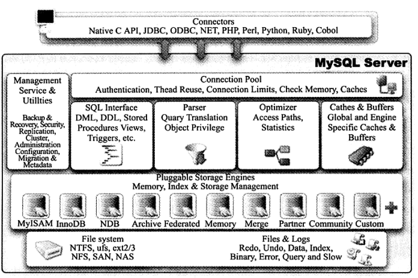
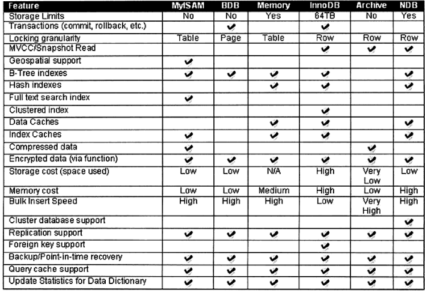

## mysql架构

> - **MYSQL组成**
>
>   >  
>   >
>   >  
>   >
>   >  
>   >
>   > - 连接池组件
>   >
>   >   > 不同客户端连接都会在服务器创建一个线程来执行SQL操作（*服务器会对连接线程进行缓存*）。
>   >   >
>   >   > TCP/IP 套接字连接
>   >   >
>   >   > SOCKET 套接字连接
>   >
>   > - 管理服务和工具组件
>   >
>   > - SQL接口
>   >
>   > - 查询分析
>   >
>   > - 缓冲
>   >
>   > - 插件式存储引擎
>   >
>   >   > - InnoDB存储引擎（支持行锁，外键），MVCC多版本并发控制，支持插入缓存，二次写，自适应哈希索引，预读等高性能和高可用功能。
>   >   >
>   >   > - MyISAM 引擎（不支持事务，表锁设计，全文索引） 
>   >   >
>   >   > - NDB存储引擎 （集群存储引擎）类似ORACLE的RAC集群
>   >   > - Memory引擎（基于内存的存储）
>   >   > - Archive （只支持Insert和Select操作）
>   >   > - Maria （取代MyISAM设计）
>   >   >
>   >   >  
>   >   >
>   >   > 
>   >
>   > - 物理文件
>   >
>   >   - frm存放表结构，myd存放数据，myi存放索引，分区表文件使用#进行扩充
>   >
>   >   - .ibd 和ibdata文件，存放Innodb索引和数据文件
>   >
>   >   - error log  MYSQL异常日志
>   >
>   >   - binarg log 用于数据恢复，主从复制
>   >
>   >   - redo undo 事务提交/事务回滚日志
>   >
>   >   - slow query log 慢查询日志
>   >
>   >   - query log 慢查询日志
>   >
>   >   - mysql ，performance_schema，sakila，sys，world ,information_schema  
>   >
>   >     - **information_schema**   提供访问数据库的元数据（表名，列数据类型，访问权限） 等数据库维护信息
>   >
>   >       - | 表名                                  | 注释                                                         |
>   >         | ------------------------------------- | ------------------------------------------------------------ |
>   >         | SCHEMATA                              | 提供了当前mysql实例中所有数据库的信息。是show databases的结果取之此表 |
>   >         | TABLES                                | 提供了关于数据库中的表的信息（包括视图）。详细表述了某个表属于哪个schema、表类型、表引擎、创建时间等信息。是show tables from schemaname的结果取之此表 |
>   >         | COLUMNS                               | 提供了表中的列信息。详细表述了某张表的所有列以及每个列的信息。是show columns from schemaname.tablename的结果取之此表 |
>   >         | STATISTICS                            | 提供了关于表索引的信息。是show index from schemaname.tablename的结果取之此表 |
>   >         | USER_PRIVILEGES                       | 用户权限表:给出了关于全程权限的信息。该信息源自mysql.user授权表。是非标准表 |
>   >         | SCHEMA_PRIVILEGES                     | 方案权限表:给出了关于方案（数据库）权限的信息。该信息来自mysql.db授权表。是非标准表 |
>   >         | TABLE_PRIVILEGES                      | 表权限表:给出了关于表权限的信息。该信息源自mysql.tables_priv授权表。是非标准表 |
>   >         | COLUMN_PRIVILEGES                     | 列权限表:给出了关于列权限的信息。该信息源自mysql.columns_priv授权表。是非标准表 |
>   >         | CHARACTER_SETS                        | 字符集表:提供了mysql实例可用字符集的信息。是SHOW CHARACTER SET结果集取之此表 |
>   >         | COLLATIONS                            | 提供了关于各字符集的对照信息                                 |
>   >         | COLLATION_CHARACTER_SET_APPLICABILITY | 指明了可用于校对的字符集。这些列等效于SHOW COLLATION的前两个显示字段。 |
>   >         | TABLE_CONSTRAINTS                     | 描述了存在约束的表。以及表的约束类型                         |
>   >         | KEY_COLUMN_USAGE                      | 描述了具有约束的键列                                         |
>   >         | ROUTINES                              | 提供了关于存储子程序（存储程序和函数）的信息。此时，ROUTINES表不包含自定义函数（UDF）。名为“mysql.proc name”的列指明了对应于INFORMATION_SCHEMA.ROUTINES表的mysql.proc表列 |
>   >         | VIEWS                                 | 给出了关于数据库中的视图的信息。需要有show views权限，否则无法查看视图信息 |
>   >         | TRIGGERS                              | 提供了关于触发程序的信息。必须有super权限才能查看该表        |
>   >
>   >     - ## performance_schema
>   >
>   >       - | 表名                              | 注释                                                         |
>   >         | --------------------------------- | ------------------------------------------------------------ |
>   >         | setup_table                       | 设置表，配置监控选项                                         |
>   >         | current_events_table              | 记录当前那些thread 正在发生什么事情                          |
>   >         | history_table                     | 发生的各种事件的历史记录表                                   |
>   >         | summary_table                     | 对各种事件的统计表                                           |
>   >         | setup_consumers\setup_instruments | 描述各种事件, 设置哪些事件能够被收集                         |
>   >         | setup_instruments                 | 描述这个数据库下的表名以及是否开启监控                       |
>   >         | setup_timers                      | 描述监控选项已经采样频率的时间间隔                           |
>   >         | threads                           | 监控服务器所有连接                                           |
>   >         | performance_timers                | 设置一些监控信息, 指定mysql服务可用的监控周期，CYCLE表示按每秒检测2603393034次, 目前 performance-schema 只支持’wait’时间的监控，代码树上 wait/ 下的函数都可以监控到 |
>   >
>   >     - **MYSQL**
>   >
>   >       - | 表名         | 注释                               |
>   >         | ------------ | ---------------------------------- |
>   >         | user         | 用户列、权限列、安全列、资源控制列 |
>   >         | db           | 用户列、权限列                     |
>   >         | host         |                                    |
>   >         | table_priv   |                                    |
>   >         | columns_priv |                                    |
>   >         | proc_priv    |                                    |

