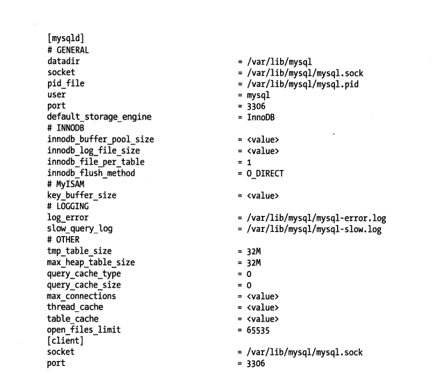
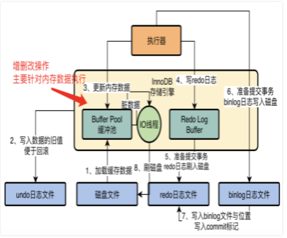
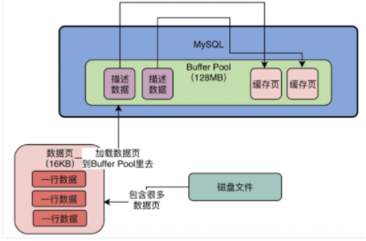

## 优化服务器设置

>  
>
> - datadir 数据存储路径
>
> - socket （socket套接字文件，只允许本地登录） 
>
> - pid-file 记入当前mysqld的进程（防止启动多个进程副本，**只有获取PID文件写入权限的进程才能更改文件**）
>
> - **Buffer Pool**  内存数据大小，基于内存更改，同步到日志与磁盘  默认128MB 
>
>   - ~~~sql
>      -- 查看INNODB 
>       show engine innodb status ; 
>      ~~~
>
>      - Total memory allocated，这就是说buffer pool最终的总大小是多少
>      - Buffer pool size，这就是说buffer pool一共能容纳多少个缓存页
>      - Free buffers，这就是说free链表中一共有多少个空闲的缓存页是可用的
>      - Database pages和Old database pages，就是说lru链表中一共有多少个缓存页，以及冷数据区域里的缓存页数量
>      - Modified db pages，这就是flush链表中的缓存页数量
>      - Pending reads和Pending writes，等待从磁盘上加载进缓存页的数量，还有就是即将从lru链表中刷入磁盘的数量、即将从flush链表中刷入磁盘的数量
>      - Pages made young和not young，这就是说已经lru冷数据区域里访问之后转移到热数据区域的缓存页的数 量，以及在lru冷数据区域里1s内被访问了没进入热数据区域的缓存页的数量
>      - youngs/s和not youngs/s，这就是说每秒从冷数据区域进入热数据区域的缓存页的数量，以及每秒在冷数据区域里被访问了但是不能进入热数据区域的缓存页的数量
>      - Pages read xxxx, created xxx, written xxx，xx reads/s, xx creates/s, 1xx writes/s，这里就是说已经读取、创建和写入了多少个缓存页，以及每秒钟读取、创建和写入的缓存页数量
>      - Buffer pool hit rate xxx / 1000，这就是说每1000次访问，有多少次是直接命中了buffer pool里的缓存的
>      - young-making rate xxx / 1000 not xx / 1000，每1000次访问，有多少次访问让缓存页从冷数据区域移动到了热数据区域，以及没移动的缓存页数量
>      - LRU len：这就是lru链表里的缓存页的数量
>      - I/O sum：最近50s读取磁盘页的总数
>      - I/O cur：现在正在读取磁盘页的数量
>
>   -  
>
>   -   
>
> - Log File 
>
> #### **配置内存使用**
>
> - 连接线程内存
>
>   - sort_buffer_size 会话缓存
>
> - 缓存内存
>
>   - InnoDB 缓存池 (buffer pool)
>
>   - InnoDB日志文件
>
>   - 查询缓存
>
> - 线程缓存(Thread_cache_size)
>
>   - 迅速响应连接请求(*创建新连接是,缓存中有线程存在,MYSQL从缓存中删除一个线程,并且把它分配给这个新连接,连接关闭时,将该线程返回缓存池中*,__可以不必每个连接都创建新线程 一个线程处理多个Client请求__
>
>   - thread_cache_size 指定MYSQL可以保存在缓存中的线程数 
>
>   - ~~~sql
>     show global status like 'thread_cache_size';
>     -- 服务器中获取
>     set global thread_cache_size = 16;
>     -- my.cnf 中配置
>     thread_concurrency = 16 
>     ~~~
>
> - 表缓存(Table Cache)
>
>   - 缓存**.frm**文件(表结构)的解析结果
>
> - **InnoDB 数据字典**
>
>   - 存储表信息(描述,字段,对象)  sys_tables,sys_columns,sys_indexs,sys_fields
>   - sys_table存储表的信息，包括表面，ID，表空间号
>     sys_columns存储表中列的信息，包括列名，列ID，列的序号，列的类型，长度等信息
>     sys_index存储表的索引信息，包括索引名，索引对应的表空间，表ID，索引ID,索引类型
>     sys_fields存储索引中定义的索引列
>   - 第一次打开表时,将系统表数据从磁盘加载到内存中缓存
>
> 
>
> - **InnoDB I/O配置**
>   -  
>   - Innodb_flush_log_at_trx_commit *提交事务redo日志策略 从内存记录到磁盘*
>     -  0   每秒执行一次刷新磁盘(存在数据丢失)
>     -  1  提交事务时候,刷新磁盘 (**fsync() 阻塞**) 
>     - 2  提交事务时候,将redo日志写入磁盘文件缓存中(存在数据丢失)
>   - sync_binlog  *控制二进制日志写入磁盘*
>     - 0 将二进制日志缓存写入磁盘**(写入操作系统缓存)**
>     - 1 事务提交后,将二进制文件写入磁盘立即执行刷新操作(同步写入磁盘)
>     - N 每写N次操作系统缓存执行操作系统
>   - 操作系统下数据文件同步
>     - fdatasync 
>     - 0_direct 
>     - ALL_0_direct
>     - 0_dsync
>
>   #### **MYSQL日志文件**
>
>   - redo  (重做日志)
>     - 确保事务的持久性(**防止提交的数据丢失**),开启事务时产生日志并写入磁盘,当事务对应的数据写入磁盘后,释放对应的redo日志 _Innodb_flush_log_at_trx_commit_ 设置redo刷新策略，
>   - undo(回滚日志)
>     - 保存事务发生之前的一个数据版本，同时可以提供多版本并发控制下的读（MVCC），也即**非锁定读**，事务开始前生成undo，事务提交后，通过purge线程判断是否由其他事务在使用undo段中表的上一个事务之前的版本信息，决定是否可以清理undo log的日志空间。
>   - bin(二进制日志)
>     - 主从复制用于数据据库的基于时间点的还原（保存的SQL语句），事务提交时候一次性写入，binlog保存时间由参数expire_logs_days配置,超过该天数被自动删除
>   - slow query log (慢查询日志)
>   - relay log (中继日志)
>
> 
>
> | 配置项                                | 说明                                                    |
> | ------------------------------------- | ------------------------------------------------------- |
> | tmp_table_size \  max_heap_table_size | 临时表使用内存                                          |
> | max_connections                       | 允许客户端登录MYSQL最大会话数量                         |
> | thread_cache_size                     | 缓存客户端连接线程                                      |
> | table_cache_size                      |                                                         |
> | expire_logs_days                      | binlog失效时间                                          |
> | max_allowed_packet                    | 响应包大小                                              |
> | max_connect_errors                    | 中断访问次数 同一个IP在短时间内产生太多中断的数据库连接 |
> | sql_mode                              |                                                         |
> | read_only                             | 非超级用户权限只读                                      |
> | skip_slave_start                      | 跳过主从复制                                            |
> | slave_net_timeout                     |                                                         |
> | innodb_autoinc_lock_mode              | 控制主键自增长                                          |
> | innodb_buffer_pool_instances          |                                                         |
>
> 

