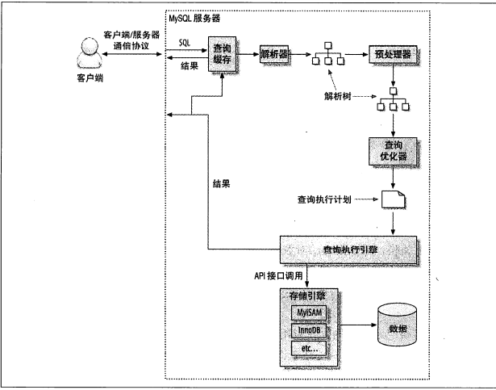

## 查询性能优化

> *优化查询任务,有两个途径,一个是较少子任务执行次数,一个消除子任务*
>
> **MYSQL执行查询**
>
>  
>
> - **MYSQL 客户端/服务器通讯协议**
>
>   > 半双工协议 (只能一方发送数据)
>
> - **查询状态**  
>
>   > show  processlist  中连接状态
>   >
>   > - Sleep 线程等待客户端发送新的请求
>   > - Query 线程正在执行查询或者正在将结果集发送客户端
>   > - Locked **等待表锁** ,_InnoDB的行锁不会在这边展示状态_
>   > - Analyzing and statistics 收集存储引擎统计信息,生成查询的执行计划
>   > - Copying to tmp table [on disk] 执行查询，将结果集复制到临时表中（Group by、UNION）
>   > - Sorting result 对结果集进行排序
>   > - Sending data 生成结果集或向客户端发送数据
>
> - **查询缓存**
>
> - **查询优化处理**
>
>   > 语法解析器和预处理(检查关键字，引号，表和数据列是否存在，验证权限)
>   >
>   > 优化器(将SQL语句转为执行计划)
>   >
>   > > 临时表无任何索引
>
> - **关联子查询**
>
>   > EXISTS / IN  与连接查询 （子表数据过多，优先使用多表连接查询）
>   
> - **优化COUNT()查询**
>
>   > COUNT(expr) 统计非空行数
>   >
>   > COUNT(*) 统计所有行数
>
> - **优化LIMIT分页**
>
>   > 使用索引覆盖(延迟关联)
>   >
>   > 

