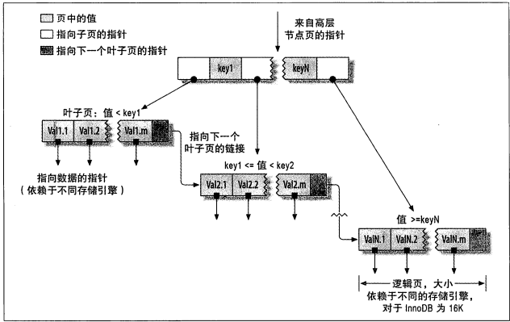
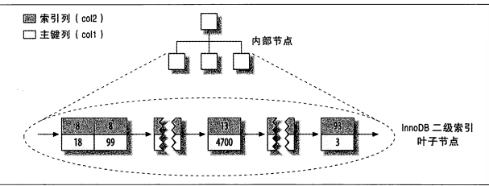

## 索引

> **MYSQL支持的索引类型**
>
> - B-TREE索引
>
>   > B-Tree索引的查询类型适用于全键值,键值范围或键前缀查找
>   >
>   >  
>   >
>   > - 从根结点查询,**子结点**定义了页中的上限与下限
>   > - **叶子结点指针指向被索引的数据**
>   > - 叶子结点中存在链表结构,按顺序排列页
>
> - 哈希索引
>
>   > 通过主键计算哈希值(物理地址)
>   >
>   > - 哈希索引只存在哈希值和行指针(不存数据)
>   > - 无法对排序进行优化
>   > - 不支持范围查询(只支持等值查询)
>   > - 存在哈希冲突
>
> - 全文索引
>
> 
>
> ####  EXPLAIN
>
> > | 列名          | 说明                                                         |
> > | ------------- | ------------------------------------------------------------ |
> > | ID            | select 的查询序号(解析多少子查询)  执行顺序                  |
> > | select_type   | 查询类型  **普通查询、联合查询、子查询**   SIMPLE 简单的select查询(查询中不包含子查询,联合查询)  PRIMARY 存在子查询(最外层查询语句标识PRIMARY)  SUBQUERY 在select或where 中包含子查询  DERIVED  衍生查询(递归查询),查询的表存在临时表中上层语句引用  UNION 使用UNION语句查询  DEPENDENT UNION   UNION RESULT |
> > | TABLE         | 访问表                                                       |
> > | TYPE          | 关联类型   system > const > eq_ref > ref > fullext > ref_of_null > index_merge > unique_subquery > index_subquery > range > index > ALL   1. const 表示通过索引一次就找到数据 **(通过主键查找数据)**  2.  eq_ref 唯一性索引扫描(查找单个数据)  3. ref 使用普通索引,左缀查询(可能找到多个符合条件行)  4. ref_or_null 类似于ref  结果集存在NULL  5. range 范围查询 使用 in between 等条件  6. index 从索引树中遍历所有数据  7. ALL 从磁盘中读取所有的数据 |
> > | possible_keys | 显示**应用在这张表的索引**,存在一个或者多个,不一定用上       |
> > | key           | 实际使用的索引 ,表示当前语句未使用索引                       |
> > | key_len       | 索引中使用的字节数，查询中使用的索引的长度（最大可能长度），并非实际使用长度 |
> > | ref           | 显示索引的那一列被使用了     const（常量） func NULL 字段名 |
> > | rows          | 估算查找记录行数                                        |
> > | extra         |                                                              |
>
> **聚族索引（索引的存储方式）**
>
> > InnoDB的聚族索引实际在同一个结构中保存了B-Tree索引和**数据行**
> >
> > - 数据行存放在索引的叶子页(leaf page),相邻的键值存在一起,**一个表只能有一个聚族索引**
> >
> > - *叶子页中存在表中所有的数据*
> >
> >    
> >
> >   InnoDB使用主键聚集数据(被索引的列),没有定义主键,InnoDB会选择一个唯一的非空索引替代(隐式定义一个主键作为聚族索引)
> >
> >   - 相关数据存放在一起,减少磁盘读取次数
> >   - 数据访问快
> >   - 使用覆盖索引扫描查询可以直接使用主键值(非回表查询)
> >
> >   - 基于内存的读写性能提升不高
> >   - 插入数据严重依赖插入顺序
> >   - 更新聚族索引列代价高
> >   - 页分裂(主键值要去插入到已满的页,存储引擎将该页进行拆分存储该行) 占用更多的磁盘空间
> >   - 二级索引(非主键索引)内容多(**二级索引存储的是行指针**)
>
> #### **InnoDB的数据分布**
>
> 聚族索引 == 表
>
>  
>
> **每个叶子结点包含该列数据所有内容(主键值,事务ID,回滚指针,及其他列信息)**
>
> **二级索引结构**
>
>  
>
> - InnoDB非叶子结点包含**索引列(数据)和指向下一级结点的指针**
> - InnoDB叶子结点包含**索引列(数据)和对应的主键值**
>
> **MyISAM与INNODB对比**
>
>  
>
> 
>
> **InnoDB表中按主键顺序**
>
> - 避免使用随机数作为主键索引(导致页分裂和数据碎片)
> - 顺序主键在高并发写时会造成间隙锁进行竞争(使并发串行执行) *设置innodb_autoinc_lock_mode 定义间隙范围*
>
> #### **覆盖索引(**索引中包含所需要查询字段的值)**
>
> > - 索引条目小于数据列条目(查询条件中只要读取索引列)
> > - 磁盘IO次数减少
> >
> > 哈希索引,空间索引,全文索引不支持索引覆盖情况
> >
> > **延迟关联(deferred join)**
> >
> > 延迟对列的访问 子查询使用覆盖索引,主句使用索引查询
> >
> > ~~~sql
> > select <cols> from profiles join (select <primary key cols> from profiles where x.sex = 'M' order by rating Limit 1000000,10) as x using <primary key cols>
> > ~~~
> >
> > 
>
> MYSQL 唯一限制索引通过主键限制实现的
>
> >  
>
> #### **索引碎片化**
>
> > - 行碎片(数据行存放多个片段中)
> > - 行间碎片(逻辑上顺序页,或者行在磁盘上不是顺序存储的)
> > - 剩余空间碎片(数据页中有大量的空余空间)
>
> 

