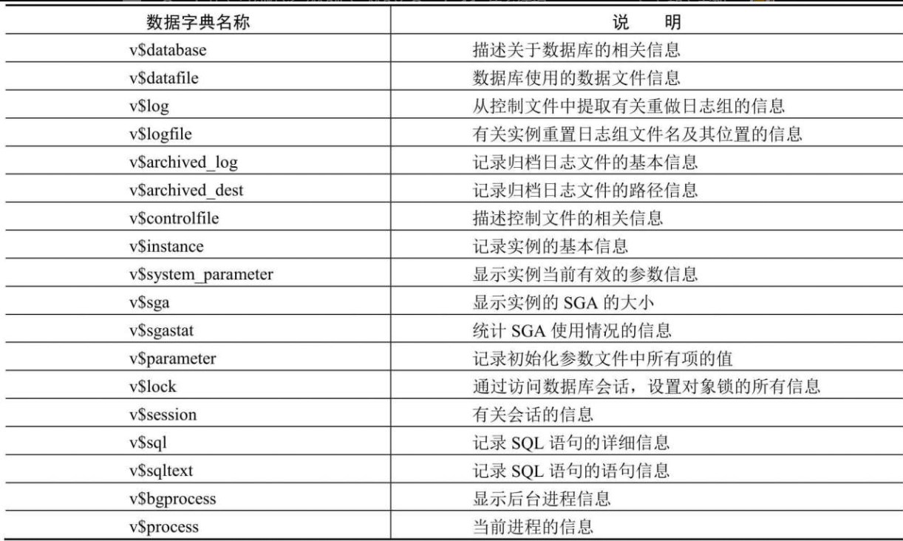

## Oracle 体系结构

> - **实例（Oracle Instance）**
>
>   > 相当与应用，运行在物理机上，一个实例只有一个数据库，一个数据库可以有n个实例组成集群。不同实例可以建相同名字的用户。
>
> - **数据库（DataBase）**
>
>   > 基于磁盘的数据文件、控制文件、日志文件、参数文件和归档日志文件等组成的物理文件集合
>
> - **表空间**(逻辑划分)
>
>   > 表空间是 Oracle 对物理数据库上相关数据文件（ORA 或者 DBF 文件）的逻辑映射。一个数据库在逻辑上被划分成一到若干个表空间，每个表空间包含了在逻辑上相关联的一组结构。
>   >
>   > 段：表的逻辑空间
>   >
>   > 区：多行数据逻辑空间
>   >
>   > 数据块：单行数据空间，最小的I/O单位
>
> - **数据文件**(dbf,ora)
>
>   > 数据库的物理存储单位，一个表空间存在多个数据文件，一个数据文件只属于某个表空间
>
> - 
>
> > Oracle 存放关于数据库内部信息的话(用来描述数据库内部的运行和管理情况)
> >
> > 包含
> >
> > - 数据表所有者
> > - 创建时间
> > - 所属表空间
> > - 用户访问权限
> >
> > 在数据库中使用`"_"标识(前缀_后缀)`
> >
> > - dba_ 包含数据库实例的所有对象信息
> > - v$_  当前实例的动态视图
> > - user_  记录用户对象信息
> > - gv_ 系统管理和系统优化使用视图
> > - all_ 记录用户对象授权信息
> >
> >  
> >
> >  
>
> #### **同义词**
>
> > [Oracle](http://lib.csdn.net/base/oracle)的同义词（synonyms）从字面上理解就是别名的意思，和视图的功能类似，就是一种映射关系。本文介绍如何创建同义词语句，删除同义词以及查看同义词语句。
> >
> > 扩展的数据库的使用范围，能够在不同的数据库用户之间实现无缝交互;同义词可以创建在不同一个数据库服务器上，通过网络实现连接。
>
> #### **序列(Sequence)**
>
> > oracle提供的用于产生一系列唯一数字的数据库对象
>
> #### **包**
>
> 建立在存储过程,函数之上,把每个模块的函数与存储过程管理起来,通过包来调用管理存储过程与函数
>
> 

