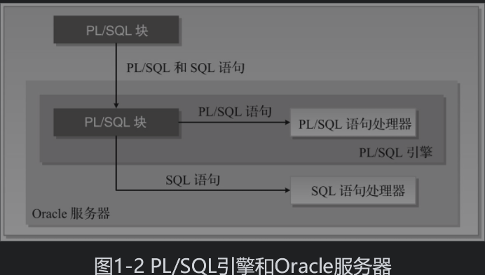
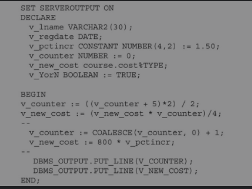
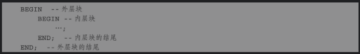
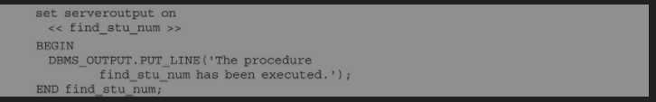

## PL/SQL(存储过程/函数)

> [PL/SQL](https://baike.baidu.com/item/PL%2FSQL/8564979)也是一种[程序语言](https://baike.baidu.com/item/程序语言/10696489)，叫做过程化[SQL语言](https://baike.baidu.com/item/SQL语言/4801972)（Procedural Language/SQL）。PL/SQL是[Oracle数据库](https://baike.baidu.com/item/Oracle数据库/3710800)对SQL语句的扩展。在普通SQL语句的使用上增加了编程语言的特点，所以PL/SQL把数据操作和查询语句组织在PL/SQL代码的过程性单元中，通过逻辑判断、循环等操作实现复杂的功能或者计算。
>
> #### **PL/SQL结构**
>
> - 声明部分(DECLARE)
>
> > 定义变量,常量,游标
>
> - 执行部分(BEGIN)
> - 异常处理部分(EXCEPTION)
> - PL/SQL块中定义的子程序不能在其他PL/SQL中调用
>
>  
>
> #### **PLSQL语言基础**
>
> > 定义变量及赋值变量
> >
> > >  
> >
> > 变量作用域及标签
> >
> > >  
> > >
> > >  
>
> **PLSQL中SQL**
>
> > - 使用SELECT INTO 初始化变量
> >
> > > ~~~sql
> > > -- 将平均值cost赋值给var_name
> > > select to_char(AVG(cost),'$9,999.99') into var_name where course;
> > > ~~~
> >
> > - 使用Oracle序列
> >
> > > CURRVAL 返回该序列当前值
> > >
> > > NEXTVAL 递增序列并返回新值
> >
> > - PLSQL中事务控制
> >
> > > COMMIT
> > >
> > > ROLLBACK
> > >
> > > SAVEPOINT
>
> #### **游标**(Oracle用于实现SQL查询结果处理的内部数据结构)
>
> > - 游标可以逐行地读取SELECT语句返回的行
> > - 游标可以被其他引用
> >
> > **游标类型**
> >
> > - 隐式(Implicit)
> >
> >   > *游标是由Oracle每次执行SQL语句时自动声明的。用户不会意识到这种情况的发生，并且不能控制或处理隐式游标中的信息*
> >   >
> >   > - 与DML语言有关 UPDATE DELETE 操作影响的行集的游标
> >
> > - 显示（explicit)
> >
> > > *游标是由程序为返回多行[插图]数据的任何查询定义的。这意味着程序员在PL/SQL代码块中声明了此游标。此声明允许应用程序顺序地处理由游标返回的每一行数据。*
> > >
> > > declare  cursor  cursor_name is  select_sql
> > >
> > > open
> > >
> > > fetch  fetch 游标名 into 变量/ PLSQL 代码
> > >
> > > > fetch 命令用于逐行提取, into 进行赋值或执行
> > > >
> > > > 每个fetch命令执行后,活动集指针就向下移动一行,直到返回为止
> > >
> > > close
> >
> > **游标属性**
> >
> > > | 游标属性  | 说明                                           |
> > > | --------- | ---------------------------------------------- |
> > > | %NOTFOUND | 前一个FETCH未返回一行,则返回TRUE,否则返回FALSE |
> > > | %FOUND    | 与上相反                                       |
> > > | %ROWCOUNT | 返回游标读取到的记录数                         |
> > > | %ISOPEN   | 判断游标是否开启                               |
> >
> > **声明数据类型**
> >
> > > **标量数据类型(基本数据类型)**
> > >
> > > %type  声明**单个字段值**
> > >
> > > %rowtype 声明单行**所有字段值**
> > >
> > > %record 声明部分字段
> > >
> > > ~~~plsql
> > >  var_code energy_region.code%type;
> > >  var_row  energy_region%rowtype;
> > >  type region is RECORD(
> > >     v_code energy_region.code%type,
> > >     v_name energy_region.name%type
> > >  );
> > >  type_region region;
> > > ~~~
> > >
> > > **整数类型**
> > >
> > > | 数字类型                                                | 特性                                                         |
> > > | ------------------------------------------------------- | ------------------------------------------------------------ |
> > > | binary_integer   pls_integer / simple_integer | 数据精度： [-2^31, 2^31) 默认值：binary_integer 和 pls_integer 都是 null，simple_integer 是 not null 执行速度：Simple_integer > Pls_Integer > Binary_Integer 运算溢出：Binary_Integer、Pls_Integer 会，Simple_integer 不会 |
> > > | number                                                  | 隐式数据转换 上述三种类型 + number = number              |
> > >
> > > **数组数据类型**
> > >
> > > varry  一维数组(单行单列) 
> > >
> > > ~~~plsql
> > >  -- 定义一维数组类型
> > >   type string_array is varray(10) of varchar2(200);
> > >   -- 声明一维数组
> > >   v_string_array string_array;
> > >   -- 初始化数组
> > >   v_string_array := string_array('a', 'b', 'c');
> > >   -- 循环取值
> > >   for i in v_string_array.first  ..  v_string_array.last loop
> > >     dbms_output.put(v_string_array(i) || ' '); 
> > >      END LOOP;
> > > ~~~
> > >
> > > table 多维数组(多行多列)
> > >
> > > ~~~plsql
> > > -- 使用游标赋值
> > >   cursor cur_region is select * from energy_region where rownum <10;
> > > -- 声明列字段
> > >   type t_table is table of cur_region%rowtype;
> > > -- 声明表
> > >   v_table t_table;
> > > -- 游标赋值
> > >  FETCH cur_region BULK COLLECT INTO v_table;
> > > -- 循环取值
> > >  FOR i IN v_table.first .. v_table.last LOOP
> > >     dbms_output.put_line('地区编码：' || v_table(i).code || ' , ' ||
> > >                          '地区名称：' || v_table(i).name || ' , ' );
> > >   END LOOP;
> > > ~~~
> > >
> > > **数组属性和相关函数**
> > >
> > > | 属性         | 描述                                                         |
> > > | ------------ | ------------------------------------------------------------ |
> > > | count        | 返回集合中元素的个数                                         |
> > > | delete       | 删除集合中 **所有** 的元素及 **extend**                      |
> > > | delete(x)    | 删除元素下标为 `x` 的元素（`对 varry 非法`）                 |
> > > | delete(x,y)  | 删除元素下标从 `x 到 y` 的元素（`对 varry 非法`）            |
> > > | trim         | 从集合`末端`开始删除`一个`元素（`对 index by 非法)           |
> > > | trim(x)      | 从集合`末端`开始删除 `x` 个元素 （`对 index by 非法`）       |
> > > | exists(x)    | 如果集合元素 x 已经 初始化(extend) ，则返回 true，否则返回 false |
> > > | extend       | 在集合 末尾 添加一个元素（对 index by 非法）                 |
> > > | extend(x)    | 在集合 末尾 添加 x个元素 （对 index by 非法）                |
> > > | extend(x, n) | 在集合 末尾 添加元素 x 个下标为n 的 副本（对 index by 非法） |
> > > | first        | 返回集合中第一个元素的下标号，对 varry 集合 始终 返回 1（除非 未初始化 则为 空） |
> > > | last         | 返回集合中最后一个元素的下标号，对 varry 集合 值始终 等于 count （除非 未初始化 则为 空） |
> > > | limit        | 返回 varry 集合的最大的元素个数，对 index by 无效            |
> > > | next(x)      | 返回在第 x 个元素之后紧挨着它的元素下标(x+1)，若 x 是最后一个元素，则返回 null |
> > > | prior(x)     | 返回在第x个元素之前紧挨着它的 元素下标(x-1)，如果 x 是第一个元素，则返回 null |
>
> #### **PLSQL流程控制语句**
>
> > IF - THEN END IF
> >
> > IF - THEN - ELSE - END IF
> >
> > IF - THEN - **ELSIF** - THEN - ELSE -  END  IF
> >
> > CASE - WHEN - THEN  - ELSE - END  CASE
> >
> > CASE WHEN - THEN - ELSE - END CASE
> >
> >  NULLIF(A,B) 表达式A不等于表示式B 则返回表达式A (相等返回NULL)
> >
> > COALESCE(A,B,C,...) 函数   表达式A为NULL计算表达式B.所有都为NULL返回NULL
>
> **PLSQL迭代控制**
>
> > - 简单循环 LOOP   EXIT WHEN -  END LOOP  
> > - WHILE - LOOP - END LOOP
> > - 数字FOR   FOR VAR_NAME IN start..end LOOP  - END LOOP   (退出条件)EXIT WHEN -
> > - CONTINUE WHEN 
> > - 游标FOR
>
> #### **错误处理与内置异常**
>
> > EXCEPTION  WHEN  THEN 
> >
> > - 内置异常
> >
> > > - ZERO_DIVIDE
> > > - LOGIN_DENIED(无效用户名)
> > > - PROGRAM_ERROR   PL/SQL程序有内部问题时引发此异常
> > > - VALUE_ERROR  当转换或大小不匹配错误发生时引发此异常
> > > - DUP_VALUE_ON_INDEX  重复值存储到一个或多个定义了唯一索引的列时
> >
> > - 用户自定义异常
> >
> > > **声明自定义异常**  DECLARE  异常名称 EXCEPTION
> > >
> > > **引发自定义异常**  RAISE (借助IF语句) IF THEN  RAISE END IF
> >
> > - 异常传播
> >
> > > 只有当一个异常被处理后，才可以引发另外的异常，但不能同时引发两个或多个异常
> >
> > - 引发未命名异常
> >
> > > RAISE_APPLICATION_ERROR(key,msg)
> > >
> > > EXCEPTION_INIT 声明编译异常 
> > >
> > > SQLCOD  
> > >
> > > SQLERRM

