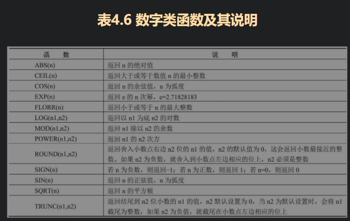
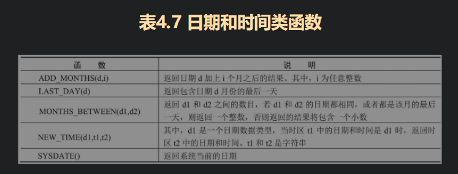
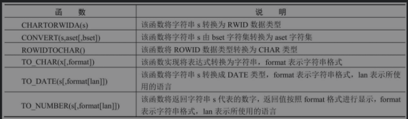
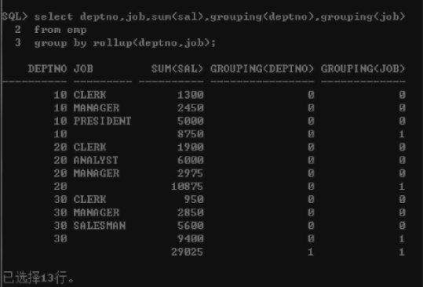

## SQL语言(Structured  Query Language) 

> SQL是Structured Query Language（结构化查询语言）的简称，是用户与数据库交流所需要的标准语言
>
> - **数据查询语言(DQL)** 
>
> > - **函数**
> >
> > > - ASCLL() 与CHA()   ASCLL与字符转换
> > > - NVL() 替代NULL值
> > > - || & concat
> > >
> > >  
> > >
> > >  
> > >
> > >  
> >
> > - #### **条件筛选**
> >
> > > **A {Operator} any (B)  表示A与B中任意一个元素进行operator比较,只要有一个比较值为True,返回该行(exist)**
> > >
> > > **A {operator} ALL (B)  表示A与B中的所有元素进行operator运算符的比较，只有与所有元素比较值都为TRUE，才返回数据行。**
> > >
> > > 
> > >
> > > ~~~sql
> > > -- sal不等于 200,300,760 的行
> > > select * from emp where sal <> all (200,300,760)
> > > 
> > > ~~~
> > >
> > > **like 模糊筛选**
> > >
> > > > % 表示0个或者多个字符
> > > >
> > > > _ 表示一个站位符
> > > >
> > > > 使用转义符 escape 实现特殊符转义
> > > >
> > > > ~~~sql
> > > >  -- 查询 IT字符开头的数据
> > > > select * from dept_temp where dname like 'IT\_%' escape '\'
> > > > ~~~
> > >
> > > **IS NULL**
> > >
> > > > 任何值与NULL比较都为FALSE
> >
> > **GROUP BY**
> >
> > - **ROLLUP**
> >
> > > group by rollup(A,B,C) 产生分组种类
> > >
> > > - group by A,B,C
> > >
> > > - group by A,B
> > >
> > > - group by A
> > >
> > > - group by NULL
> > >
> > > group by A,rollup(A,B) 产生分组种类
> > >
> > > - group by A,B
> > > - group by A
> > > - group by A,NULL 
> >
> > - **CUBE**
> >
> > > group by cube (A,B,C) 产生分组种类
> > >
> > > - group by A,B,C
> > > - group by A,B
> > > - group by A,C
> > > - group by B,C
> > > - group by B,C
> > > - group by A
> > > - group by B
> > > - group by C
> > > - group by NULL
> > >
> > > group by cube((A,B),C)
> > >
> > > - group by A,B,C
> > > - group by A,B
> > > - group by C
> > > - group by NULL
> >
> > - **GROUPING**
> >
> > > **与 CUBE 和 ROLLUP 使用 确定统计结构使用的列**
> > >
> > > ~~~sql
> > > -- 使用到显示 1 没有使用显示0
> > > select depton,job,sum(sal),grouping(deptno),grouping(job) from emp 
> > > group by rollup(detno,job)
> > > ~~~
> > >
> > >  
> >
> > - **GROUPING SETS**
> >
> > > group by grouping set (A,B,C)
> > >
> > > - group by A
> > > - group by B
> > > - group by C
> >
> > #### 多表关联查询
> >
> > > **外连接**
> > >
> > > - LEFT JOIN   
> > > - RIGHT JOIN
> > > - FULL JOIN 完全连接(左连接和右连接去重并集)
> >
> > > **交叉连接**
> > >
> > > > CROSS JOIN 
>
> - **数据操作语言(DML)**
>
> > 
>
> - **事务控制语言(TCL)**
>
> - **数据定义语言(DDL)**
>
> - **数据控制语言(DCL) 权限控制**
>
>   