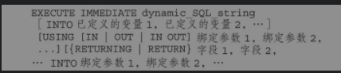

## 本地动态SQL(dynamic)

> **EXECUTE IMMEDIATE**  适用于单行SELECT语句 DML 和DDL语句
>
>  
>
> - 执行DDL语句（DDL语句不能绑定参数）
> - 给动态语句传值（using） EXECUTE IMMEDIATE sql using ...params
> - 将结果赋值给变量  （into） EXECUTE IMMEDIATE sql into param
> - execute immediate 不存在 ； 和  /  作为终止标识符
>
> **OPEN-FOR   FETCH  CLOSE** 适用于多行SELECT 语句和游标
>
> - OPEN cursor_variable for sql  using ...params 将游标绑定动态SQL
>
> - FETCH cursor_variable  into ...params  EXIT WHEN   返回游标中结果集单行，并且将游标移动下一行 ,如果没下一行执行EXIT WHEN语句
> - CLOSE 断开游标变量与SQL关联
>
> #### 批量SQL
>
> - **FORALL** 
>
> > FORALL  item in **bounds clause** SQL
> >
> > bound clause 循环范围
> >
> > - lower_limit .. upper_limit
> > - INDICES OF collect_name between lower_limit .. upper_limit
> > - values of collect_name 
>
> - **BULK COLLECT** (一次性将所有的行返回到数组/表中)
>
>  

