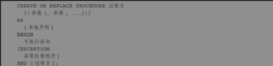
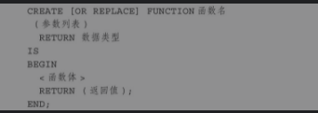

## 过程与函数

> - #### 创建存储过程
>
>   >  
>
> - **传递过程参数IN 和OUT**
>
> > | 模式   | 说明                                     | 用途 |
> > | ------ | ---------------------------------------- | ---- |
> > | IN     | 把值传入存储过程,在程序中不能更改此变量  | 只读 |
> > | OUT    | 存储过程输出值,不能赋予默认值,必须是变量 | 只写 |
> > | IN OUT | 入参出参相同的变量                       | 变量 |

## **函数**

> **创建函数**
>
> >  
> >
> > 

