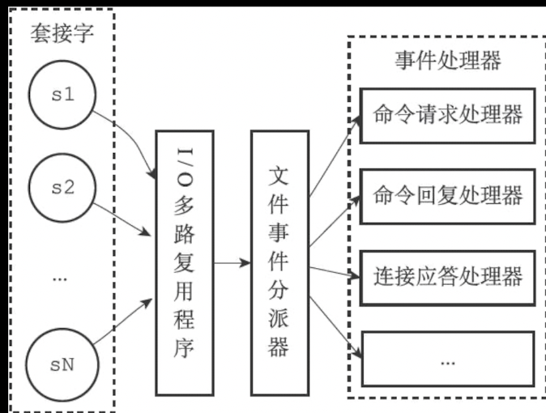
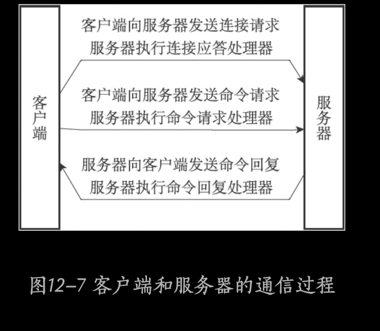
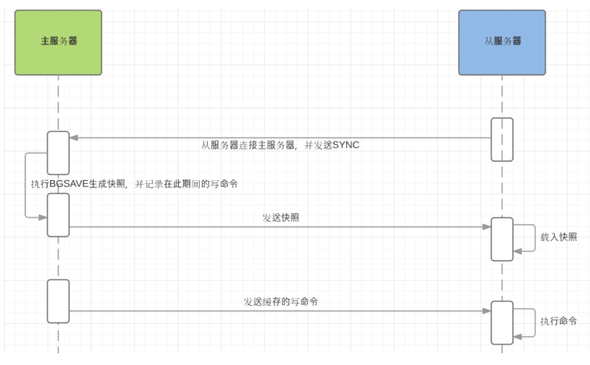
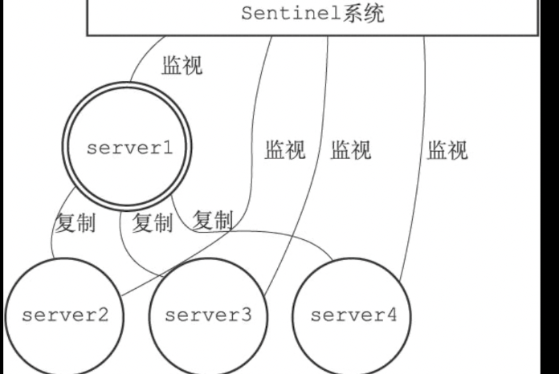
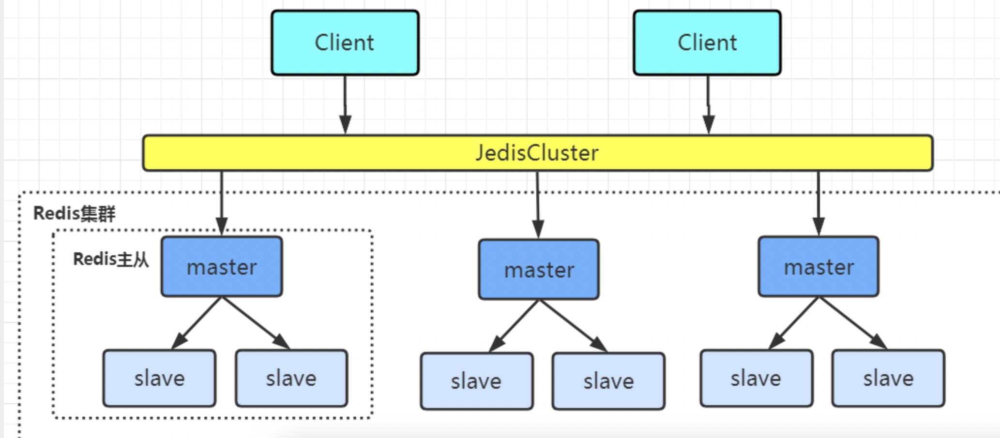

## Redis操作

- ####  **[Redis API ](https://redis.io/commands/bgrewriteaof)**

  > **ACL用户权限**
  >
  > - ACL CAT 查看Redis所有操作类目
  > - ACL DELUSER  删除所有指定的 ACL 用户并终止所有通过此类用户身份验证的连接
  > - ACL GENPASS 生成可靠的密码（返回64字节字符串）
  > - ACL GETUSER 获取用户定义
  > - ACL LIST  返回当活跃的ACL  （登录用户）
  > - ACL LOAD 
  > - ACL LOG（登录日志）
  > - ACL SAVE 
  > - ACL SETUSER 
  > - ACL USERS 
  > - ACL WHOAMI
  > - EXPIRE 设置KEY过期时间
  > - EXPIREAT 设置KEY过期时间为指定时间

- #### **RedisServer**

  > **读写键空间时的维护操作**
  >
  > 1. 读取键之后，服务器根据键统计命中次数和不命中次数，并更新LRU（最后使用时间）
  >
  > 2. 服务器读取键发现改建已过期，先删除这个过期键在处理
  >
  >  
  >
  > **过期键删除策略**
  >
  > - 定时（定时器timer）
  >
  >   > 减小内存使用空间，占用CPU时间
  >
  > - 懒惰（使用时检测是否过期）
  >
  > - 定期（固定时间清理）
  >
  >   
  >
  > **RDB持久化**
  >
  > - SAVE命令（阻塞Redis服务进程，直到RDB文件创建完毕）
  > - BGSAVE命令(非阻塞命令)
  > - Save 300 10 表示在300秒内发送10次更改进行BGSAVE操作
  >
  > 

- #### **事件**

  > - **文件事件**
  >
  >   > I/O多路复用（用一个线程监听多个socket，并以非阻塞方式执行）同时监听多个套接字，**并根据套接字执行任务来为套接字关联不同事件处理器**
  >   >
  >   > **文件事件处理器**
  >   >
  >   >  
  >   >
  >   >  
  >   >
  >   > I/O多路复用程序将所有的事件放到一个队列中，然后以有序，**同步**，**每次一个套接字的方式**向文件事件分派器传输数据（阻塞及分类）。
  >   >
  >   >  
  >   >
  >   > Redis服务器使用单线程单进程方式处理命令请求，并与多个客户端进行网络通信。
  >   >
  >   >  
  >   >
  >   >  
  >   >
  >   >  
  >
  > - **时间事件**
  >
  >   > 定时事件
  >   >
  >   > 周期性事件

- #### **主从复制**

  > SLAVEOF IP:port 
  >
  > replicaof IP:port
  >
  >  
  >
  > **全量同步**
  >
  >  
  >
  >  
  >
  > PSYNC执行完全同步

- **Sentinel（哨兵）**

  > Sentinel作用是监视所有Redis服务是否可用，并当Master不可用时，从Slave选举一个出来代替Master
  >
  >  
  >
  > - Server1为Master其他为slave
  >
  > 

- #### **集群**

  > Redis提供的分布式数据方案，**通过分片方式进行数据共享**，并提供复制故障转移功能
  >
  >   
  >
  > Redis Cluster 将所有数据划分16384个槽位，每个节点只复制处理这些槽位范围数据
  >
  > 

- #### **发布与订阅**

  > 

- #### **事务**

  > Redis通过MULTI，EXEC，WATCH等命令来实现事务功能
  >
  >  
  >
  > **WATCH** （手动监听）
  >
  > 在EXEC命令执行前，监视任意数量的数据库键，并在执行EXEC时，检查被监视的键是否有一个已经被修改过，如果存在修改，拒绝此次EXEC
  >
  > 
  >
  > 

- **Lua脚本**

- #### **慢查询日志**

- #### **监视器**

