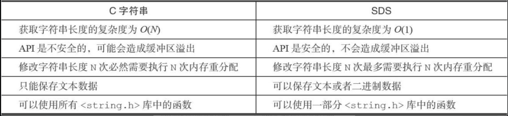
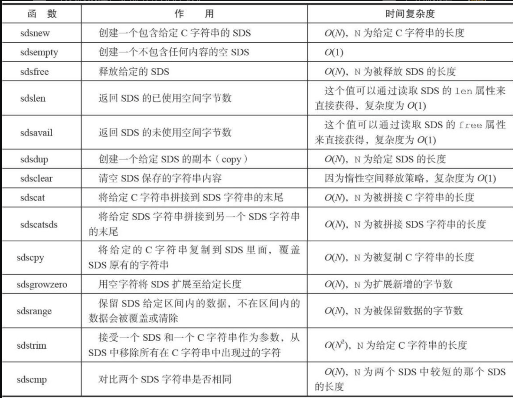
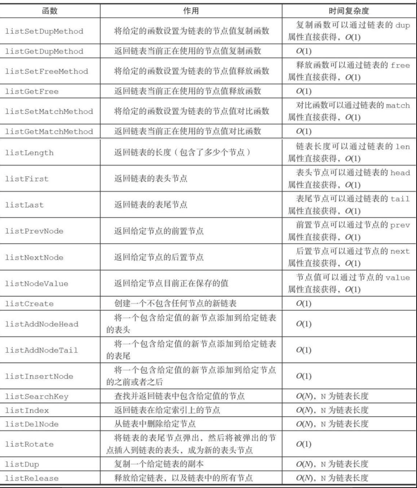

## Redis数据结构

> - #### **SDS(动态字符串)**
>
>   > - 实现字符串对象
>   > - 在Redis程序内部用作char*类型替代品(key值结构)
>   >
>   > ~~~c
>   > struct sdshdr {
>   >   // 记录buf数组中已使用字节数量
>   >   int len;
>   >   //记录buf数组中未使用字节数量
>   >    int free;
>   >   // 字节数组 保存字符串
>   >    char buf[];
>   > }
>   > ~~~
>   >
>   > *C语言使用长度+1的字符数组表示长度为N的字符串(使用\0表示字符结尾)*
>   >
>   > - free记录的是buf中未使用的空间,SDS实现空间预分配和惰性空间释放优化策略,使其操作字符时不必指定数组长度和动态扩容
>   >
>   >   - 空间预分配 (SDS中len长度小于1MB,len与free相同,即使用长度扩容一倍,当SDS长度大于1MB,free值扩容1MB未使用空间 SDS数组的实际长度= free + len + '/0')
>   >   - 惰性空间释放 (对字符进行删减时,将删减内容移动到free空间中,防止直接操作buf数组)
>   >
>   >   - 只要扩容的内容不超过free长度,不会对buf进行扩容
>   >
>   > **二进制安全**
>   >
>   > > *C字符串的特殊性(空格当做结尾),因此字符串内容中不允许存在空格,不能保存图片,视频二进制流转码的字符*
>   > >
>   > > SDS中API都是二进制安全的,所有的API都会以二进制方式处理buf数组中数据**(通过len长度判断字符结尾)**
>   >
>   >  
>   >
>   > **SDS API**
>   >
>   >  
>
> #### **链表**
>
> > *链表提供了高效的节点重排能力，以及顺序性的节点访问方式，并且可以通过增删节点来灵活地调整链表的长度。*
> >
> > **redis中链表使用场景** 
> >
> > -  发布与订阅、慢查询、监视器等功能
> > - 保存多个客户端的状态信息,以及使用链表来构建客户端输出缓冲区（outputbuffer）
> >
> > **redis中链表结构**
> >
> > ~~~c
> > typedef struct listNode{
> >   // 前置节点
> >   struct listNode * prev;
> >   //后置节点
> >   struct listNode * next;
> >   // 节点置
> >   void * value;  
> > } listNode;
> > // adlist.h/list持有链表
> > typedef struct list {
> >   // 表头
> >   listNode * head;
> >   // 表尾
> >   listNode * tail;
> >   // 链表包含的节点数量
> >   unsigned long len;
> >   // 节点值复制函数
> >   void *(*dup) (void * ptf);
> >   // 节点值释放函数
> >   void (*free) (void * ptf);
> >   //节点对比函数
> >   int (*match) (void *ptr , void *key);
> > } list;
> > ~~~
> >
> >  
> >
> > - **Redis链表特性**
> >   - 双端
> >   - 无环
> >   - 带表头指针和表尾指针
> >   - 长度计数器
> >   - 多态
> >
> > **Redis链表API**
> >
> >  
>
> #### **字典(symbol table)**
>
> > *字典，又称为符号表（symbol table）、关联数组（associative array）或映射（map），是一种用于保存键值对（key-value pair）的抽象数据结构。*
> >
> > - redis字典时哈希键的底层实现之一
> >
> > **字典实现**
> >
> > 一个哈希表里面可以有多个哈希表节点，而每个哈希表节点就保存了字典中的一个**键值对**。
> >
> > **哈希表**
> >
> > ~~~c
> > typedef struct dictht{
> >   // 哈希表数组 保存键值对
> >   dictEntry ** table;
> >   // 哈希表长度
> >   unsigned long size;
> >   // 哈希表大小掩码 用于计算索引值 size -1  与哈希值决定k-存放索引位置
> >   unsigned long sizemask;
> >   // 已使用节点数量
> >   unsigned long used;
> > } dictht;
> > // 哈希表节点
> > typedef struct dictEntry{
> >   // 键
> >   void *key;
> >   //值
> >   union{
> >     void *val;
> >     uint64_tu64;
> >     int64_ts64;
> >   } v;
> >   //指向下一节点 形成链表 防止哈希冲突 (同一个哈希有多个对应值)
> >   struct dictEntry *next;
> > } dictEntry;
> > // Redis中字典 dict.h/dict 结构表示
> > typedef struct dict {
> >   //类型特定函数
> >   dictType * type;
> >   //私有数据
> >   void * privdata;
> >   // 哈希表
> >   dictht ht[2];
> >   //rehash索引 (空为 -1 )
> >   in trehashidx ;
> > }dict;
> > 
> > ~~~
> >
> >  
> >
> > - type属性 和 privdata 属性针对不同类型的键值对,为创建多态字典设置的
> >   - type属性 指向dictType结构的指针
> >   - privdata可选类型参数
> >
> > ~~~c
> > typedef struct dictType{
> >   // 计算哈希值的函数
> >   unsigned int (*hashFunction)(const void *key);
> >   //复制键的函数
> >   void *(*keyDup)(void *privdata,const void *key);
> >   // 复制值得函数
> >   void *(*valDup)(void *privdata,const void *key);
> >   ....
> > }
> > ~~~
> >
> > #### **哈希算法**
> >
> > ~~~c
> > #使用字典设置的哈希函数,计算键key的哈希值
> > hash = dict -> type -> hashFunction(key);
> > #使用哈希表的sizemask属性和哈希值,计算出索引值
> > index  = hash & dict ->ht[x].sizemask;
> > 
> > ~~~
> >
> > **rehash**
> >
> > 
> >
> > 

