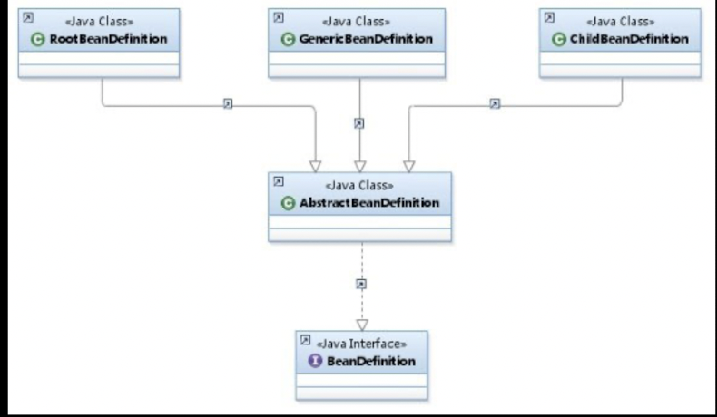
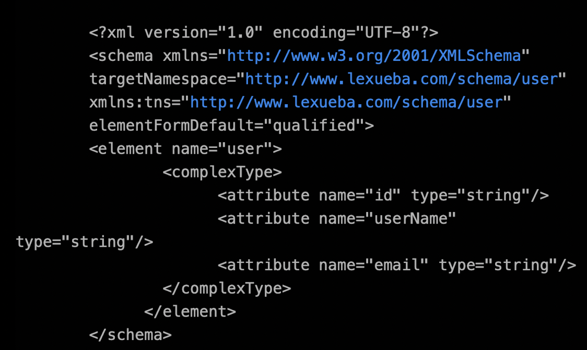
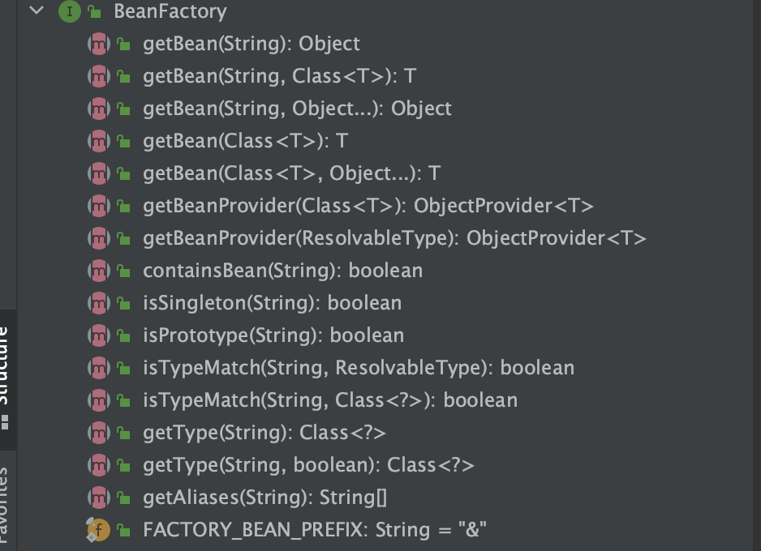
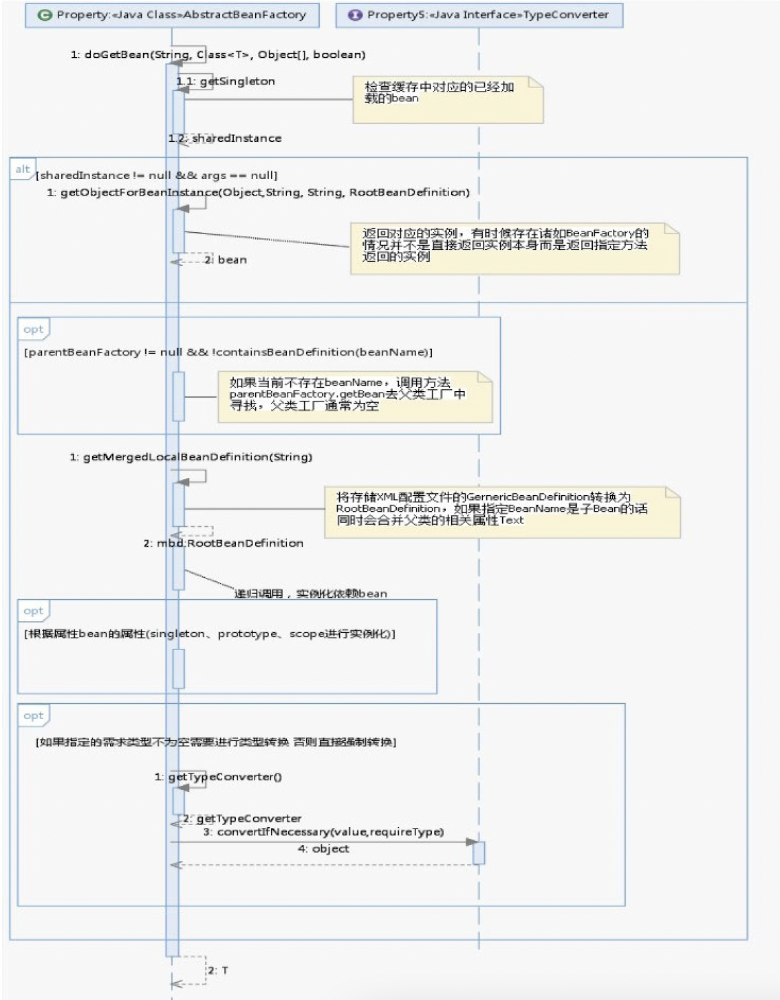
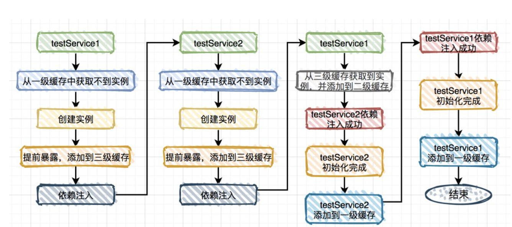

## Beans

- #### **Bean标签解析**

  > - **默认标签(parseDefaultElement)**
  >
  >   > import
  >   >
  >   > alias
  >   >
  >   > bean
  >   >
  >   > beans
  >   >
  >   > ~~~java
  >   > //Bean标签解析方法
  >   > protected void processBeanDefinition(Element ele, BeanDefinitionParserDelegate delegate) {
  >   >        // 元素解析返回XML实例 包含beanName ，alias数组，id 属性
  >   >         BeanDefinitionHolder bdHolder = delegate.parseBeanDefinitionElement(ele);
  >   >       // 对自定义标签处理
  >   >      if (bdHolder != null) {
  >   >             bdHolder = delegate.decorateBeanDefinitionIfRequired(ele, bdHolder);
  >   >             try {
  >   >                 BeanDefinitionReaderUtils.registerBeanDefinition(bdHolder, this.getReaderContext().getRegistry());
  >   >             } catch (BeanDefinitionStoreException var5) {
  >   >                 this.getReaderContext().error("Failed to register bean definition with name '" + bdHolder.getBeanName() + "'", ele, var5);
  >   >             }
  >   >           // 对当前bd对象注册
  >   >             this.getReaderContext().fireComponentRegistered(new BeanComponentDefinition(bdHolder));
  >   >         }
  >   >     }
  >   > ~~~
  >   >
  >   > BeanDefinition是配置文件<bean>元素标签在容器中内部表示形式
  >   >
  >   > BeanDefinition的实现子类有RootBeanDefinition，ChildBean，Definition及GenericBeanDefinition
  >   >
  >   >  BeanDefinitionRegistry 是它们的容器，以map形式存入内存，后续直接读取map中配置信息
  >   >
  >   >  
  >
  > - **自定义标签**
  >
  >   > 通过BeanDefinitionParserDelegate的命名空间判断是否是自定义配置
  >   >
  >   >  

- #### **Bean的加载**

  > org.springframework.beans.factory.BeanFactory
  >
  >  
  >
  > ~~~java
  > // doGetBean 重载
  > public Object getBean(String name){
  > return doGetBean(name,null,null,false);
  > }
  > // doGetBean 加载方法 
  > protected <T> T doGetBean(String name, @Nullable Class<T> requiredType, @Nullable Object[] args, boolean typeCheckOnly) throws BeansException {
  >  // 转换对应的beanName
  > String beanName = this.transformedBeanName(name);
  > Object sharedInstance = this.getSingleton(beanName);
  > Object beanInstance;
  > /**
  >           * 检查缓存或者工厂中是否有对应实例
  >           * 检查创建单例bean中是否存在依赖注入情况（避免循环依赖）
  >           * 存在缓存直接使用缓存中bean对象
  >           */
  > 
  >         // 尝试从缓存或者singletonFactories中获取Bean
  >          if (sharedInstance != null && args == null) {
  >              if (this.logger.isTraceEnabled()) {
  >                  if (this.isSingletonCurrentlyInCreation(beanName)) {
  >                      this.logger.trace("Returning eagerly cached instance of singleton bean '" + beanName + "' that is not fully initialized yet - a consequence of a circular reference");
  >                  } else {
  >                      this.logger.trace("Returning cached instance of singleton bean '" + beanName + "'");
  >                  }
  >              }
  >           // 返回bean的实例
  >              beanInstance = this.getObjectForBeanInstance(sharedInstance, name, beanName, (RootBeanDefinition)null);
  >          } else {
  >            // 只有单例中尝试解决循环依赖，原型模式下，如果存在A中有B的元素并且
  >            // B中有A的属性，创建时候就会先创建依赖B在返回创建当前A，当创建B时由于B
  >            // 已经存在，造成循环依赖
  >              if (this.isPrototypeCurrentlyInCreation(beanName)) {
  >                  throw new BeanCurrentlyInCreationException(beanName);
  >              }
  >              BeanFactory parentBeanFactory = this.getParentBeanFactory();
  >            // 从beanDefinitMap中不存在beanName 则尝试从parentBeanFacort检测
  >            if (parentBeanFactory != null && !this.containsBeanDefinition(beanName)) {
  >                  String nameToLookup = this.originalBeanName(name);
  >                  if (parentBeanFactory instanceof AbstractBeanFactory) {
  >                      return ((AbstractBeanFactory)parentBeanFactory).doGetBean(nameToLookup, requiredType, args, typeCheckOnly);
  >                  }
  > 
  >                  if (args != null) {
  >                      return parentBeanFactory.getBean(nameToLookup, args);
  >                  }
  > 
  >                  if (requiredType != null) {
  >                      return parentBeanFactory.getBean(nameToLookup, requiredType);
  >                  }
  > 
  >                  return parentBeanFactory.getBean(nameToLookup);
  >              }
  > 
  >            // 类型检查，并记录
  >              if (!typeCheckOnly) {
  >                  this.markBeanAsCreated(beanName);
  >              }
  >  						//将XML中配置文件转为RootBeanDefinition 将子Bean与父类属性合并
  >              StartupStep beanCreation = this.applicationStartup.start("spring.beans.instantiate").tag("beanName", name);
  > 
  >              try {
  >                  if (requiredType != null) {
  >                      beanCreation.tag("beanType", requiredType::toString);
  >                  }
  > 
  >                  RootBeanDefinition mbd = this.getMergedLocalBeanDefinition(beanName);
  >                  this.checkMergedBeanDefinition(mbd, beanName, args);
  >                  String[] dependsOn = mbd.getDependsOn();
  >                  String[] var12;
  >                //存在依赖递归实例化bean
  >                  if (dependsOn != null) {
  >                      var12 = dependsOn;
  >                      int var13 = dependsOn.length;
  > 
  >                      for(int var14 = 0; var14 < var13; ++var14) {
  >                          String dep = var12[var14];
  >                          if (this.isDependent(beanName, dep)) {
  >                              throw new BeanCreationException(mbd.getResourceDescription(), beanName, "Circular depends-on relationship between '" + beanName + "' and '" + dep + "'");
  >                          }
  > 
  >                          this.registerDependentBean(dep, beanName);
  > 
  >                          try {
  >                              this.getBean(dep);
  >                          } catch (NoSuchBeanDefinitionException var31) {
  >                              throw new BeanCreationException(mbd.getResourceDescription(), beanName, "'" + beanName + "' depends on missing bean '" + dep + "'", var31);
  >                          }
  >                      }
  >                  }
  >            // singleton 模式创建
  >                  if (mbd.isSingleton()) {
  >                      sharedInstance = this.getSingleton(beanName, () -> {
  >                          try {
  >                              return this.createBean(beanName, mbd, args);
  >                          } catch (BeansException var5) {
  >                              this.destroySingleton(beanName);
  >                              throw var5;
  >                          }
  >                      });
  >                      beanInstance = this.getObjectForBeanInstance(sharedInstance, name, beanName, mbd);
  >                  } else if (mbd.isPrototype()) { //prototype 模式创建（new）
  >                      var12 = null;
  > 
  >                      Object prototypeInstance;
  >                      try {
  >                          this.beforePrototypeCreation(beanName);
  >                          prototypeInstance = this.createBean(beanName, mbd, args);
  >                      } finally {
  >                          this.afterPrototypeCreation(beanName);
  >                      }
  > 
  >                      beanInstance = this.getObjectForBeanInstance(prototypeInstance, name, beanName, mbd);
  >                  } else {
  >                    // 指定scope上实例化bean
  >                      String scopeName = mbd.getScope();
  >                      if (!StringUtils.hasLength(scopeName)) {
  >                          throw new IllegalStateException("No scope name defined for bean '" + beanName + "'");
  >                      }
  > 
  >                      Scope scope = (Scope)this.scopes.get(scopeName);
  >                      if (scope == null) {
  >                          throw new IllegalStateException("No Scope registered for scope name '" + scopeName + "'");
  >                      }
  > 
  >                      try {
  >                          Object scopedInstance = scope.get(beanName, () -> {
  >                              this.beforePrototypeCreation(beanName);
  > 
  >                              Object var4;
  >                              try {
  >                                  var4 = this.createBean(beanName, mbd, args);
  >                              } finally {
  >                                  this.afterPrototypeCreation(beanName);
  >                              }
  > 
  >                              return var4;
  >                          });
  >                          beanInstance = this.getObjectForBeanInstance(scopedInstance, name, beanName, mbd);
  >                      } catch (IllegalStateException var30) {
  >                          throw new ScopeNotActiveException(beanName, scopeName, var30);
  >                      }
  >                  }
  >              } catch (BeansException var32) {
  >                  beanCreation.tag("exception", var32.getClass().toString());
  >                  beanCreation.tag("message", String.valueOf(var32.getMessage()));
  >                  this.cleanupAfterBeanCreationFailure(beanName);
  >                  throw var32;
  >              } finally {
  >                  beanCreation.end();
  >              }
  >          }
  > 
  >          return this.adaptBeanInstance(name, beanInstance, requiredType);
  >      }
  > ~~~
  >
  > 1. 转换对应beanName（将别名，或者FactoryBean进一步解析）
  > 2. 尝试从缓存中加载单例（缓存中无，从singletonFactories中获取）
  > 3. 对Bean实例化
  > 4. 在单例情况下，使用setter方法造成的循环依赖，才能被检查到
  > 5. parentBeranFactory 无缓存的的话，从父类工厂加载
  >
  >   
  >
  > ---
  >
  > **FactoryBean**
  >
  > 
  >
  > **Sping循环依赖解决方法**
  >
  > *循环依赖主要出现在单例bean中*
  >
  > Spring中Bean创建过程：通过反射创建对应的实例，在通过实例的方法对属性进行赋值
  >
  > - Spring通过递归方式获取目标bean及其依赖bean
  >
  > - Spring实例化bean时候，**先实例化无依赖状态目标bean，在为其注入属性**
  >
  > **实现**
  >
  > - singletonObjects 一级缓存Map（保存beanName与实例化，注入，初始化完成bean实例）
  > - earlySingletonObject 二级缓存Map（用于保存实例化完成的bean，没注入属性）
  > - singletonFactories 三级缓存Map（保存bean的创建工厂，便于后续扩展，代理）
  >
  > 
  >
  > **循环依赖场景**
  >
  > - 单例setter注入（引用属性）
  > - 多例setter注入
  > - 构造器注入
  > - 单例代理对象setter注入（使用代理）
  > - DependsOn循环依赖（检测是否存在循环依赖，存在抛出异常）
  >
  > ---
  >
  > **解决方案**
  >
  > @Lazy 延迟加载bean
  >
  > @DependsOn注解 指定bean加载顺序
  >
  > 修改文件名称，更改循环依赖类的加载顺序
  >
  > ---
  >
  > **从Bean的实例中获取对象**
  >
  > getObjectForBeanInstance() 检查当前bean是否是FacoryBean类型的bean，如果是则使用工厂方法**创建实例并初始化实例属性**
  >
  > ~~~java
  >   protected Object getObjectForBeanInstance(Object beanInstance, String name, String beanName, @Nullable RootBeanDefinition mbd) {
  >         if (BeanFactoryUtils.isFactoryDereference(name)) {
  >             if (beanInstance instanceof NullBean) {
  >                 return beanInstance;
  >             } else if (!(beanInstance instanceof FactoryBean)) {
  >                 throw new BeanIsNotAFactoryException(beanName, beanInstance.getClass());
  >             } else {
  >                 if (mbd != null) {
  >                     mbd.isFactoryBean = true;
  >                 }
  > 
  >                 return beanInstance;
  >             }
  >         } else if (!(beanInstance instanceof FactoryBean)) {
  >             return beanInstance;
  >         } else {
  >             Object object = null;
  >             if (mbd != null) {
  >                 mbd.isFactoryBean = true;
  >             } else {
  >                 object = this.getCachedObjectForFactoryBean(beanName);
  >             }
  > 
  >             if (object == null) {
  >                 FactoryBean<?> factory = (FactoryBean)beanInstance;
  >                 if (mbd == null && this.containsBeanDefinition(beanName)) {
  >                     mbd = this.getMergedLocalBeanDefinition(beanName);
  >                 }
  > 
  >                 boolean synthetic = mbd != null && mbd.isSynthetic();
  >                 object = this.getObjectFromFactoryBean(factory, beanName, !synthetic);
  >             }
  > 
  >             return object;
  >         }
  >     }
  > ~~~
  >
  > - 对FactoryBean正确性验证
  > - 对非FactoryBean不做任何处理
  > - 对Bean进行转换
  > - 将Factory中解析bean的工作委托getObjectFromFactoryBean完成
  > - doGetObjectFromFactoryBean
  
  #### **Bean创建**
  
  > **doCreateBean 创建Bean方法**
  >
  > ~~~java
  >   protected Object doCreateBean(String beanName, RootBeanDefinition mbd, @Nullable Object[] args) throws BeanCreationException {
  >         BeanWrapper instanceWrapper = null;
  >         if (mbd.isSingleton()) {
  >             instanceWrapper = (BeanWrapper)this.factoryBeanInstanceCache.remove(beanName);
  >         }
  > 
  >         if (instanceWrapper == null) {
  >           // 根据指定bean使用对应的策略创建新的实例（工厂方法，构造函数，简单初始化）
  >             instanceWrapper = this.createBeanInstance(beanName, mbd, args);
  >         }
  > 
  >         Object bean = instanceWrapper.getWrappedInstance();
  >         Class<?> beanType = instanceWrapper.getWrappedClass();
  >         if (beanType != NullBean.class) {
  >             mbd.resolvedTargetType = beanType;
  >         }
  >        // 检查循环依赖
  >         synchronized(mbd.postProcessingLock) {
  >             if (!mbd.postProcessed) {
  >                 try {
  >                     this.applyMergedBeanDefinitionPostProcessors(mbd, beanType, beanName);
  >                 } catch (Throwable var17) {
  >                     throw new BeanCreationException(mbd.getResourceDescription(), beanName, "Post-processing of merged bean definition failed", var17);
  >                 }
  > 
  >                 mbd.postProcessed = true;
  >             }
  >         }
  > 
  >         boolean earlySingletonExposure = mbd.isSingleton() && this.allowCircularReferences && this.isSingletonCurrentlyInCreation(beanName);
  >         if (earlySingletonExposure) {
  >             if (this.logger.isTraceEnabled()) {
  >                 this.logger.trace("Eagerly caching bean '" + beanName + "' to allow for resolving potential circular references");
  >             }
  > // 避免循环依赖，将bean初始化完成前创建实例ObjectFactory加入工厂
  >             this.addSingletonFactory(beanName, () -> {
  >               //AOP代理
  >                 return this.getEarlyBeanReference(beanName, mbd, bean);
  >             });
  >         }
  > 
  >         Object exposedObject = bean;
  > 
  >         try {
  >           //初始化bean属性（递归）
  >             this.populateBean(beanName, mbd, instanceWrapper);
  >             exposedObject = this.initializeBean(beanName, exposedObject, mbd);
  >         } catch (Throwable var18) {
  >             if (var18 instanceof BeanCreationException && beanName.equals(((BeanCreationException)var18).getBeanName())) {
  >                 throw (BeanCreationException)var18;
  >             }
  > 
  >             throw new BeanCreationException(mbd.getResourceDescription(), beanName, "Initialization of bean failed", var18);
  >         }
  > 
  >         if (earlySingletonExposure) {
  >             Object earlySingletonReference = this.getSingleton(beanName, false);
  >             if (earlySingletonReference != null) {
  >                 if (exposedObject == bean) {
  >                     exposedObject = earlySingletonReference;
  >                 } else if (!this.allowRawInjectionDespiteWrapping && this.hasDependentBean(beanName)) {
  >                     String[] dependentBeans = this.getDependentBeans(beanName);
  >                     Set<String> actualDependentBeans = new LinkedHashSet(dependentBeans.length);
  >                     String[] var12 = dependentBeans;
  >                     int var13 = dependentBeans.length;
  > 
  >                     for(int var14 = 0; var14 < var13; ++var14) {
  >                         String dependentBean = var12[var14];
  >                         if (!this.removeSingletonIfCreatedForTypeCheckOnly(dependentBean)) {
  >                             actualDependentBeans.add(dependentBean);
  >                         }
  >                     }
  > 
  >                     if (!actualDependentBeans.isEmpty()) {
  >                         throw new BeanCurrentlyInCreationException(beanName, "Bean with name '" + beanName + "' has been injected into other beans [" + StringUtils.collectionToCommaDelimitedString(actualDependentBeans) + "] in its raw version as part of a circular reference, but has eventually been wrapped. This means that said other beans do not use the final version of the bean. This is often the result of over-eager type matching - consider using 'getBeanNamesForType' with the 'allowEagerInit' flag turned off, for example.");
  >                     }
  >                 }
  >             }
  >         }
  > 
  >         try {
  >           //根据scopse注册bean
  >             this.registerDisposableBeanIfNecessary(beanName, bean, mbd);
  >             return exposedObject;
  >         } catch (BeanDefinitionValidationException var16) {
  >             throw new BeanCreationException(mbd.getResourceDescription(), beanName, "Invalid destruction signature", var16);
  >         }
  >     }
  > ~~~
  >
  > **创建bean方法**
  >
  > - 实例化bean将beanDefinition转换为BeanWrapper  **对应createBeanInstance方法**
  >   - 工厂方法存在使用工厂方法初始化
  >   - 多个构造函数，使用绑定的参数进行实例化
  >   - 不存在工厂方法和构造函数，使用默认的构造方法进行初始化
  > - MergedBeanDefinitionPostProcessor **（autowireConstructor参数处理）**
  >   - 构造函数参数确定
  >   - 缓存获取（bean解析时缓存）
  >   - 配置文件获取
  >   - 实例化策略**（instantiate，使用cglib加强或直接反射）**
  > - 依赖处理（ObjectFactory）
  >   - earlySingletonExposure ：提前曝光单例
  >   - isSingleton ：是否是单例
  >   - allowCircularReferences：是否允许循环依赖
  >   - isSingletonCurrentlyInCreation(beanName) ：当前bean是否在创建中
  >
  > - 属性填充（**populateBean**）
  >
  >   - autowireByName
  >   - autowireByType
  >
  > - 循环依赖检查（Spring不能处理的循环依赖）
  >
  > - 注册DisposableBean（注册销毁）
  >
  > - 完成创建并返回
  >
  >   
  >
  >   

