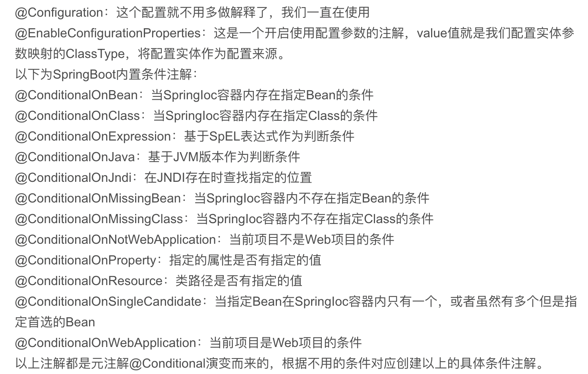

## SpringBoot

- #### **Springboot 优点**

  1. 创建独立的Spring应用
  2. 嵌入式Tomcat，Jetty，undertow服务
  3. 自动装配Spring
  4. 提供生成就绪功能，指标，健康检测，外部配置
  5. 无XML配置

- #### **Springboot自动装配**

  > @SpringBootApplication 注解
  >
  >  
  >
  > - **@SpringBootConfiguration & @Component  & @Bean**
  >
  >   > ~~~java
  >   > public @interface Configuration {
  >   >     @AliasFor(annotation = Component.class)
  >   >     String value() default "";
  >   >     // Configuration中Bean开启CGLIB代理（反射创建对象并放到IOC容器中）
  >   >     boolean proxyBeanMethods() default true;
  >   > }
  >   > 
  >   > //使用new方式创建组件，使用时创建
  >   > public @interface Component {
  >   >     String value() default "";
  >   > }
  >   > 
  >   > // initMethod、destroyMethod 钩子方法
  >   > public @interface Bean {
  >   >     @AliasFor("name")
  >   >     String[] value() default {};
  >   >     @AliasFor("value")
  >   >     String[] name() default {};
  >   >     boolean autowireCandidate() default true;
  >   >     String initMethod() default "";
  >   >     String destroyMethod() default "(inferred)";
  >   > }
  >   > 
  >   > ~~~
  >   >
  >   > ---
  >   >
  >   > @Component ，@controller，@repository，@service 功能相同，标识为扫描类
  >   >
  >   > ---
  >   >
  >   > org.springframework.context.annotation.ConfigurationClassPostProcessor处理@Configuation注解
  >   >
  >   > ---
  >   >
  >
  >
  > - **@EnableAutoConfiguration 自动读取配置**
  >
  >   > ~~~java
  >   > @AutoConfigurationPackage
  >   > @Import({AutoConfigurationImportSelector.class})
  >   > public @interface EnableAutoConfiguration {
  >   >  String ENABLED_OVERRIDE_PROPERTY = "spring.boot.enableautoconfiguration";
  >   >  Class<?>[] exclude() default {};
  >   >  String[] excludeName() default {};
  >   > }
  >   > // AutoConfigurationPackage 使用SpringBoot自动配置，用来将主配置类所在包及其子包中的类加载到Spring容器 
  >   > // Registrar实现register接口 通过BeanDefinitionRegistry进行注册
  >   > @Import({Registrar.class})
  >   > public @interface AutoConfigurationPackage {
  >   >  String[] basePackages() default {};
  >   >  Class<?>[] basePackageClasses() default {};
  >   > }
  >   > 
  >   > 
  >   > //加载第三方依赖
  >   > public class AutoConfigurationImportSelector {
  >   > 
  >   > }
  >   > ~~~
  >   >
  >   >  
  >   >
  >   > spring.factories 第三方配置信息
  >   >
  >   > 装配条件
  >   >
  >   > 
  >   >
  >   >  [Springboot 自动装配](https://www.cnblogs.com/loongk/p/11973642.html)
  >
  > - **@ComponentScan 自动扫描组件**
  >
  >   > 根据定义的扫描路径，把符合扫描规则的类装配到IOC容器中
  >   >
  >   > ~~~java
  >   > @Retention(RetentionPolicy.RUNTIME)
  >   > @Target({ElementType.TYPE})
  >   > @Documented
  >   > public @interface ComponentScans {
  >   >     ComponentScan[] value();
  >   > }
  >   > 
  >   > public @interface ComponentScan {
  >   >     @AliasFor("basePackages")
  >   >     String[] value() default {};
  >   > 
  >   >     @AliasFor("value")
  >   >     String[] basePackages() default {};
  >   > 
  >   >     Class<?>[] basePackageClasses() default {};
  >   > 
  >   >     Class<? extends BeanNameGenerator> nameGenerator() default BeanNameGenerator.class;
  >   > 
  >   >     Class<? extends ScopeMetadataResolver> scopeResolver() default AnnotationScopeMetadataResolver.class;
  >   > 
  >   >     ScopedProxyMode scopedProxy() default ScopedProxyMode.DEFAULT;
  >   > 
  >   >     String resourcePattern() default "**/*.class";
  >   > 
  >   >     boolean useDefaultFilters() default true;
  >   > 
  >   >     ComponentScan.Filter[] includeFilters() default {};
  >   > 
  >   >     ComponentScan.Filter[] excludeFilters() default {};
  >   > 
  >   >     boolean lazyInit() default false;
  >   > 
  >   >     @Retention(RetentionPolicy.RUNTIME)
  >   >     @Target({})
  >   >     public @interface Filter {
  >   >         FilterType type() default FilterType.ANNOTATION;
  >   > 
  >   >         @AliasFor("classes")
  >   >         Class<?>[] value() default {};
  >   > 
  >   >         @AliasFor("value")
  >   >         Class<?>[] classes() default {};
  >   > 
  >   >         String[] pattern() default {};
  >   >     }
  >   > }
  >   > 
  >   > ~~~
  >   >
  >   > basePackage 与value 指定路径扫描
  >   >
  >   > useDefaultFilters ：是否开启对component repository server 扫描
  >   >
  >   > includeFilter：扫描过滤条件
  >
  > - Springboot 配置文件优先级加载
  >
  >   > - 命令行参数
  >   > - 来自java:comp/env的JNDI属性
  >   > - Java系统属性（System.getProperties())
  >   > - 操作系统环境变量
  >   > - RandomValuePropertySource 
  >   > - Jar 包外部的 application-{profile}.properties
  >   > - Jar 包内的 application-{profile}.properties
  >   > - Configuration上的@PropertySource
  >   > - SpringApplication.setDefaultProperties指定的默认属性
  >
  > 
  
  

