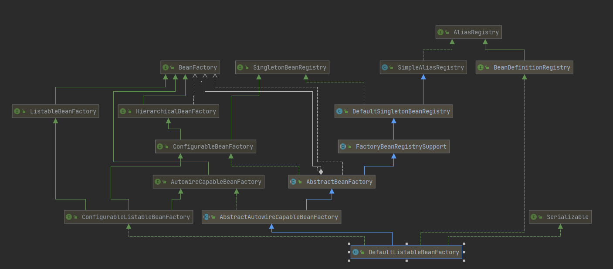
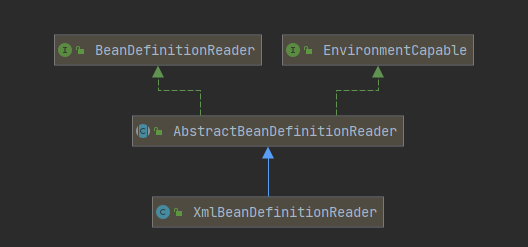

## Spring的结构组成

- **Beans**

  > **DefaultListableBeanFactory** ：负责bean的加载与注册
  >
  >  
  >
  > **XmlBeanDefinitionReader：**负责XML配置文件读取
  >
  >  
  >
  > 

- #### **容器的基础XmlBeanFactory**

- #### **XML验证模式**

- #### **BeanDefinitions解析及注册**

- 