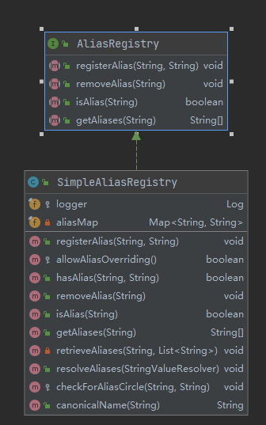

## Beans

> __DefaultListableBeanFactory__
>
> _DefaultListableBeanFactory是整个Bean加载的核心部分,Spring注册及加载Bean的默认实现_
>
> > AliasRegistry : 定义标签的增删改
> >
> > SimpleAliasRegistry: 对AliasRegistry实现(__使用map作为alias缓存__) 
> >
> > SingletonBeanRegistry: 定义单例的注册及获取
> >
> > __BeanFactory:定义获取bean及bean的各种属性__
> >
> >  
> >
> > 
>
> 
>
> __XmlBeanDefinitionReader__
>
> _资源文件读取,解析及注册_
>
> ResourceLoader 定义资源加载器(根据给定的资源文件地址返回对应的Resource)
>
> BeanDefinitionReader:定义资源文件读取并转为BeanDefinition
>
> EnvironmentCapable:  应用程序运行的环境
>
>  
>
> 
>
> **XmlBeanFactory**
>
> _获取xml配置流->校验xml约束->转换Document->解析及注册(BeanDefinition)_
>
> ~~~java
> // 解析Element 并注册Bean
> protected void doRegisterBeanDefinitions(Element root) {
> 		BeanDefinitionParserDelegate parent = this.delegate;
> 		this.delegate = createDelegate(getReaderContext(), root, parent);
> 
> 		if (this.delegate.isDefaultNamespace(root)) {
> 			String profileSpec = root.getAttribute(PROFILE_ATTRIBUTE);
> 			if (StringUtils.hasText(profileSpec)) {
> 				String[] specifiedProfiles = StringUtils.tokenizeToStringArray(
> 						profileSpec, BeanDefinitionParserDelegate.MULTI_VALUE_ATTRIBUTE_DELIMITERS);
> 				if (!getReaderContext().getEnvironment().acceptsProfiles(specifiedProfiles)) {
> 					if (logger.isDebugEnabled()) {
> 						logger.debug("Skipped XML bean definition file due to specified profiles [" + profileSpec +
> 								"] not matching: " + getReaderContext().getResource());
> 					}
> 					return;
> 				}
> 			}
> 		}
> 
> 		preProcessXml(root);
> 		parseBeanDefinitions(root, this.delegate);
> 		postProcessXml(root);
> 		this.delegate = parent;
> 	}
> ~~~
>
> 
>
> **Bean的加载**
>
> 1. _beanName 获取名字转换_
> 2. 尝试从缓存中获取已加载单例(getSingleton)  
> 3. bean实例化 (getObjectForBeanInstance)
> 4. 依赖检查 isPrototypeCurrentlyInCreation(beanName)
> 5. 寻找依赖(A依赖B,首先加载B)
> 6. scope进行bean创建
> 7. 类型转换(Spring中提供类型转换器)
>
> ~~~java
> protected <T> T doGetBean(
> 			String name, @Nullable Class<T> requiredType, @Nullable Object[] args, boolean typeCheckOnly)
> 			throws BeansException {
> 		String beanName = transformedBeanName(name);
> 		Object beanInstance;
> 		// Eagerly check singleton cache for manually registered singletons.
>       
> 		Object sharedInstance = getSingleton(beanName);
> 		if (sharedInstance != null && args == null) {
> 			if (logger.isTraceEnabled()) {
> 				if (isSingletonCurrentlyInCreation(beanName)) {
> 					logger.trace("Returning eagerly cached instance of singleton bean '" + beanName +
> 							"' that is not fully initialized yet - a consequence of a circular reference");
> 				}
> 				else {
> 					logger.trace("Returning cached instance of singleton bean '" + beanName + "'");
> 				}
> 			}
> 			beanInstance = getObjectForBeanInstance(sharedInstance, name, beanName, null);
> 		}
> 
> 		else {
> 			// Fail if we're already creating this bean instance:
> 			// We're assumably within a circular reference.
> 			if (isPrototypeCurrentlyInCreation(beanName)) {
> 				throw new BeanCurrentlyInCreationException(beanName);
> 			}
> 
> 			// Check if bean definition exists in this factory.
> 			BeanFactory parentBeanFactory = getParentBeanFactory();
> 			if (parentBeanFactory != null && !containsBeanDefinition(beanName)) {
> 				// Not found -> check parent.
> 				String nameToLookup = originalBeanName(name);
> 				if (parentBeanFactory instanceof AbstractBeanFactory) {
> 					return ((AbstractBeanFactory) parentBeanFactory).doGetBean(
> 							nameToLookup, requiredType, args, typeCheckOnly);
> 				}
> 				else if (args != null) {
> 					// Delegation to parent with explicit args.
> 					return (T) parentBeanFactory.getBean(nameToLookup, args);
> 				}
> 				else if (requiredType != null) {
> 					// No args -> delegate to standard getBean method.
> 					return parentBeanFactory.getBean(nameToLookup, requiredType);
> 				}
> 				else {
> 					return (T) parentBeanFactory.getBean(nameToLookup);
> 				}
> 			}
> 			if (!typeCheckOnly) {
> 				markBeanAsCreated(beanName);
> 			}
> 			StartupStep beanCreation = this.applicationStartup.start("spring.beans.instantiate")
> 					.tag("beanName", name);
> 			try {
> 				if (requiredType != null) {
> 					beanCreation.tag("beanType", requiredType::toString);
> 				}
> 				RootBeanDefinition mbd = getMergedLocalBeanDefinition(beanName);
> 				checkMergedBeanDefinition(mbd, beanName, args);
> 
> 				// Guarantee initialization of beans that the current bean depends on.
> 				String[] dependsOn = mbd.getDependsOn();
> 				if (dependsOn != null) {
> 					for (String dep : dependsOn) {
> 						if (isDependent(beanName, dep)) {
> 							throw new BeanCreationException(mbd.getResourceDescription(), beanName,
> 									"Circular depends-on relationship between '" + beanName + "' and '" + dep + "'");
> 						}
> 						registerDependentBean(dep, beanName);
> 						try {
> 							getBean(dep);
> 						}
> 						catch (NoSuchBeanDefinitionException ex) {
> 							throw new BeanCreationException(mbd.getResourceDescription(), beanName,
> 									"'" + beanName + "' depends on missing bean '" + dep + "'", ex);
> 						}
> 					}
> 				}
> 				// Create bean instance.
> 				if (mbd.isSingleton()) {
> 					sharedInstance = getSingleton(beanName, () -> {
> 						try {
> 							return createBean(beanName, mbd, args);
> 						}
> 						catch (BeansException ex) {
> 							// Explicitly remove instance from singleton cache: It might have been put there
> 							// eagerly by the creation process, to allow for circular reference resolution.
> 							// Also remove any beans that received a temporary reference to the bean.
> 							destroySingleton(beanName);
> 							throw ex;
> 						}
> 					});
> 					beanInstance = getObjectForBeanInstance(sharedInstance, name, beanName, mbd);
> 				}
> 
> 				else if (mbd.isPrototype()) {
> 					// It's a prototype -> create a new instance.
> 					Object prototypeInstance = null;
> 					try {
> 						beforePrototypeCreation(beanName);
> 						prototypeInstance = createBean(beanName, mbd, args);
> 					}
> 					finally {
> 						afterPrototypeCreation(beanName);
> 					}
> 					beanInstance = getObjectForBeanInstance(prototypeInstance, name, beanName, mbd);
> 				}
> 
> 				else {
> 					String scopeName = mbd.getScope();
> 					if (!StringUtils.hasLength(scopeName)) {
> 						throw new IllegalStateException("No scope name defined for bean '" + beanName + "'");
> 					}
> 					Scope scope = this.scopes.get(scopeName);
> 					if (scope == null) {
> 						throw new IllegalStateException("No Scope registered for scope name '" + scopeName + "'");
> 					}
> 					try {
> 						Object scopedInstance = scope.get(beanName, () -> {
> 							beforePrototypeCreation(beanName);
> 							try {
> 								return createBean(beanName, mbd, args);
> 							}
> 							finally {
> 								afterPrototypeCreation(beanName);
> 							}
> 						});
> 						beanInstance = getObjectForBeanInstance(scopedInstance, name, beanName, mbd);
> 					}
> 					catch (IllegalStateException ex) {
> 						throw new ScopeNotActiveException(beanName, scopeName, ex);
> 					}
> 				}
> 			}
> 			catch (BeansException ex) {
> 				beanCreation.tag("exception", ex.getClass().toString());
> 				beanCreation.tag("message", String.valueOf(ex.getMessage()));
> 				cleanupAfterBeanCreationFailure(beanName);
> 				throw ex;
> 			}
> 			finally {
> 				beanCreation.end();
> 			}
> 		}
> 
> 		return adaptBeanInstance(name, beanInstance, requiredType);
> 	}
> ~~~
>
> __FactoryBean接口__
>
> >  
> >
> > getObject() 返回FactoryBean中创建bean的实例,isSingleton()返回true 则实例会放到Spring容器单例缓存池中
> >
> > getObjectType() 返回FactoryBean创建bean类型

