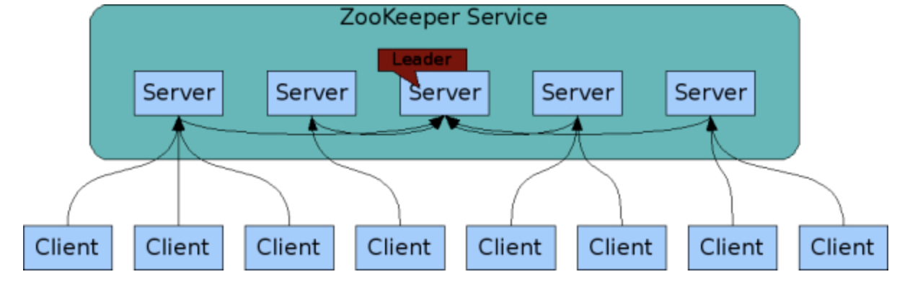
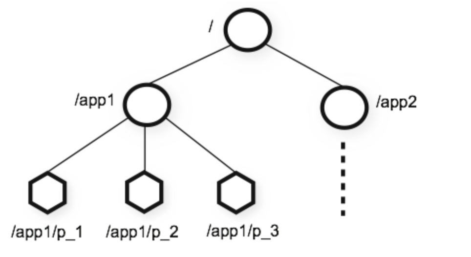

##Zookeeper

- Zookeeper 概述

> ZK功能
>
> 1. 统一注册服务（支持节点检查，替换，更新）
> 2. 分布式锁（分布式数据运算，保证数据一致性）
> 3. 配置管理（集群下配置文件统一管理）
> 4. 节点故障修复（leader选举）
>
> ZooKeeper 被设计用来存储协调数据：状态信息、配置、位置信息等，所以每个节点存储的数据通常很小，在字节到千字节的范围内。
>
> zk 集群连接方式（zk节点之间星状拓扑通信）
>
> 
>
>  zk数据模型和分层命名空间
>
>  
>
> - 节点与临时节点
>
>   > zk命名空间中每个节点都可以拥有与其管理的数据及子节点。
>   >
>   > 1. Znode 数据结构包含数据更改，ACL权限更改和时间戳版本号（每次 znode 的数据更改时，版本号都会增加）
>   > 2. 临时节点（只在一次会话中有效）
>
> - 有条件的更新和监视
>
> > **客户端可以在 znode 上设置监视。**当 znode 发生变化时，watch 将被触发并移除。当 watch 被触发时，客户端会收到一个数据包，说明 znode 已更改。如果客户端和其中一个 ZooKeeper 服务器之间的连接断开，客户端将收到本地通知。
>
> - ZK 保证
>
>   > - 顺序一致性（**客户端的更新将按照它们发送的顺序应用**）
>   > - 原子性
>   > - 单一系统镜像（zk服务故障转移）
>   > - 可靠性（应用更新一致）
>   > - 及时性（保证应用端在一定时间范围内是最先的）

 - #### **zoo.cfg 文件**
>1. tickTime：心跳频率（单位毫秒）
>2. dataDir ：存储内存数据快照位置
>3. clientPort：监听客户端口
>4. dataLogDir：事务日志存放位置（决定zk吞吐量及性能）
>5. server.id：host:port: 集群模式下主从选举
>6. initLimit：配置Leader服务器等待Follower启动，并完成数据同步的时间（tickTime的倍数）
>7. sysncLimit：用于配置Leader服务器和Follower之间进行心跳检测的最大延时时间（tickTime倍数）
>8. snapCount：表示每进行snapCount次事务日志输出后，触发一次快照
>9. preAllocSize：用于配置Zookeeper事务日志文件预分配的磁盘空间大小（单位K)
>10.  **minSessionTimeout**/ **maxSessionTimeout**：表示会话的超时时间在
>11. maxClientCnxns：从Socket层面限制单个客户端与单台服务器之间的并发连接数，即以ip地址来进行连接数的限制。如果设置为0，表示不做任何限制。仅仅是单台客户端与单个Zookeeper服务器连接数的限制，不能控制所有客户端的连接数总和。
>12. clientPortAddress：针对多网卡的机器，允许为每个IP地址指定不同的监听端口。
>13.  fsync.warningthresholdms：用于配置Zookeeper进行事务日志fsync操作时消耗时间的报警阈值。一旦fsync操作消耗的时间大于该参数指定的值，就在日志中打印出报警日志。
>14. foreSync：用于配置Zookeeper服务器是否在提交的时候，将日志写入操作强制刷入磁盘，默认情况下，每次事务日志写入操作都会实时刷入磁盘，如果设置为“no”，则能一定程度的提高ZooKeeper的写性能，但会存在类似机器断电等安全风险。
>15. globalOutstandingLimit：默认值为1000，zookeeper.globalOutstandingLimit。用于配置ZooKeeper服务器最大请求堆积数量。在Zookeeper服务器运行的过程中，客户端会源源不断的将请求发送到服务器，为了防止服务端资源耗尽，服务端必须限制同时处理的请求数，即最大请求堆积数量。
>16. leaderServers：
>17. 默认值为yes，可选配置项为“yes”和“no”，zookeeper.leaderServes。用于配置Leader服务器是否能够接受客户端的连接，即是否允许Leader向客户端提供服务。默认情况下，Leader服务器能够接受并处理客户端的所有读写请求。在Zookeeper的架构设计中，Leader服务器主要用来进行对事务更新
>18. skipAcl：默认值为no，可选配置项为“yes”和“no”，。用于配置ZooKeeper服务器是否跳过ACL权限检查
>19. cnxTimeout：zookeeper.cnxTimeout。用于配置在Leader选举过程中各服务器之间进行TCP连接创建的超时时间。
>20. electionAlg：用于配置选择ZooKeeper进行Leader选举时所使用的算法。

- #### **Zookeeper集群配置**

> Zookpeer 集群节点必须大于3个且为奇数
>
> 1. 创建myid文件（myId文件内容为数组，表示节点编号，且与其他节点不同，id范围1~225）
> 2. 修改zoo.cfg文件 server.${myid} = ip:port:port  ip为其他ZK节点IP，第一个 port 为ZK客户端端口，第二个port端口为ZK选举leader节点
> 3. 启动各个节点ZK   ./zkServer start
> 4. 验证集群是否成功  ./zkCli.sh -server ip:port  执行命令ZNode

