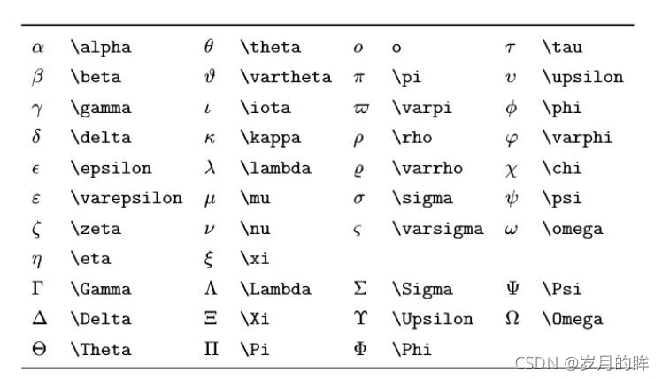
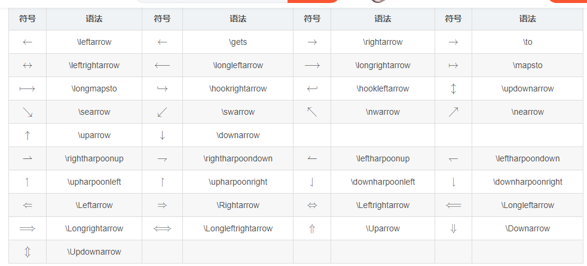
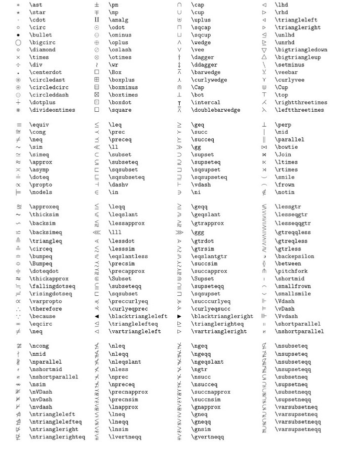
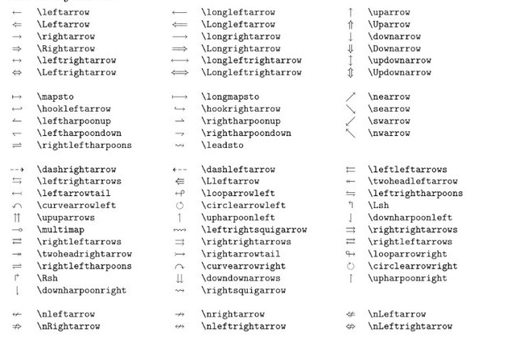
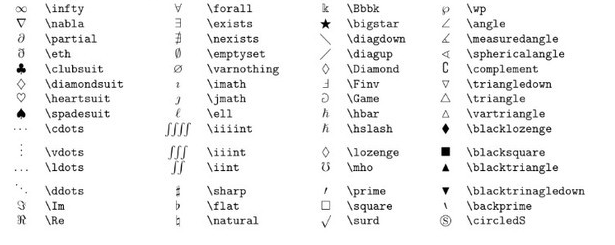

- 箭头表达

 

- Ctrl + Shift + M   编辑公式块

- 空格  \quad   \;

- 非  \lnot

- 分数表达  \frac $\frac{2}{3}$

- 矢量表达 \vec   $\vec{ab}$

- 积分表达  \iint  $\iiint_{1}^2xdx$

- 曲线积分 \oint $\oint_{C} x^2\, dx + 4y^2\, dy$ 

- 极限 \lim  infty 无穷  $\lim_{n\rightarrow+\infty}$ 

- 累乘 \prod  $\prod_{n=1}^{99}{x_n}$

- 导数 \partial $\frac{\partial ^2 z}{\partial x}|_{x=x_0}$

- 矩阵与行列式   {matrix}  {vmatrix} {bmatrix} {Bmatrix} {pmatrix}使用&分隔同行元素，\ \换行
  $$
  \begin{matrix}
  	1 & x & x^2\\
  	1 & y & y^2\\
  	1 & z & z^2\\
  	\end{matrix}
  $$

  $$
  a = \left[
  \matrix{
    \alpha_1 & test1\\
    \alpha_2 & test2\\
    \alpha_3 & test3 
  }
  \right]
  $$

  $$
  X=\left|
  	\begin{matrix}
  		x_{11} & x_{12} & \cdots & x_{1d}\\
  		x_{21} & x_{22} & \cdots & x_{2d}\\
  		\vdots & \vdots & \ddots & \vdots \\
  		x_{11} & x_{12} & \cdots & x_{1d}\\
  	\end{matrix}
  \right|
  $$

   

- 方程式  \text 表示文本  {case}
  $$
  f(n)=
  	\begin{cases}
  		n/2, & \text{if $n$ is even}\\
  		3n+1,& \text{if $n$ is odd}
  	\end{cases}
  $$

- 方程组 {array} .

$$
\left\{
	\begin{array}{c}
		a_1x+b_1y+c_1z=d_1\\
		a_2x+b_2y+c_2z=d_2\\
		a_3x+b_3y+c_3z=d_3
	\end{array}
\right.
$$

- 关系运算符

  |      运算符      |     表达式     |
  | :--------------: | :------------: |
  |      $\pm$       |      \pm       |
  |     $\times$     |     \times     |
  |     $\cdot$      |     \cdot      |
  |     $\circ$      |     \circ      |
  |      $\div$      |      \div      |
  |      $\neq$      |      \neq      |
  |     $\equiv$     |     \equiv     |
  |      $\leq$      |      \leq      |
  |      $\geq$      |      \geq      |
  |    $\forall$     |    \forall     |
  |     $\infty$     |     \infty     |
  |    $\exists$     |    \exists     |
  |     $\nabla$     |     \nabla     |
  |      $\bot$      |      \bot      |
  |     $\angle$     |     \angle     |
  |    $\because$    |    \because    |
  |   $\therefore$   |   \therefore   |
  |     $\cong$      |     \cong      |
  |      $\gg$       |      \gg       |
  |      $\ll$       |      \ll       |
  |      $\in$       |      \in       |
  |      $\ni$       |      \ni       |
  |    $\subset$     |    \subset     |
  |   $\subseteq$    |   \subseteq    |
  |    $\supset$     |    \supset     |
  |   $\supseteq$    |   \supseteq    |
  |      $\cup$      |      \cup      |
  |      $\cap$      |      \cap      |
  |        ∧         |     \land      |
  |        ∨         | \lor *or* \vee |
  |     $\lnot$      |     \lnot      |
  | $\mathscr{P}(X)$ | \mathscr{P}(X) |
  |   $\emptyset$    |   \emptyset    |
  |  $\overline{A}$  |  \overline{A}  |
  |  $\sqrt[2]{5}$   |  \sqrt[2]{5}   |
  |    $\vec{a}$     |    \vec{a}     |
  
  

