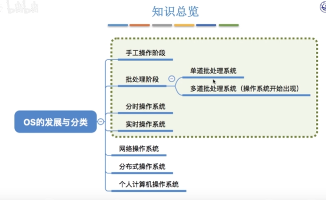

## 操作系统概述

- #### 操作系统功能与特性

>**操作系统定义**：负责管理协调硬件，软件等计算机资源工作，为上层的应用程序，用户提供简易用服务
>
>- **操作系统功能**
>   - 进程管理
>   - 存储管理
>   - 文件管理
>   - 设备管理
>    - 用户接口
>- **操作系统特性**
>   - 并发性 （多个事件在同一**时间间隔**内执行）（并行是多个事件同时发生）
>    - 共享性（系统中内存可以供多个并发进程使用，**互斥共享和同时共享**）
>     - 虚拟(空分复用技术、时分复用技术)
>     - 异步（多道环境程序下，运行多个程序并发执行，存在**资源等待阻塞**的进程）
>
- #### **操作系统体系**

>- **Windows操作系统**
>
>    -  
>
>    - 内核（提供线程调度，处理，异常处理，中断处理，供执行体使用）正在运行的线程不能优先于内核）
>
>    - 硬件抽象层（HAL）
>
>      *多硬件平台可移值性库，与各种硬件相关*
>
>    - 执行体
>
>    - 系统进程和线程 
>
>- **UNIX操作系统**
>
>    -  
>    - 内核
>    - 系统调用
>    - 应用层
>
>- **Linux操作系统**
>
>    - 内核（系统调用，内存管理，进程管理，设备驱动，文件系统，网络管理）
>    - Shell（用户与内核交互操作接口）
>    - 文件系统
>    - 应用程序
>
>- **Android操作系统**
>
>    -  
>    - Android使用Linux内核完成对硬件扩展

#### **操作系统发展**

>  
>
> 1. 手工操作阶段（用户独占全机，资源利用率极低）
> 2. 批处理阶段
>    - 单道批处理系统（新存储技术磁带引用）
>    - 多道批处理系统（读入多道程序，使用**中断技术**，**操作系统**，无人机交互功能，响应用户时间长）
> 3. 分时操作系统（以时间片轮询方式服务，提供终端控制作业执行）
> 4. 实时操作系统（在严格时间内完成）

**操作系统结构**

> 1. 整体式结构
>    1. 将整体划分为模块，模块之间相互调用（组合）
> 2. 层次式结构
>    1. 使用置顶向上或者向下设计功能层级，**只有相邻层级**之间存在依赖
> 3. 微核（客户/服务器)
>    1. 运行内核
>    2. 以客户，服务器方式进行的进程

