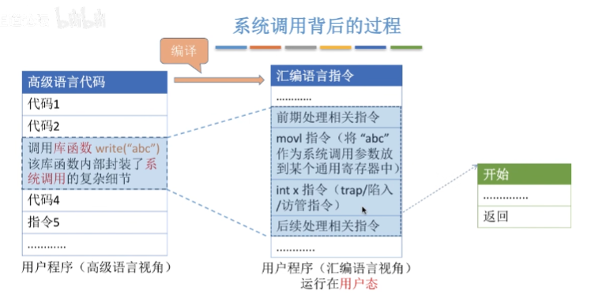

## 操作系统运行环境

 

#### **处理器**
>
>**处理器组成**
>
>1. 运算器（处理器核心，负责算数运算与逻辑运算）
>
>2. 控制器（负责程序运行流程，取值，维护处理器状态，处理器与内存交互）
>
>3. 寄存器（存储处理器计算结果，地址及指令信息）
>
>   - 用户寄存器（程序可用，减少内存访问次数，使程序运行速度最大化）
>
>   - 数据寄存器（存储算数逻辑指令和访存方式）
>   - 地址寄存器（存储物理地址，线性地址，有效地址）
>   - 条件码寄存器（结果标记位，异常，中断标记位）
>   - 控制、状态寄存器
>4. 高速缓存
>
>
>
>**指令执行过程（单个指令周期）**
>
>1. 处理器从存储器中读入指令
>2. 程序计数器指向下一条指令地址
>3. 将指令存入寄存器
>4. 处理器解析并执行这条指令
>
>
>
>**处理器状态**
>
>- 管态：能够访问所有系统资源和指令（操作系统内核）
>- 目态：访问有限的系统资源和指令（应用程序和用户进程）
>
>
>
>**内核程序**
>
>- 中断处理程序
>- 系统调用
>- 进程调度程序
>- 设备驱动程序
>- 文件系统
>- 时钟管理（计时功能）
>- 原语（设备驱动，CPU切换任务，接近硬件，具有原子性不能被中断）
>
> 
>
>
>
>**程序状态字（PSW）**：存储和反映当前程序执行时的处理器状态信息
>
> - PC(程序计数器)：指向程序中当前正在执行的指令的内存地址
>- CPU状态码（标识处于管态还是目态）
>- 条件码（标志位）：记录最近执行指令的结果状态
> 1. ZF：零标志位
> 2. CF：进位
>  3. SF：符号标志
>  4. OF：出标志
>  5. PF：奇偶标志
> - 中断屏蔽码：是否允许外部中断或者特定类型的中断
> 
>**内核与微核对比**
>
>- 内核：集中式管理计算机硬件和软件资源。所有服务都在管态下运行，对硬件直接的访问，性能更高；内核中的任何错误或漏洞都可能使整个系统崩溃，难以扩展：添加新功能或修改现有功能需要修改内核代码
>- 微核：将内核功能组件服务化，通过消息传递机制与多个微核交互，大多数服务运行在用户态，性能比内核低；可扩展性与模块化强
>
>
>
>**系统调用：** 操作系统提供应用程序使用的接口（应用程序调用的特殊函数），**所有应用程序获得计算机资源时，必须先通过操作系统请求进行协调管理**。
>
> 
>
>**系统调用，库函数，内核函数关系**
>
>- 系统调用：用户与操作系统内核之间交互的接口（中断机制来切换到内核）
>- 库函数：由程序调用，不是操作系统的一部分
>- API：API 通常是系统调用更高级别的抽象，不直接涉及操作系统内核
>- 内核函数：硬件与操作系统之间交互（应用程序无法直接调用内核函数）
>
> 

- #### **系统硬件**

  > 存储系统
  >
  > - RAM：随机存取存储器（断电数据丢失，可反复读写）
  >
  > - ROM：只读存储器
  >
  >   
  >
  > 存储保护
  >
  > - 界地址存储器（通过内存上下限限制程序存取内存范围）
  >
  > - 层次结构（容量，成本，速度【访问局部性原理时提高存储耗能关键】）
  >
  > 
  >
  > **I/O部件**（处理器与外部设备控制）
  >
  > - 通道：控制外部设备与内存数据交互，以事件中断方式通知CPU进行相应操作
  > - DMA技术：允许外围设备直接与计算机内存交互，而无需 CPU 干预
  > - 缓存技术（解决输入速度与处理器速度不一致问题）
  >
  > - 时钟部件
  
- #### **中断机制**

  > **中断**：用于暂停正在运行的进程并跳转到特殊代码（中断处理程序）以响应外部事件
  >
  > 1. 中断处理程序：负责响应特定中断
  > 2. 进程调度器：保存其当前状态（PSW）并切换到中断处理程序（**目态转为管态**）
  > 3. 中断屏蔽： 在处理中断时根据优先级判定是否继续中断
  > 4. 中断返回：返回到程序进程（管态转为目态）
  >
  > 
  >
  > 常见的中断：
  >
  > - 硬件中断
  >   1. 时钟中断（计数器达到预设值时触发，用于调度任务）
  >   2. 外部设备事件或异常中断
  > - 异常中断
  >   1. 软件中断（程序bug，调用系统资源）
  >   2. 断言中断（程序无法获得对应条件导致中断）
  > - 内中断（中断信号来源于当前执行指令和CPU内部）
  > - 外中断（中断信号来源于其他进程）
  >
  > 
  >
  > 
  >
  > **中断分类**
  >
  > - 多级中断优先级作用
  >   1. 对各类中断信号依据紧急程度和重要级别划分等级
  >   2. 优先处理中断事件
  >      - 固定优先树
  >      - 轮转发（依次响应）
  > - 中断屏蔽
  >   - 延后处理（保存在寄存器中）
  >   - 直接丢弃
  > - 中断嵌套
  >   - 多个中断事件处理
  >     1. **在中断过程中，对新发生的中断延迟到下一周期处理**
  >     2. 多层嵌套，在中断过程中，优先级高的事件可以打断只在执行优先级低的中断
  >     
  >     

  
