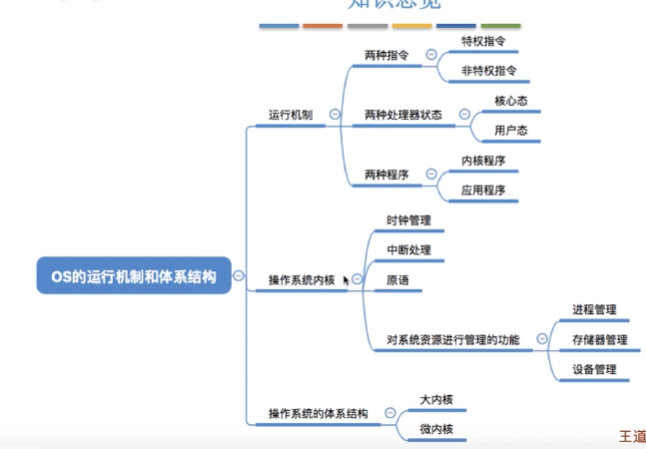

## 操作系统运行环境

 

#### **处理器**
>
>**处理器组成**
>
>1. 运算器（处理器核心，负责算数运算与逻辑运算）
>2. 控制器（负责程序运行流程，取值，维护处理器状态，处理器与内存交互）
>3. 寄存器（存储处理器计算结果，地址及指令信息）
>   - 用户寄存器（程序可用，减少内存访问次数，使程序运行速度最大化）
>     - 数据寄存器（存储算数逻辑指令和访存方式）
>     - 地址寄存器（存储物理地址，线性地址，有效地址）
>     - 条件码寄存器（结果标记位，异常，中断标记位）
>   - 控制、状态寄存器
>4. 高速缓存
>
>**指令执行过程（单个指令周期）**
>
>1. 处理器从存储器中读入指令
>2. 程序计数器指向下一条指令地址
>3. 将指令存入寄存器
>4. 处理器解析并执行这条指令
>
>---
>
>**程序状态字（PSW）**
>
>*表示处理器当前的工作状态*
>
>- PSW 
>  1. CPU的工作状态码（标识处于管态还是目态）
>  2. 条件码（执行指令后结果特征）
>  3. 中断屏蔽码（是否运行中断）
>- PC(程序计数器)
>
>---
>
>**处理器状态**
>
>*处理器依据运行程序资源和机器指令的使用权将处理器设置为不同状态*
>
>- 管态：能执行特权指令
>- 目态：只能执行非特权指令
>- 目态到管态转换：中断
>- 管态到目态转换：PSW指令（修改程序状态字）
>
>---
>
>**内核程序**
>
>- 时钟管理（计时功能）
>- 中断系统
>- 原语（设备驱动，CPU切换任务，接近硬件，具有原子性不能被中断）
>
> 

- #### **系统硬件**

  > *处理器唯一能直接访问内存，任何程序和数据都必须装载入内存，处理器才能操作*
  >
  > - **存储系统**
  >
  >   - 类型
  >
  >     1. RAM 随机**存取**的程序数据
  >     2. ROM 只读存储器
  >
  >   - 存储保护
  >
  >     ​	界地址存储器（通过内存上下限限制程序存取内存范围）	
  >
  > - **I/O部件**
  >
  >   - I/O构造 
  >  - 通道（控制**外部设备与内存数据交互**，当外部设备结束工作后以事件中断方式通知CPU进行相应操作）
  >   - DMA技术（直接存储器访问）自动控制内存与I/O单元数据块，处理器控制DMA单元，由DMA单元与设备I/O进行数据交互
  >   - 缓存技术（解决输入速度与处理器速度不一致问题）
  > 
  > - **时钟部件**
  >
  >   1. **处理系统死循环，访问机时浪费**
  >  2. 在分时系统中，安装时间间隔轮询作业
  >   3. 实时系统中，按时间间隔输入输出作业
  >   4. 定时唤醒指定的事件
  >   5. 记录时间发生时间和时间间隔
  > 
  >   硬件时钟主要通过**晶体振荡器**每间隔一定时间产生的脉冲频率，软件时钟利用**内存单元模拟时钟计数器**
  >
  >   - 绝对时间（不会被终止，同时使用公历时间显示）
  >  - 相对时间（计数器中计数间隔）
  
- #### **中断机制**

  > **中断**：处理器对系统中或系统外发生的**异步事件的响应**(_异步事件是指无一定时序关系的随机发生事件_)
  >
  > > 1. 中断发生时，CPU立即进入**核心态**
  > > 2. 中断发生后，**当前运行的进程暂停**，并由**操作系统内核对中断进行处理**，CPU从目态转换为管态
  > > 3. 不同中断信号，CPU进行不同处理
  > > 4. 中断是将CPU从目态转为管态的唯一途径
  >
  > **中断与异常分类**
  >
  > - **内中断（中断信号来源于当前执行指令和CPU内部）**
  >   1. 系统调用
  >   4. 硬件故障中断
  >   3. 程序异常终止
  > - **外中断（中断信号来源于其他进程）**
  >   1. 外设请求
  >   2. 人工干预
  >
  > 
  >
  > **外中断处理过程：**
  >
  > 1. CPU执行指令后，检查是否存在外部中断信号
  > 2. 存在外部中断信号，保护被中断进程的CPU环境（PSW）
  > 3. 根据中断信号转入操作系统处理（**目态转为管态**）
  > 4. 操作系统恢复原进程作业（管态转为目态）
  >
  > ---
  >
  > **中断分类**
  >
  > - 多级中断优先级作用
  >   1. 对各类中断信号依据紧急程度和重要级别划分等级
  >   2. 优先处理中断事件
  >      - 固定优先树
  >      - 轮转发（依次响应）
  > - 中断屏蔽
  >   - 延后处理（保存在寄存器中）
  >   - 直接丢弃
  > - 中断嵌套
  >   - 多个中断事件处理
  >     1. **在中断过程中，对新发生的中断延迟到下一周期处理**
  >     2. 多层嵌套，在中断过程中，优先级高的事件可以打断只在执行优先级低的中断

- #### **系统调用与库函数**

> **系统调用：** 操作系统提供应用程序使用的接口（应用程序调用的特殊函数），**所有应用程序获得计算机资源时，必须先通过操作系统请求进行协调管理**。
>
> ---
>
> **常用的系统调用（管态运行）**
>
> - 设备管理
> - 文件操作系统（读写文件）
> - 进程通讯类系统（进程之间数据共享）
> - 进程控制
> - 内存管理
>
> ---
>
> **系统调用与程序调用区别**
>
>   
>
> **系统调用过程**
>
>  
>
> 1. 传递系统调用参数
> 2. 执行陷入指令（**内中断，由目态变为管态**）
> 3. 执行系统调用相应服务（管态）
> 4. 返回用户进程

