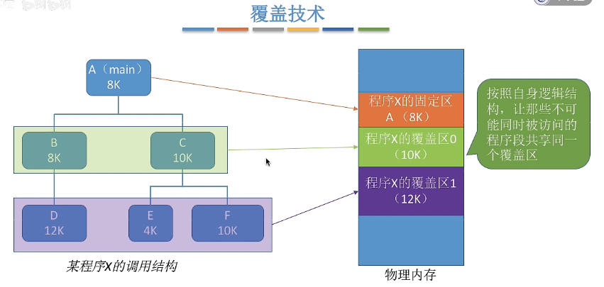
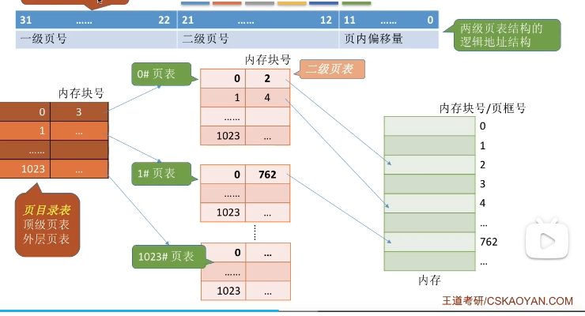
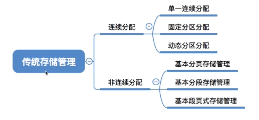
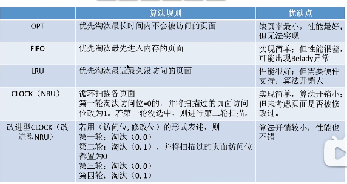
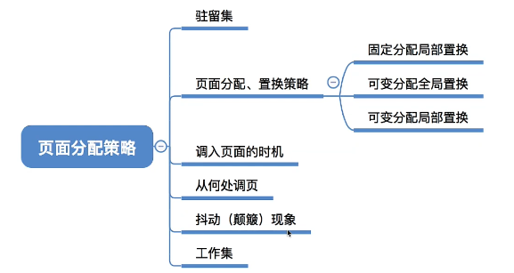

## 存储管理

- #### **概述**

  > 物理地址：内存中实际存储单元地址
  >
  > 逻辑地址：（相对地址）：指令地址
  >
  > 编译：将告警语言翻译为机器语言
  >
  > 装载：将程序从外存载入内存中运行
  >
  > 装载方式：
  >
  > - 绝对装入（编译时产生物理地址的指令）
  > - 静态重定位（依据当前内存情况，将**相对地址重定位到物理地址**，作业进入内存，在运行期间不能移动）
  > - **动态重定位**（将地址转换推迟到程序执行时进行，CPU进行转换）
  >
  > 程序运行步骤：
  >
  > 1. 编辑源代码文件
  > 2. 编译
  > 3. 链接
  > 4. 装入

- #### **内存管理**

  > 地址转换（装载方式）
  >
  > 分配与回收
  >
  > 内存扩充
  >
  > 内存共享
  >
  > 内存保护（进程不越界访问内存）
  >
  > > **设置上下限寄存器**
  > >
  > > **利用重定位寄存器，界地址寄存器判断**

- #### **内存空间扩充**

  >  _解决程序大小超过物理内存总和问题_
  >
  > - **覆盖技术** 
  >
  >   > 将程序分为多个段(模块)，将需要常住内存的段放入固定区，将不常用的段放在覆盖区，**需要运行时调入内存**
  >   >
  >   >   
  >   >
  >   > *必须由程序员声明覆盖结构，操作系统自动完成覆盖，对用户不透明**
  >
  > - **交换技术** 
  >
  >   > 内存空间不足时，将某些进程暂时换出外存，把外存中具备允许条件的进程换入内存（内存调度）
  >   >

#### **内存空间分配与回收**

> - **连续分配管理方式（进程使用连续的空间）**
>
>   > **单一连续分配**：系统内存分为用户区和系统区，用户进程独占用户区且只能有一道程序运行，无内存碎片，存储器利用低。
>   >
>   > 
>   >
>   > **固定分区分配：** 等额，非等额切分内存，并建立分区说明表（分区大小，起始位置，状态）
>   >
>   > 
>   >
>   > **动态分区分配：** 可变分区分配，不会预先划分内存空间，根据进程的大小动态建立分区（分区的大小正好合适进程的需要，无内部碎片）
>   >
>   > ​	内部碎片：分配给进程的内存区域中存在部分没用上
>   >
>   > ​	外部碎片：内存中某些空闲的分区太小难以使用
>   >
>   >  
>   >
>   >  **动态分区分配算法：** _解决多个空闲分区满足需求是，选择那个分区进行分配_
>   >
>   > 1. 首次适应算法（按**低地址排序**查询，找到第一个满足大小的空闲区）
>   >
>   > 2. 最佳适应算法（按**容量递增**链接，每次分配内存时按内存大小顺序查找空闲分区链）
>   >
>   >    > 会产生很多外部碎片
>   >
>   > 3. 最大适应算法（按**容量递减**链接，每次分配内存时查找第一个满足要求的分区）
>   >
>   >    > 存在大进程无法使用内存空间
>   >
>   > 4. 邻近适应算法（按低地址排序，每次分配内存时从上次分配地址查找）
>   >
>   >   
>
> **非连续分配管理方式（进程使用离散的空间）**
>
>   > **分页存储管理方式：** _将内存空间分为一个大小相等的分区_
>   >
>   > > **页：** 将程序的逻辑空间分为一些**大小相同的片段**
>   > >
>   > > **物理块：** 内存空间分为与**页大小相同**的片段
>   > >
>   > > **页表：**__记录页到物理块的关系映射集合__，**每一个进程都提供一个页表放在PCB中**
>   > >
>   > > **动态地址转变**
>   > >
>   > > >地址结构：逻辑地址包含页号p，页内位移量v（页内地址）
>   > > >
>   > > >​                   物理地址分解为物理块号b，和物理块内位移量v
>   > > >
>   > > >p = 逻辑地址 / **页面长度**
>   > > >
>   > > >v = 逻辑地址 % **页面长度**
>   > >
>   > > **基本地址变换机构**
>   > >
>   > > > PTR：页表寄存器（**存放页表在内存中启起始地址F和页表长度M**）
>   > > >
>   > > > 页表项：记录页与内存块的映射关系
>   > > >
>   > > > 页表长度：页表记录长度
>   > > >
>   > > > 页表项长度：页表项占用的存储空间
>   > > >
>   > > > ---
>   > > >
>   > > > **逻辑地址A到物理地址E转变过程** (L为页面长度)
>   > > >
>   > > > 1. 计算逻辑地址页号p和页内偏移量v
>   > > > 2. 比较页号p和**页表长度M**，P>=M 则越界中断
>   > > > 3. 页表中页号p对应的**页表项地址=起始地址F + 页号P * 页表项长度**，通过页表项获取内存块号b
>   > > > 4. E = b * L +v
>   > > >
>   > > >  **确定页面长度，逻辑地址**，系统可以自动计算出页号，页内偏移量
>   > > >
>   > > > 
>   > >
>   > > **块表(TLB)**   _联想寄存器，加快对**页表项**访问速度_
>   > >
>   > > > *通过加快页表的访问，以加速地址转换的过程，与此对应，内存中的页表称为慢表*
>   > > >
>   > > > 最近使用过的页表项会放入块表（充当缓存）
>   > > >
>   > > > ---
>   > > >
>   > > > 时间局部性：程序中某条指令在短时间内多次访问
>   > > >
>   > > > 空间局部性：连续访问内存地址相邻的指令
>   > >
>   > > **两级页表**
>   > >
>   > > > 单级页表问题
>   > > >
>   > > > 1. 页表必须连续存放，因此页表很大时，需要占用多个连续的物理块
>   > > > 2. 没有必要让整个页表常住内存
>   > > >
>   > > > ---
>   > > >
>   > > > 页目录表：将之前的页表以一定范围进行分组
>   > > >
>   > > >   
>   > > >
>   > > > 采用多级页表机制，则各级页表大小不能超过一个页面
>   >
>   > ---
>   >
>   > **分段存储管理方式**
>   >
>   > > 分段：按照**程序自身逻辑关系**划分为若干个段，每个段都有段名，**每段从0开始编址**，分配内存时以段位单位进行分配，**每个段在内存中占据连续空间，各段之间可以不相邻**
>   > >
>   > >  
>   > >
>   > > **段表：** 记录段号，段长，基址映射关系集合
>   >
>   > ---
>   >
>   > 分页与分段对比
>   >
>   > 1. 页为信息的物理单位，分页主要是实现内存的离散分配，提高内存利用率，是操作系统进行控制，对用户不可见
>   > 2. 段是信息的逻辑单位，分段主要目的是为更好满足用户需求
>

#### **虚拟内存**

> *实现内存空间扩充，建立离散分配内存管理方式上*
>
>  
>
> 传统存储管理方式：（内存不够问题）
>
> - 一次性：作业必须一次性全部装入内存后运行
> - 驻留性：作业被装入内存，就会一直驻留在内存中
>
> **虚拟存储器：** 虚拟存储器具有请求调入和置换功能，能从逻辑上对内存容量进行扩充的一种存储系统
>
> ---
>
> 时间局部性：程序中某条指令在短时间内多次访问
>
> 空间局部性：连续访问内存地址相邻的指令
>
> **分页虚拟存储管理**
>
> - 页表机制：
>
>   > 1. 状态位（是否已调入内存）
>   > 2. 修改位（内存中页是否修改）
>   > 3. 访问字段（最近访问次数/时间）
>   > 4. 外存地址
>
> - 缺页中断机制（内中断）
>
>   > 进程访问的页面不在内存，操将产生一个缺页中断，此时**缺页的进程阻塞，放入阻塞队列**，调页完成后将其唤醒，放入就绪队列。
>   >
>   >  
>   >
>   >   
>   >
>   > ---
>   >
>   > **页面置换算法** （内存不足时选择页进行置换）
>   >
>   > - **OPT（最佳置换算法）**
>   >
>   >   > **每次选择最长时间内不再被访问的页面，** 缺页率 = $\frac{缺页中断次数}{页面访问次数}$
>   >   >
>   >   > ---
>   >   >
>   >   > 需要知道进程访问页面的顺序，操作系统无法预知进程访问的页面序列，**无法实现**
>   >
>   > - FIFO（先进先出)
>   >
>   >   > **每次选择淘汰的页面是最早进入内存的页面**
>   >   >
>   >   > ---
>   >   >
>   >   > Belady异常，当为进程分配的物理块数增大时，缺页次数增加，性能差
>   >
>   > - **LRU(最近最久未使用)**
>   >
>   >   > 每次淘汰页面是最近最久未使用的页面，**访问字段记录上次被访问时间**，使用逆推判断时间最早的内存块
>   >   >
>   >   > ---
>   >   >
>   >   > 实现困难，需要硬件支持，性能接近OPT算法
>   >
>   > - CLOCK（时钟置换，最近未使用算法）
>   >
>   >   > 每个页面设置访问字段记录**是否被访问**，**将内存中页面指针链接循环队列，定时替换循环队列中未被访问的页，并且将已访问的字段记录改为未被访问**
>   >   >
>   >   > 
>   >   >
>   >   > **改进后的时钟置换（优先淘汰未被访问和修改的页面）**
>   >   >
>   >   >   *(0,0)第一位表示未被访问，第二位表示未被修改*
>   >   >
>   >   > 1. 扫描查找第一个(0,0)的帧 （最近没访问且没修改的页）
>   >   > 2. 扫描查找第一个(0,1)的帧，并改变访问位为未读（最近没访问，修改的页面）
>   >   > 3. 查找(0,0)的帧 (最近访问过，但没被修改的页)
>   >   > 4. 查找(0,1)的帧（最近访问过，且已被修改的页）
>   >
>   >        

#### **页面分配策略**

>  
>
> **驻留集：**请求分页存储管理中给**进程分配的物理块集合** （操作系统为进程分配的物理块）
>
> > 驻留集过小，系统将频繁处理缺页，驻留集过大，系统资源利用率不高
> >
> > 固定分配驻留集：操作系统为每一个进程分配一块固定数目的物理块，在运行期间不在改变**(不支持全局替换)**
> >
> > 可分配驻留集：操作系统先为每一个进程分配一定数目的物理块，运行期间可以适当增加或减小
> >
> > 局部置换：进程发生缺页后只选择直接的物理块进行置换
> >
> > 全局置换：操作系统将**其他进程持有的物理块置换到外存**，在分配给缺页进程
>
> **页面分配，置换策略**
>
> > - 固定分配局部置换（需要开始确定进程分配多少物理块合理）
> > - 可变分配全局置换
> > - 可变分配局部置换
> >
> >  
>
> **调入策略**
>
> > - 预调页策略（根据局部原理，**一次调入若干个相邻的页面**，适用进程初始化时使用）
> > - 请求调页策略（进程发生缺页时，通过缺页中断调入内存，I/O开销较大）
>
> **调入位置**
>
> >   
>
> **抖动现象**
>
> > **内外存数据频繁置换，**主要原因是进程频繁访问页面数高于可用物理块数（分配给进程的物理块不够）
> >
> > **工作集：**某段时间间隔内，**进程实际访问的页面集合**（运行期间，最小使用物理块集合）
> >
> > 驻留集大小不能小于工作集大小，否则进程运行执行过程中频繁缺页（系统抖动）

