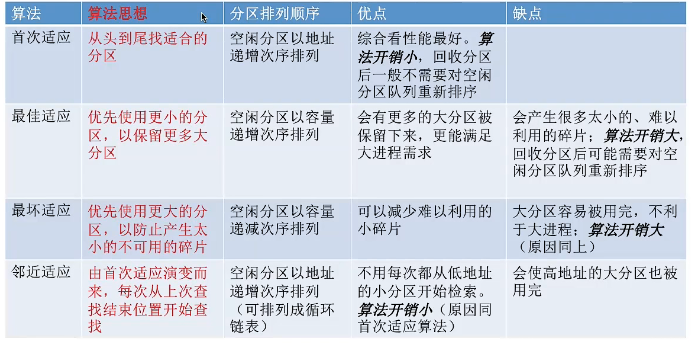
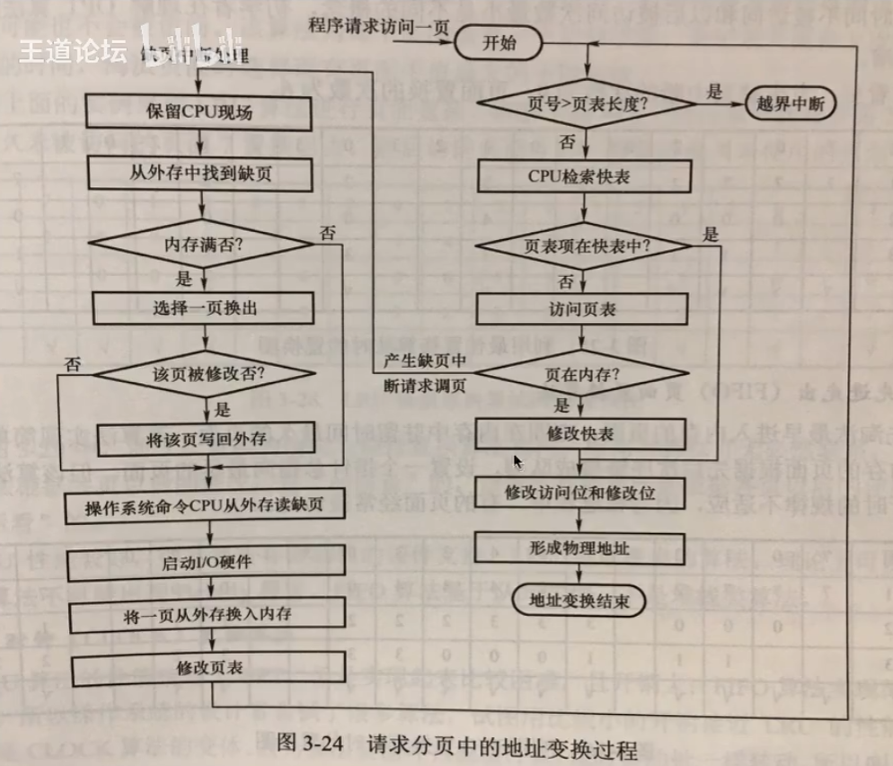

## 存储管理

- #### **概述**

  > 物理地址：内存中实际存储单元地址
  >
  > 逻辑地址：（相对地址）：指令地址
  >
  > 编译：将告警语言翻译为机器语言
  >
  > 装载：将程序从外存载入内存中运行
  >
  > 装载方式：
  >
  > - 绝对装入（编译时产生物理地址的指令）
  > - 静态重定位（依据当前内存情况，将**相对地址重定位到物理地址**，作业进入内存，在运行期间不能移动）
  > - **动态重定位**（将地址转换推迟到程序执行时进行，CPU进行转换）
  >
  
- #### **内存空间扩充**

  >  - **覆盖技术**（将不同程序或数据段加载到同一个内存地址）
  >
  >     
  >
  >   - **交换技术** ：内存空间不足时，将某些进程暂时换出外存，把外存中具备允许条件的进程换入内存（内存调度）
  >

#### **内存空间分配**

>  
>
> 
>
> **连续分配管理方式（进程使用连续的空间）**
>
> 1. 单一连续分配：用户进程独占用户区且只能有一道程序运行，无内存碎片，存储器利用低
>
> 2. 固定分区分配：等额切分内存，并建立分区说明表（分区大小，起始位置，状态）
>
> 3. 可变分区：不预先划分内存空间，根据进程的大小动态建立分区（分区的大小正好合适进程的需要，无内部碎片）
>
>    - 动态分区分配算法
>
>       
>
> **非连续分配管理方式**
>
> 1. 分页存储管理方式：将内存空间分为一个大小相等的分区
>
>    页/物理块：程序的逻辑空间和内存分为一些大小相同的片段
>
>    页表：记录页与物理块地址映射关系
>
>    地址计算：
>
>    - 逻辑地址组成：n = p + v 位二进制 ：p表示页号所占位数，v表示页内偏移所占位数
>    -  p = $n - log_2(P)$，v = $log_2(P)$    P为页面大小（单位字节）
>    - 逻辑地址A到物理地址E转变过程：页面长度，逻辑地址，计算出页号，页内偏移量
>      1. 计算逻辑地址页号$2^p-1$和页内偏移量$2^v -1$
>      2.  **物理地址=起始地址F + 页号P * 页长度 + 偏移量**，通过页表项获取内存块号b
>    - TLB快表：缓存页表中转换的地址项目
>      1. 时间局部性：程序中某条指令在短时间内多次访问
>      2. 空间局部性：连续访问内存地址相邻的指令
>    - 多级页表存储方式
>      1. 单级页表：页表占用大，需要多个连续的物理块存储；没有必要让整个页表常住内存
>      2.  
>      3. 页表项以一定范围进行分组，各级页表大小不能超过一个页面
>
> 2. 分段存储管理方式：按照程序自身逻辑关系划分为若干个段，每个段大小不同，且不连续
>    -  
>    - **段表：** 记录段号，段长，基址映射关系集合
> 3. 段页式存储管理方式：将内存先分段，在段中在进行分页
>    - 地址计算：首先根据段号查找段表，获取段的起始地址和长度，将逻辑地址中的偏移量转换为页号和页内偏移量
>
> 页式存储管理：内存管理灵活，页可以独立分配和回收，允许程序动态增长和收缩，提高内存利用率；实现相对简单；访问内存时都需要检查页表，增加了延迟；动态内存分配可能会导致碎片化，降低内存利用率；页面的固定大小限制了内存分配的粒度，导致内存浪费。
>
> 段式存储管理：内存组织灵活性，程序可以按逻辑段组织；代码共享容易：对于具有相似结构的程序，可以共享代码段，节省内存；内存管理复杂，段表维护相对复杂，需要跟踪段的长度和位置。
>
> 段页式存储管理优点：
>
> - 段的大小可以动态调整，适应不同程序的需求，避免了内存碎片问题
> - 段有独立保护机制，可以设置不同的访问权限，增强了系统的安全性
> - 通过分页机制实现了虚拟内存，提高了内存的利用率和管理效率

#### **虚拟内存**

> **虚拟存储器：** 虚拟存储器具有请求调入和置换功能，能从逻辑上对内存容量进行扩充的一种存储系统
>
> 传统存储管理方式：（内存不够问题）
>
> - 一次性：作业必须一次性全部装入内存后运行
> - 驻留性：作业被装入内存，就会一直驻留在内存中
> - 时间局部性：程序中某条指令在短时间内多次访问
> - 空间局部性：连续访问内存地址相邻的指令
>
> **分页虚拟存储管理**
>
> - 页表项：
>
>   1. 状态位（是否已调入内存）
>
>   2. 修改位（内存中页是否修改）
>
>   3. 访问字段（最近访问次数/时间）
>
>   4. 外存地址
>- 缺页中断机制（内中断）
> 
>    
>
>    
>
> **页面置换算法**：内存不足时选择页与外存进行置换
>
> - **OPT（最佳置换算法）**
>
>   每次选择最长时间内不再被访问的页面， 缺页率 = $\frac{缺页中断次数}{页面访问次数}$​​
>
>   需要知道进程访问页面的顺序，操作系统无法预知进程访问的页面序列，**无法实现**
>
> - FIFO（先进先出)
>
>   每次选择淘汰的页面是最早进入内存的页面
>
> - LRU（最近最久未使用）
>   
>   每次选择页面是最近最久未使用的页面，**访问字段记录上次被访问时间**，使用逆推判断时间最早的内存块
>
>  - CLOCK（时钟置换，最近未使用算法）
>  
>     每个页面设置访问字段记录是否被访问**，**将内存中页面指针链接循环队列，定时替换循环队列中未被访问的页，并且将已访问的字段记录改为未被访问
>
>   -  
>      

#### **页面分配策略**

> 虚拟内存中的页面如何分配给物理内存
>
>  
>
> 
>
> **驻留集：**请求分页存储管理中给**进程分配的物理块集合** （操作系统为进程分配的物理块）
>
> > 驻留集过小，系统将频繁处理缺页，驻留集过大，系统资源利用率不高
> >
> > 固定分配驻留集：操作系统为每一个进程分配一块固定数目的物理块，在运行期间不在改变**(不支持全局替换)**
> >
> > 可分配驻留集：操作系统先为每一个进程分配一定数目的物理块，运行期间可以适当增加或减小
> >
> > 局部置换：进程发生缺页后只选择直接的物理块进行置换
> >
> > 全局置换：操作系统将**其他进程持有的物理块置换到外存**，在分配给缺页进程
>
> **页面分配，置换策略**
>
> > - 固定分配局部置换（需要开始确定进程分配多少物理块合理）
> > - 可变分配全局置换
> > - 可变分配局部置换
> >
> >  
>
> **调入策略**
>
> > - 预调页策略（根据局部原理，**一次调入若干个相邻的页面**，适用进程初始化时使用）
> > - 请求调页策略（进程发生缺页时，通过缺页中断调入内存，I/O开销较大）
>
> **抖动现象**
>
> > **内外存数据频繁置换，**主要原因是进程频繁访问页面数高于可用物理块数（分配给进程的物理块不够）
> >
> > **工作集：**某段时间间隔内，**进程实际访问的页面集合**（运行期间，最小使用物理块集合）
> >
> > 驻留集大小不能小于工作集大小，否则进程运行执行过程中频繁缺页（系统抖动）

