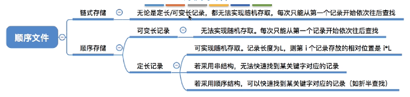

## 文件系统

#### 	**文件管理内容**

>  
>
> **文件属性**
>
> > - 文件名
> > - 标识符：文件标识符，供操作系统识别
> > - 类型
> > - 位置
> > - 大小
> > - 创建时间
> > - 修改时间
> > - 文件所有者
> > - 保护信息（权限）
> > - 文件共享
>
> **外存特性**
>
> > 与内存一样，有多个存储单元组成（2的整数幂），每个存储单元对应一个物理地址，操作系统以块为单位为文件分配存储空间**（文件内容大小不等于占用磁盘空间）**

#### **文件逻辑结构**

> **无结构文件（流式文件）**
>
> > 文件内部数据由二进制流或字符组成（流式文件），文件数据没有明显的结构特性（无逻辑结构）
>
> **有结构文件（记录文件）**
>
> > 由一组**相似的记录组成**，每条记录有为若干个数据项
> >
> > **逻辑结构**
> >
> > 1. 顺序
> >
> >    > 文件记录逻辑上线性排列，记录在物理块中可以用顺序存储和链式存储
> >    >
> >    >  
> >
> > 2. 索引(解决可变长记录文件查找速度慢问题)
> >
> > > 索引表（记录文件指针，定长记录的顺序文件）
> > >
> > > 索引顺序文件（解决索引表太大问题）
> >
> > 3. 索引顺序
> >
> >    > 对索引进行分组，多级索引

#### **文件目录**

>  
>
> **文件控制块FCB：** 包含文件基本信息（**文件名，物理地址**，逻辑结构，物理结构），存储控制信息（读写权限，访问用户），使用信息（创建，修改时间）
>
> **目录结构：**
>
> - 单级目录，实现按名存取，不允许文件名重复
>
> - 两级目录结构
>
>   > 主文件目录（MFD），用户文件目录（UFD） 
>   >
>   > **允许不同用户的文件重名，不能对文件分类**
>
> - 多级目录结构（树形目录结构）
>
>   > 读取文件时，磁盘I/O操作与文件所在层级有关，**树形目录不便于实现文件共享**
>
> - 无环图目录结构
>
>   > 有向无环图
>
> **索引结点（FCB）**
>
> > 除文件名外其他的信息放到索引结点中，**每个文件都包含一个唯一的索引结点**

#### **文件物理结构**

> *非空闲磁盘块管理*
>
> 内存与磁盘之间的**数据交换都是以块为单位**（内存块与磁盘块大小相等）
>
> 外存管理中，文件的逻辑地址空间被划分为一个个文件块
>
> **文件物理空间分配方式**
>
> 1. 连续分配
>
>    > **每个文件在磁盘上占有连续的磁盘块（物理存储单元相邻，FCB中记录长度和起始位置）**
>    >
>    > ---
>    >
>    > **物理块号 = 起始块号 + 逻辑块号** （通过逻辑块号可以知道物理块号）
>    >
>    > ---
>    >
>    > 支持顺序访问和随机访问，文件采用连续分配的方式存储，在**顺序读写时速度最快**
>    >
>    > ---
>    >
>    > 文件内容扩展效率低，需要连续的物理存储空间，且会产生**磁盘碎片**
>
> 2. 链接分配（离散分配）
>
>    > 隐式链接 
>    >
>    > > **FCB记录文件起始块和结束块**，并执行该文件**记录下一个存储单元指针**）
>    > >
>    > > **只支持顺序访问，不支持随机访问，查找效率低，利于文件扩展，不存在磁盘碎片，外存利用率高**
>    >
>    > 显式链接
>    >
>    > > **FCB记录文件起始块** 
>    > >
>    > > FAT 文件分配表（将用于链接文件各**物理块的指针和对应的下一块指针**显示存放在一张表中）
>    > >
>    > > ​	**一个磁盘对应一个文件分配表**，FAT常住内存，不需要读盘操作，地址转换时不需要访问磁盘，支持顺序访问 
>
> 3. 索引分配
>
>    > 系统为每个文件建立索引表，索引表记录文件到各个**磁盘块对应的物理块**
>    >
>    > **FCB记录索引块，索引块中记录磁盘块和逻辑块的映射关系**

#### **文件存储空间管理**

> **文件卷：** 存储空间划分，将物理磁盘划分为一个个文件卷（逻辑卷），文件卷包含**目录区和文件区**，目录区包含文件目录信息（FCB），用于磁盘存储空间管理信息，文件区存放文件数据。文件卷可以由多个物理盘组成。
>
> 
>
> 

#### 

