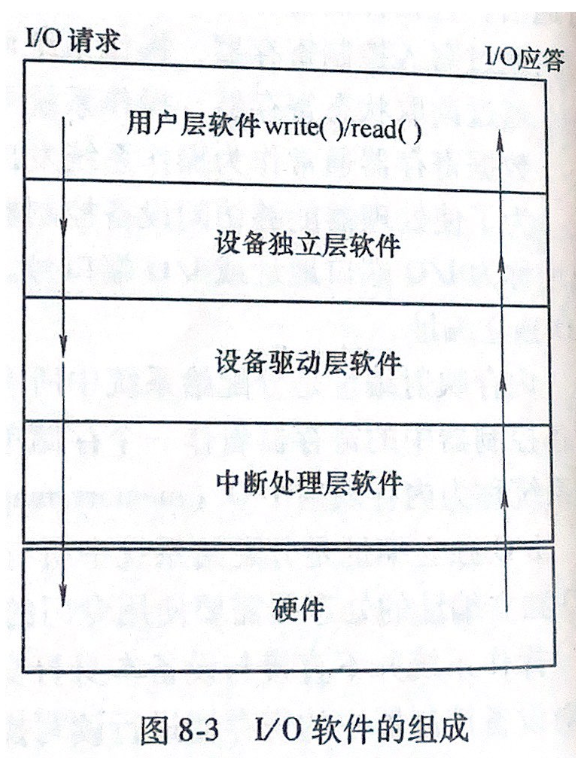
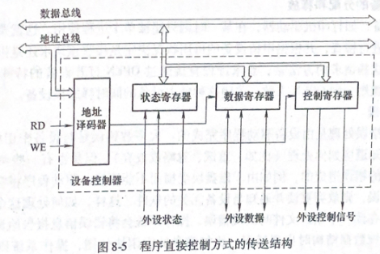

## I/O设备管理

- #### **I/O设备分类**

  > 按使用特性分类
  >
  > - 输入
  > - 输出
  > - 交互
  > - 存储
  >
  > 按设备组织方式分类
  >
  > - 字符设备（以字符为处理单位设备，不需要寻址，没有查找操作）
  > - 块设备（以数据块为单位处理，*能随时读写任何一块与之无关的数据*）
  >
  > 按设备使用共享性分类
  >
  > - 独占（运行期间只能一个用户或程序使用，非并发性使用）
  > - 共享
  > - 虚拟

  #### **I/O硬件与I/O软件组成**

  > **设备控制器**
  >
  > 设备控制器（电子部件，每个设备控制器都有若干个寄存器用来与处理器进行通信）
  >
  > 操作系统通过设备控制器可以收发数据，开启，关闭。
  >
  > 
  >
  > I/O端口：处理器访问控制器中寄存器地址
  >
  > I/O端口编址方式：
  >
  > - 内存
  >
  >   > 处理器把设备控制器中寄存器当做存储单元，通过对数据的编码完成响应操作
  >
  > - 独立
  >
  >   > 处理器使用专用I/O指令控制设备。
  >
  >   
  >
  > **I/O软件组成**
  >
  >  
  >
  > - 中断处理层软件
  >
  >   > 负责控制I/O设备与内存与处理器之间数据传输
  >
  > - 设备驱动
  >
  >   > 与设备相关，描述设备信号代表的含义，及控制设备操作
  >
  > - **设备独立**
  >
  >   > 对使用用户提供统一的操作接口，包装驱动相关操作，将硬件与软件分开

- #### **设备独立性(Device Independence)**

  > - 命名（用来区分设备驱动，及硬件）
  > - 保护
  > - 与设备无关的逻辑块
  > - 缓冲
  > - 存储设备块分配
  > - 独占设备的分配与释放
  > - 错误处理

- #### **I/O设备控制方式**

> - **程序控制（PIO）**
>
>   > 用户进程控制处理器与内存，设备之间通信（忙-等待，轮询），单片机
>   >
>   >  
>   >
>   > ---
>   >
>   > 硬件结构简单，处理器效率低，对异常处理事件无实时响应
>
> - **中断控制**
>
>   > 触发事件，调用相应处理程序进行服务（中断程序与中断处理器执行的进程相互独立，相互不传递数据）
>   >
>   > **中断控制特性**
>   >
>   > 1. 提高系统效率，不需要处理器主动查询设备状态
>   > 2. 及时响应能力
>   >
>   > ---
>   >
>   > **中断控制处理过程**
>   >
>   > 1. 处理器通过数据总线发出命令，启动外设，阻塞当前进程。
>   > 2. 外设数据就绪，置位中断请求触发器
>   > 3. 接口向处理器发送中断请求
>   > 4. 当前程序被中断，执行设备程序
>
> - **DMA控制方式**(直接内存访问)
>
> - > 
>
> 

