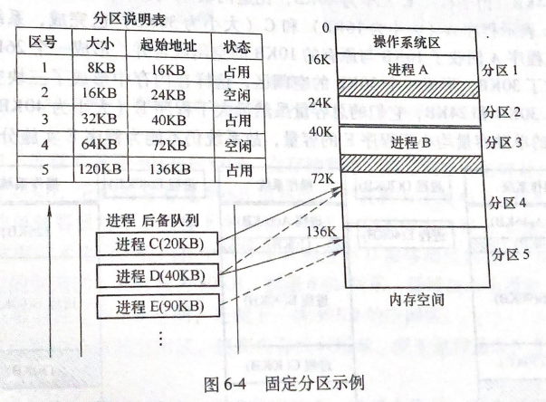
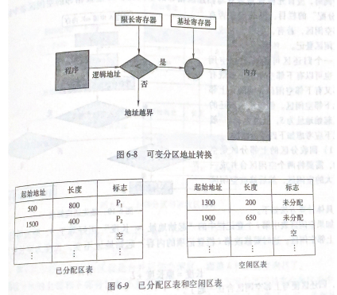
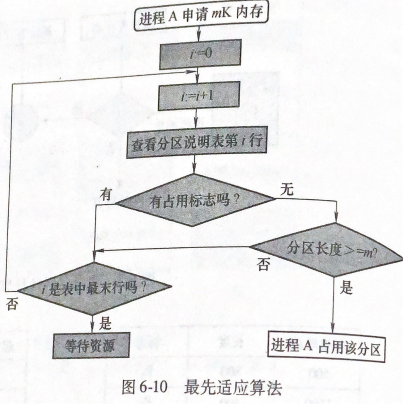
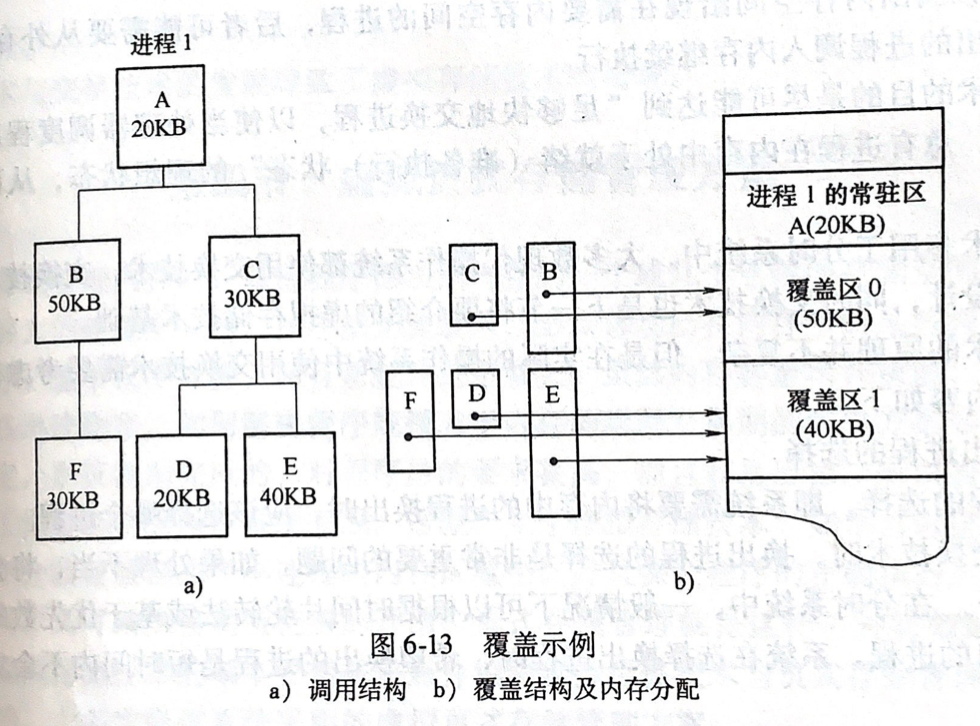

## 存储管理

- #### **存储体系**

> *计算机系统中存储器一般分为主存储器和辅助存储器两级。主存储器简称主存，又称内存，它由**顺序编址的单元**（通常为字或字节）所组成，是处理机直接存取指令和数据的存储器。它速度快，但容量有限。辅助存储器简称辅存，又称外存，它由**顺序编址的“块”所组成，每块包含若干个单元**，**寻址与交换均以块为单位进行**，处理机不能直接访问它，须经过专门的启动I/O过程与内存交换信息。它存取速度较慢，但容量远大于内存。实际上，现代计算机系统中用户的数据（或信息）都是保存在外存中。*
>
> 存储管理主要是对内存的管理，同时也涉及对内存和外存交换信息的管理。内存可以分成系统区和用户区两部分，系统区用来存储操作系统等系统软件，用户区用于分配给用户程序使用，存储管理实际上是对用户区的管理
>
> **存储速度**
>
> 寄存器 
>
> 高速缓存
>
> 主存
>
> 本地外存
>
> 云存储
>
> ---
>
> **存储管理目的**
>
> 为用户提供方便，安全和充分的存储空间
>
> 方便是指将**逻辑地址和物理地址**分开，用户只在各自的逻辑地址空间编写程序，不必过问物理空间和物理地址的细节，地址的转换由操作系统自动完成；
>
> 安全是指同时驻留在内存的多个**用户进程相互之间不会发生干扰**，也不会访问操作系统所占有的空间；
>
> 充分大的存储空间是指利用**虚拟存储技术**，从逻辑上对内存空间进行扩充，从而可以使用户在较小的内存里运行较大的程序。

- #### **存储管理任务**

> - 地址转换
>
>   > 逻辑地址：用户程序**经过编译或汇编后形成的目标代码出现的地址**（通常为相对地址）
>   >
>   > 物理地址：内存中存储单元编号为物理地址（绝对地址）
>   >
>   > 处理机执行的指令按物理地址操作数据（进程运行前必须把指令中逻辑地址转为内存中物理地址）
>
> - 内存分配与回收
>
>   >  分配表格，组织方式
>   >
>   > 1. 位示图表示（表示空闲页与非空闲页）
>   >
>   > 2. 空闲页面表
>   >
>   > 3. 空闲块表
>   >
>   >    内存分配方法
>   >
>   > 1. 静态：程序运行过程中不允许再申请内存或转移（分配工作在程序载入内存中完成）
>   >2. 动态：运行程序在运行中分配内存和转移空间（不需要程序一次性装载内存）
>   > 
>   > 
>   
> - 内存地址保护
>
>   > 1. 地址越界保护
>  > 2. 权限保护
> 
> - 内存共享
>
> - 内存扩充
>
>   > 将内存与外存结合统一使用

- #### **地址转换**

> - 地址重定位（将程序逻辑地址改为内存物理地址）
>
> - 静态重定位（程序装载内存时将所有逻辑地址转为物理地址，执行时无须转换）
>
> - 动态重定位（程序执行时完成地址转换）
>
>   > 软件与硬件配合完成

- #### **内存分区**

>为满多道程序运行的存储方案，**将内存划分多个连续区域**，每个分区装入一个运行程序。分区的方式可以是固定分区和动态分区。
>
>---
>
>- **固态分区**
>
> > 将内存划分若干等大的分区，系统在运行时期不允许重写划分，对程序的大小有限制。
> >
> >  
> >
> > 内存分配表：将分区按顺序说明对应的表目，表目内容包括分区序号，分区大小，分区起始位置及使用状态。
> >
> >  
> >
> > ---
> >
> > 固定分区不能充分利用类型，灵活性差
>
>- **可变分区**
>
>  > 程序装载内存时进行分区，需要硬件支持（基址寄存器和限长寄存器)
>  >
>  > **内存压缩**
>  >
>  > 程序退出释放内存造成小快内存空闲，空闲内存不足以满足其他程序内存分配，这些内存称为内存碎片。内存碎片需要在适当时候进行移动处理。
>  >
>  > - 移动带来系统开销
>  >- 内存移动具有条件
>  > 
>  > 
>  >
>  >  **可变分区实现**
>  >
>  > 已分配区表：记录已装载程序在内存中占用分区的**起始地址和长度**
>  >
>  > 空闲区表：记录可提供分配空闲空间的起始地址和长度
>  >
>  >  
>  >
>  > 
>  >
>  >  **空闲分区分配策略**
>  >
>  > 1. 顺序分配
>  >2. 最优适应（找出最小能满足程序载入的内存碎片）
>  > 3. 最坏适应（找出最大的空闲内存）
>  > 
>  >  
> 
> - **分区回收**
>
>> 检查释放内存是否有相邻的空闲空间，如果存在则合并相邻的空闲空间
>
>>  
>>
>- **分区保护**
>
>> - 界限寄存器
>> - 保护键（程序访问内存时，匹配标识）
>
>---
>
>**内存分区特点**
>
>- 实现内存共享，有效利用处理器和I/O设备
>- 提高系统吞吐量和缩短周转时间
>- 需要处理内存碎片
>- 收到物理存储与实际存储限制

- #### **内存覆盖与交换**

> 解决内存空间不足问题，引进外存概念。覆盖技术与交换技术控制内外存数据交换。
>
> ---
>
> - 覆盖技术
>
>   > **将程序划分若干个功能上相对独立的程序段**，按照其自身的逻辑结构不会同时执行程序共享内存区域，覆盖技术由编译程序提供支持，被覆盖的块是编译程序预先处理好，需要是在装载入内存。
>   >
>   >  
>   >
>   > ---
>   >
>   > 覆盖技术主要应用于系统内存管理上。
>
> - #### 交换技术
>
> > 将进程从内存转存到外存，并再移回内存为交换。内存交换由操作系统控制。
> >
> > **交换技术控制**
> >
> > 1. 换出进程选择
> > 2. 交换时间确定
> > 3. 交换空间分配
> > 4. 换入进程换回内存时位置确定

- #### **虚拟页式存储管理方案**

> *将逻辑地址连续的程序分散存储到几个不连续的内存区域中，并且保证程序的正确执行。*
>
> - **虚拟存储技术**
>
>   > 程序运行时，将一部分程序装入内存，一部分留在外存，执行的指令不在内存时，由操作系统将外存程序载入内存；当内存不足时，操作系统自动选择部分内存空间，将原有的内存内容交换到外存上。
>   >
>   > ---
>   >
>   > 区别于交换技术，交换技术主要是进程内外存交换，虚拟存储技术交换单位为页
>
> - **虚拟页式存储管理**
>
>   > 物理页：存储管理部件（MMU）将内存划分等大的区，这些区为物理页面
>   >
>   > 逻辑页：程序中逻辑地址进行分区，大小与物理页相同（虚拟地址）
>   >
>   > ---
>   >
>   > 页式存储结构确定了物理页面大小
>
> - **物理内存的分配与回收**
>
>   > $$
>   > 物理页面号 = 字号 \times 字长 + 位号 \\
>   > 字号 = [\frac{i}{字长}]， 位号 = i\mod\ 字长 
>   > $$
>   >
>   > 使用位示图表示内存物理页是否使用
>
>   

