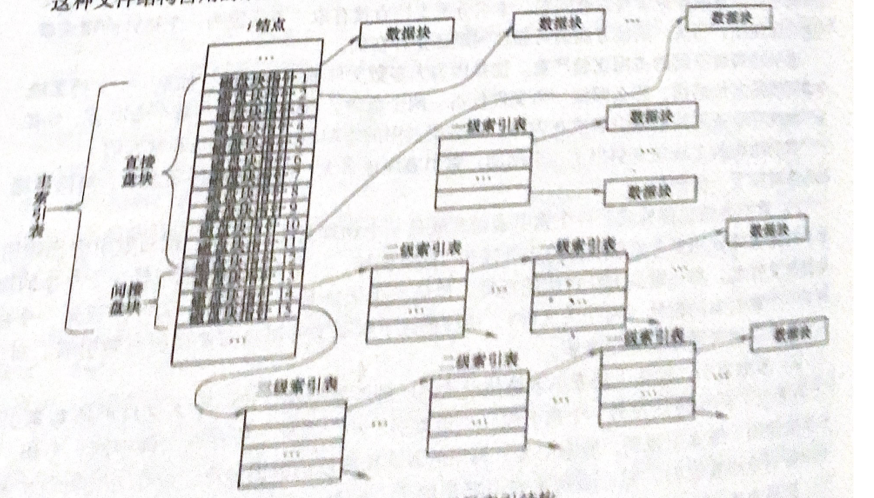

## 文件系统

> - 能存储大量信息
> - 能长期保存
> - 可以共享信息
>
 #### **文件系统具有的功能**
>
> 1. 统一管理文件的存储空间，实施存储空间分配与回收
>
> 2. 实现文件从名字到外存地址空间映射
>
> 3. 实现文件信息共享，并提供文件保护和保密
>
> 4. 向用户提供文件接口
>
> 5. 系统维护及向用户提供有关信息
>
> 6. 保持文件系统执行效率
>
> 7. 提供统一的I/O接口
>
#### **外存储设备介质**
>
>- 磁带（只能顺序物理存储数据）
>
>- 磁盘
>
>  > 磁道：记录数据区域（不同半径的同心圆）
>  >
>  > 扇区：磁道分区（每个磁道可以分为4~32个扇区）
>  >
>  > 柱面：不同盘片相同半径的磁道所组成的圆柱
>  >
>  > 存储容量 = $磁头数 \times 磁道 \times 每道扇区数 \times 每扇区字节数$
>
>- 光盘
>
>- 闪存
>
>**提高文件系统的性能**
>
>1. 块高速缓存
>2. 顺序存储数据
>3. 磁盘调度
>
>**磁盘I/O时间**
>
>1. 查找时间（读写磁头读盘时间）
>2. 等待(磁头与磁盘同步)
>3. 传输（内存和磁盘之间数据交互）
>
>**磁盘移臂调度**
>
>- FCFS（先来先服务）
>- SSTF（最短查找时间）
>- SCAN（扫描算法，访问距离磁头最近的数据）
>
>**磁盘优化分布**

#### **文件在存储设备中存取方式**

> - 顺序存取
> - 随机存取

#### **文件的分类**

> **文件用途分类**
>
> - 系统文件（操作系统和各种应用程序和数据组成文件）
> - 库函数文件（C语言函数库，不允许用户直接更改）
> - 用户文件（源文件，目标程序，用户数据文件，用户数据库）
>
> **文件组织形式分类**
>
> - 普通文件（包换数据和程序）
> - 目录文件（包含文件目录信息，主要用来检索文件）
> - 特殊文件（硬件描述文件）

#### **文件结构**

> 面向用户的逻辑结构
>
> - 流式文件（由程序描述使用，包含程序内容）
> - 记录式文件（具有特定意义的信息单位）
>
> 物理结构
>
> - 顺序
>
>   > 逻辑上连续的文件信息依次存放在物理块中
>   >
>   > ---
>   >
>   > 知道文件存储设备起始块号和文件长度能够快速存取，不能动态分配空间
>
> - 链表
>
>   > 将逻辑上相邻的信息以链表连接方式存入分散物理块中
>   >
>   > ---
>   >
>   > 提供磁盘利用空间，有利于文件动态扩展，存取速度慢与顺序，文件指针占用额外空间
>
> - 索引
>
>   > 创建索引表记录文件物理块指针，索引指针执行逻辑指针
>   >
>   > ---
>   >
>   > 会引发多次的寻道次数，索引表增加存储开销。
>
> **UNIX的三级索引结构**
>
>  

#### **文件目录**

> FCB：文件描述性数据结构（所有文件都包含）
>
> > - 文件名
> > - 文件号（文件系统中唯一ID）
> > - 用户名
> > - 地址
> > - 长度
> > - 类型
> > - 属性
> > - 共享计数
> > - 创建日期
> > - 保存期限
> > - 最后修改时间
> > - 最后访问时间
> > - 口令
> > - 文件逻辑结构（流式或记录）
> > - 文件物理结构（使用存储方式）
>
> 目录：将FCB有序组织起来，构成有序集合。（文件符号名到物理地址之间映射）
>
> > - 一级目录
> >
> >   > 文件名与文件一一对应，不能重名，检索慢
> >
> > - 二级目录
> >
> >   > 实现用户间文件共享，解决文件名重复问题
> >
> > - 多级目录
> >
> >   > 层次清除，便于权限管理，查找速度快
>
> **目录项与目录文件**
>
> > 目录项：与文件相关的信息与属性记录在该文件控制块中（目录项必定对应一个文件）
> >
> > 目录文件：多个文件的控制块集合在一起的文件目录

#### **Linux文件与目录实现**

> **Linux文件系统**
>
> - VFS （虚拟文件系统，兼容各系统的文件系统）
>
>   > 以接口形式调用其他文件系统
>
> - EXT2 /EXT3(文件扩展系统)
>
>   > EXT2，EXT3使用索引节点记录文件信息（FCB），目录只是将目录名与索引节点相关联（**一个索引节点可能关联多个目录，一个目录只能关联单一索引节点**）
>   >
>   > EXT2不支持日志
>
> **Linux文件类型**
>
> - 正规文件（数据载体）
> - 目录文件（包含目录下文件的**文件名及文件指针**）
> - 字符型特殊文件（指定设备描述文件）
> - 块型特殊文件（磁盘设备数据文件）
> - FIF（进程通信文件）
> - Socket（进程间网络通信文件）
> - 符号连接文件（symbolic link）
>
> 

