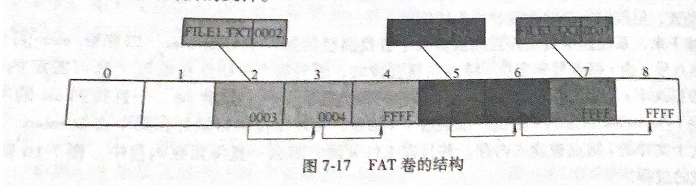
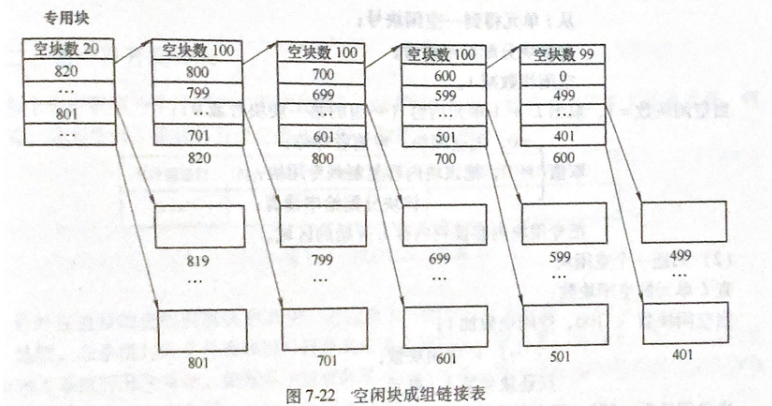
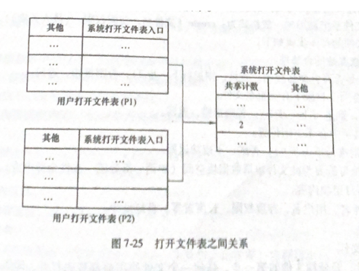
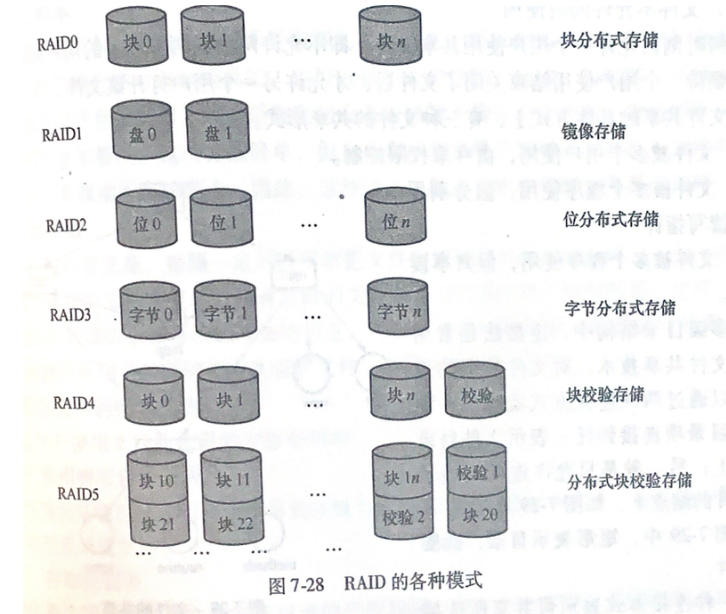
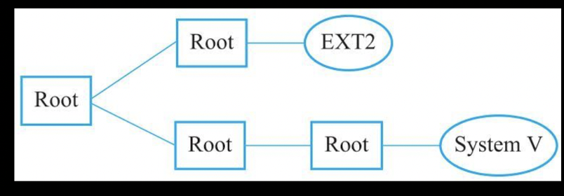
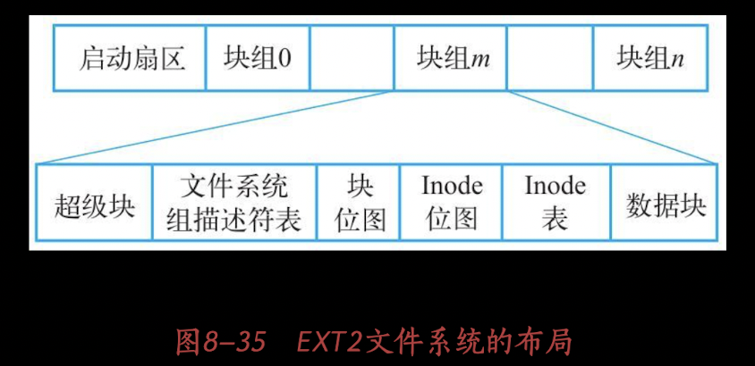

## 文件系统

> - 能存储大量信息
> - 能长期保存
> - 可以共享信息
>
 #### **文件系统具有的功能**
>
> 1. 统一管理文件的存储空间，实施存储空间分配与回收
>
> 2. 实现文件从名字到外存地址空间映射
>
> 3. 实现文件信息共享，并提供文件保护和保密
>
> 4. 向用户提供文件接口
>
> 5. 系统维护及向用户提供有关信息
>
> 6. 保持文件系统执行效率
>
> 7. 提供统一的I/O接口
>
#### **外存储设备介质**
>
>- 磁带（只能顺序物理存储数据）
>
>- 磁盘
>
>  > 磁道：记录数据区域（不同半径的同心圆）
>  >
>  > 扇区：磁道分区（每个磁道可以分为4~32个扇区）
>  >
>  > 柱面：不同盘片相同半径的磁道所组成的圆柱
>  >
>  > 存储容量 = $磁头数 \times 磁道 \times 每道扇区数 \times 每扇区字节数$
>
>- 光盘
>
>- 闪存
>
>**提高文件系统的性能**
>
>1. 块高速缓存
>2. 顺序存储数据
>3. 磁盘调度
>
>**磁盘I/O时间**
>
>1. 查找时间（读写磁头读盘时间）
>2. 等待(磁头与磁盘同步)
>3. 传输（内存和磁盘之间数据交互）
>
>**磁盘移臂调度**
>
>- FCFS（先来先服务）
>- SSTF（最短查找时间）
>- SCAN（扫描算法，访问距离磁头最近的数据）
>
>**磁盘优化分布**

#### **文件在存储设备中存取方式**

> - 顺序存取
> - 随机存取

#### **文件的分类**

> **文件用途分类**
>
> - 系统文件（操作系统和各种应用程序和数据组成文件）
> - 库函数文件（C语言函数库，不允许用户直接更改）
> - 用户文件（源文件，目标程序，用户数据文件，用户数据库）
>
> **文件组织形式分类**
>
> - 普通文件（包换数据和程序）
> - 目录文件（包含文件目录信息，主要用来检索文件）
> - 特殊文件（硬件描述文件）

#### **文件结构**

> 面向用户的逻辑结构
>
> - 流式文件（由程序描述使用，包含程序内容）
> - 记录式文件（具有特定意义的信息单位）
>
> 物理结构
>
> - 顺序
>
>   > 逻辑上连续的文件信息依次存放在物理块中
>   >
>   > ---
>   >
>   > 知道文件存储设备起始块号和文件长度能够快速存取，不能动态分配空间
>
> - 链表
>
>   > 将逻辑上相邻的信息以链表连接方式存入分散物理块中
>   >
>   > ---
>   >
>   > 提供磁盘利用空间，有利于文件动态扩展，存取速度慢与顺序，文件指针占用额外空间
>
> - 索引
>
>   > 创建索引表记录文件物理块指针，索引指针执行逻辑指针
>   >
>   > ---
>   >
>   > 会引发多次的寻道次数，索引表增加存储开销。
>
> **UNIX的三级索引结构**
>
>  

#### **文件目录**

> FCB：文件描述性数据结构（所有文件都包含）
>
> > - 文件名
> > - 文件号（文件系统中唯一ID）
> > - 用户名
> > - 地址
> > - 长度
> > - 类型
> > - 属性
> > - 共享计数
> > - 创建日期
> > - 保存期限
> > - 最后修改时间
> > - 最后访问时间
> > - 口令
> > - 文件逻辑结构（流式或记录）
> > - 文件物理结构（使用存储方式）
>
> 目录：将FCB有序组织起来，构成有序集合。（文件符号名到物理地址之间映射）
>
> > - 一级目录
> >
> >   > 文件名与文件一一对应，不能重名，检索慢
> >
> > - 二级目录
> >
> >   > 实现用户间文件共享，解决文件名重复问题
> >
> > - 多级目录
> >
> >   > 层次清除，便于权限管理，查找速度快
>
> **目录项与目录文件**
>
> > 目录项：与文件相关的信息与属性记录在该文件控制块中（目录项必定对应一个文件）
> >
> > 目录文件：多个文件的控制块集合在一起的文件目录

#### **FAT文件系统实现(File Allocation Table 文件分配表)**

>  
>
> - 引导扇区（Boot Sector）包含用于描述卷的信息，基于这些信息访问文件系统
> - 文件分配表

#### **文件存储空间管理**

> **磁盘空间分配回收算法**
>
> 1. 位示图（物理块与数位对应）
>
> 2. 空闲块表（空闲块首号及大小）
>
> 3. 空闲块链表（使用指针执行下一个可用物理块）
>
> 4. **空闲块成组链接法**
>
>    >  
>    >
>    > 将空闲块分组存放在组头上，组头之间形成链表，在将组头信息使用专门存储块加载入内存。（网状结构）
>

#### **实现文件系统的表目**

> 表目：当用户申请打开文件时，系统要在内存中为该用户保存必要信息
>
> 表目在内存中包括共享计数，修改标志，FCB等信息
>
>  

#### **文件及文件目录操作**

#### **文件系统性能**

> **记入成组**
>
> 把若干个逻辑记录合成一组存储一物理块（相邻逻辑数据存在一起）
>
> **记录分解**
>
>  
>
> **RAID技术**
>
> > 解决机械硬盘故障，性能问题。
> >
> >  

#### **文件共享，保护和保密**

> - **文件共享**
>
>   > 允许多个用户共同使用，允许目录项连接到任意表示文件目录的节点上
>   >
>   > 允许连接到普通文件节点上（快捷链接）
>
> - **文件存取控制**
>
>   > 1. 建立副本
>   > 2. 定时转储
>   > 3. 规定文件存取权限

---

#### **Linux文件操作**

- 文件系统

  > VFS（虚拟文件系统，兼容各系统的文件系统，以接口形式调用）
  >
  > EXT2 (文件扩展系统)

- Linux文件类型

  > 正规文件
  >
  > 目录文件（目录下文件名及包含的文件指针集合）
  >
  > 字符型特殊文件（指定设备描述文件）
  >
  > 块型特殊文件（磁盘数据文件）
  >
  > FIF（进程通信文件）
  >
  > Socket（进程网络通信文件）
  >
  > 符号连接文件（symbolic link）

- Linux 文件系统目录
  
  >  
  
- Linux文件查找
  
  > 在内存中查找dentry节点（文件与物理节点映射表）
  
- Linux文件操作
  
  > 1. 文件打开（系统分配文件ID号，进程通过文件ID操作文件指针）
  > 2. 读取文件
  > 3. 写文件
  > 4. 关闭文件
  > 5. 指针移动
  > 6. 文件连接，反连接和符号连接
  > 7. 重命名
  
- Linux EXT2文件系统
  
  >  
  >
  > - 超级块（包含对文件系统基本大小和状态描述）
  >
  >   1. 魔术号码（文件系统安装软件通过检查号码判断是否属于这个超级块）
  >   2. 修订版本号
  >   3. 安装次数与最大安装次数
  >   4. 块组号
  >   5. 块大小
  >   6. 每组块数
  >   7. 空闲块数
  >   8. 空闲节点数
  >   9. 起始节点号（对应/)
  >
  > - 组描述符（用于描述每个块组的控制和统计信息）
  >
  >   
  >
  > 

