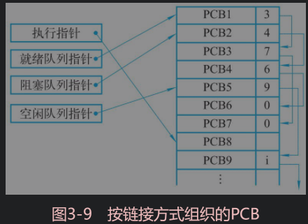
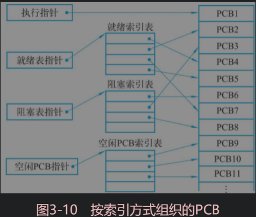

## 进程

- **全驱图定义**

> *前驱图是一个有向无循环图，图中的每个结点可用于表示一条语句、一个程序段或进程；结点间的有向边表示在两结点之间存在的偏序或前驱关系“→”，→={（Pi，Pj）|Pi必须在Pj开始前完成}。如果（Pi，Pj）∈→，可写成Pi→Pj，称Pi是Pj的前驱，而Pj是Pi的直接后继*
>
> eg：
>
> P1→P2，P1→P3，P1→P4，P2→P5，P3→P5，P4→P6，P5→P7，P6→P7
>
>  

- #### **程序顺序执行**

> 顺序执行的程序特征
>
> 1. 处理机的操作严格按程序规定的顺序执行，即只有前一操作结束后才能执行后继操作
> 2. 程序执行的封闭性。程序独占全机资源，因而机内各资源的状态（除初始状态外）只有本程序才能改变。程序一旦开始运行，**其执行结果不受外界因素的影响**
> 3. 程序执行结果的确定性。程序执行的结果与它的执行速度无关，任何都不会影响得到最终结果
> 4. 程序结果的可再现性。

- #### **程序并发执行**

> 并发执行的程序特征
>
> 1. 程序执行间断性（多个执行任务存在相互等待资源）
> 2. 程序执行失去封闭性（多个执行任务存在相互影响）
> 3. 程序结构不可再现性
> 4. 程序和计算不再对应

- #### **多道程序设计**

> *让多个程序同时进入计算机执行* 主要提供计算机处理效率，提升系统效率

- #### **进程**

> 进程具有一定独立功能的程序在某个数据集合上的**运行活动**，是系统进行资源分配和调度的独立单位
>
> **进程：** 
>
> 1. 程序在处理机上执行时**所发生的活动**称为进程（Dijkstra）
> 2. 进程可以和别的计算并发
> 3. 进程是一个**程序及其数据**在处理机上**顺序执行**时所发生的活动
> 4. 程是程序在一个数据集合上的运行过程，是系统进行资源分配和调度的一个**独立单位**（Peter Denning）。
>
> **程序与进程区别：**
>
> 1. 进程是**程序的一次执行**，完成程序的特定功能的指令有序序列（一个进程可以执行几个程序）
> 2. 进程是系统进行资源**分配和调度**的一个独立单位，程序则是以多个用户进程共享一个编译程序
> 3. 程序可用作为一种软件**资源长期保存**，进程是临时的，有生命周期，表现在它由创建而产生，完成任务后撤销
> 4. 进程具有结构，描述进程变化过程
> 4. 程序是构成进程组成部分之一
>
> **进程特征**
>
> 1. 动态性
> 2. 并发性
> 3. 独立性（独立运行的基本单位，同时也是系统中独立获得资源和独立调度的基本单位）
> 4. 异步性（执行不可见）
>
> #### **三状态模型**
>
> 1. 就绪（当前进程已分配到处理机以外所有必要的资源）
> 2. 执行
> 3. 阻塞（**进程因某种事件而暂停执行状态**）
>
>  
>
> - 执行->就绪状态（通常出现在分时系统中，正在执行的进程时间片用完被暂停）
> - 阻塞->就绪状态（阻塞进程不能直接运行，需要重新获得处理器执行权）
>
> 
>
> #### **五状态进程模型**（在基本状态下进一步划分)
>
> 1. 创建（New）
> 2. 就绪（Ready）*进程获取除处理器外所有资源*
> 3. 运行（Run）
> 4. 阻塞（Blocked）*由于中断，暂停进程运行*
> 5. 结束（Exit）*回收除进程控制外其他资源*
>
> 
>
> - **主要状态转换**
>
>   1. 创建
>   2. 提交（前期资源准备，提交致就绪）
>   3. 调度运行(就绪列表中获取任务执行)
>   4. 释放（进程完成、失败导致终止。包括异常退出）
>   5. 超时(时间片用完，优先级高进程对其进行抢占)
>   6. 事件等待
>   7. 事件出现
>
>    
>
> 
>
> #### **七状态进程模型**
>
> *五状态进程模型没有区分进程空间地址，进程的数据载入时间存在影响*
>
> 就绪与阻塞状态进一步划分（就绪挂起，阻塞挂起）
>
>  
>
> - **进程状态**
>   1. 就绪（Ready） 进程在内存且可以立即进入执行状态
>   2. 阻塞（Blocked）进程在内存等待事件出现
>   3. 阻塞挂起(Suspend) 进程在**外存**并等待事件出现
>   4. 就绪挂起 （**进程在外存**，需要进入内存执行）
>
> - **进程状态转换**
>
>   - 挂起（把进程从内存转到外存）
>     1. 阻塞到阻塞挂起
>     2. 就绪到就绪挂起（将优先级低的进程挂到外存）
>     3. 运行到就绪挂起（分时系统高优先级进程事件到就绪挂起）
>   - 激活（把进程从外存载入内存）
>     1. 就绪挂起到就绪
>     2. 阻塞挂起到阻塞
>   - 事件出现
>     1. 阻塞到就绪
>     2. 阻塞挂起到阻塞就绪
>   - 提交
>
> 
>
> - **进程挂起场景**
>
>   1. 终端用户进程调试（执行状态暂停）
>   2. 父进程修改子进程，或挂起自己的子进程
>   3. 操作系统优化
>   4. 进程对换（缓解内存紧张，将内存中阻塞进程转至外存）
>   5. 负载调节
>
> #### **进程控制块(PCB)**
>
> *为便于系统控制，描述进程活动过程，在操作系统核心中定义专门的数据结构，为进程控制块（PCB）。*
>
> **PCB中内容**
>
> - **调度信息**（描述进程当前情况）
>   1. 进程名，进程号
>   2. 地址空间信息
>   3. 优先级
>   4. 当前状态（三种基本状态）
>   5. 资源清单（运行所需资源）
>   6. 家族关系（子父进程关系）
>   7. 消息指针（与其他进程通信）
>   8. 进程队列指针
> - **现场信息**（描述运行情况，中断时保存进程状态）
>
> **进程组成**
>
> - 程序
> - 数据
> - PCB
>
> 
>
> #### **进程组织方式**
>
> - 链接方式
>
>   把具有**相同状态或策略**的进程块分组链接成队列
>
>    
>
> - 索引方式
>
>   根据**进程状态**建立索引表（索引表指针存在专用单元）
>
>    
>
>  -  线性方式
>
> 
>
> #### **进程的队列**
>
> - 就绪
> - 等待
> - 运行（只有一个）
>
> 
>
> #### **进程控制**
>
> 原语：操作系统核心，由多条指令组成的指令序列，用来实现特定的操作功能。指令序列为原子操作
>
> 系统调用：可以在目态下执行，对比原语，原语具有不可中断操作
>
> - **进程控制原语**
>
>   1. 创建（开辟PCB，创建进程存入就绪队列）
>   2. 撤销（释放进程资源，清空PCB）
>   3. 阻塞
>   4. 唤醒
>
> - **UNIX操作系统进程创建操作 fork**（父类进程通过fork函数创建子线程）
>
>   1. 为子进程创建proc结构（进程描述符）
>   2. 赋值唯一标识PID
>   3. 以一次一页方式复制父进程用户地址空间
>   4. 获得子进程继承共享资源指针
>   5. 子线程就绪，加入就绪队列
>   6. 子线程返回标识符0，向父进程发回子进程的PID
>
>   *子进程得到与父进程**用户地址空间相同的副本***，子进程与父进程唯一的区别在于不同的PID
>
> - exec函数为**父进程运行不同于子线程的代码**
>   1. 在父线程中装入新的程序代码，数据，堆和栈
>   2. 保存进程ID与父进程ID等
>   3. 继承控制终端
>   4. 保留所有文件信息
>
> UNIX中**父类进程与子类进程是异步**的，父类进程可能早于子类进程结束，会导致子进程的资源，内存无法返回父进程，引起内存泄漏，wait函数父类进程用来获取子进程的结束状态并回收资源。**父类进程调用wait函数阻塞自身**，等待子进程结束信号唤醒父类进程收回子进程资源。子进程先于父类进程结束，子进程会继续占有部分资源，直到**父类进程执行wait函数收回**（父进程不用阻塞）
>
>  
>
> **信号（Signal）** _UNIX处理异步事件方法_
>
> 信号产生
>
> 1. 用户终端命令
> 2. 硬件异常信号
> 3. 进程kill函数（可将信号由一个进程发送到另一个进程）
> 4. 通知所有有关进程
>
> 
>
> **fork函数创建子进程示例**
>
> 
>
> #### **Linux进程与进程管理**
>
> linux 进程控制块结构使用task_struct表示，定义在文件 include\linux\seched.h中
>
> 1. 进程状态（运行，等待，暂停，僵死）
> 2. 进程调度信息
> 3. 进程标识PID，组标识GID（访问文件系统和设备使用）
> 4. 内部通信信息（消息队列，信号量，共享内存）
> 5. 进程指针（父子进程，兄弟进程之间关系）
> 6. 时钟信息
> 7. 文件系统
> 8. 虚拟存储（进程内存空间分配信息）
> 9. 进程上下文（记录进程现场必要信息）
>
> **进程调度**
>
> 普通进程与实时进程
>
> TODO
