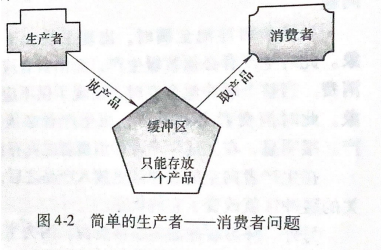
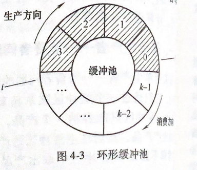
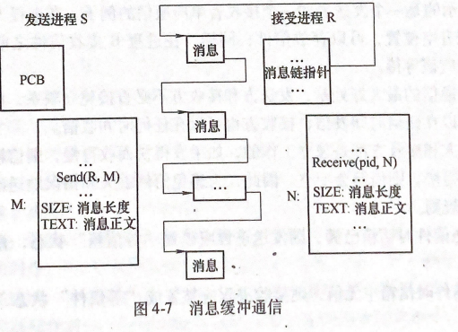

## 进程同步与互斥

- 有关进程与无关进程

  > 一个进程执行过程中不影响其他进程，**无关并发进程一定没有共享的变量**

- 与时间有关错误

  > 多个进程共享资源，执行速度不同，执行结果也不同（程序的计算结果与并发执行的速度有关）

- 进程同步

  > 进程之间协同工作关系（直接约束，在工作次序中相互等待对方事件），

- 进程互斥

  > 当进程进入临界区使用资源时，另一个进程必须等待（资源不共享）

- 临界区（临界资源，共享变量）

  > 临界区：*系统资源一次只允许一个进程使用*
  >
  > 相关临界区：*若干进程共享临界区*
  >
  > 进入相关临界区的进程必须保持互斥关系，相关临界区调度关系原则
  >
  > 1. 空闲让进
  > 2. 忙则等待
  > 3. 有限等待
  > 4. 让权等待

#### **信号量**

> 信号量：解决进程同步的机制（进程互斥也是同步）。
>
> 进程同步机制有
>
> 1. 硬件同步
> 2. 软件同步（PV信号量）
> 3. 管程
> 4. 条件临界域
> 5. 路径表达式
> 6. 远程过程调用同步机制
> 
>
> - 信号量操作（P，V），**只有P，V操作和信号初始化才能被访问和更改值**
>
>   > P：等待（执行减法）
>   >
>   > V：发送信号（执行加法）
>   >
>   > 
>   >
>   > 其中S为信号量
>   >
>   > P(S)：若S小于0 将该**进程设置为等待状态**，PCB中插入S信号量，直到**其他进程在S上执行V操作**
>   >
>   > V(S)：若S小于等于0，**释放S信号对列中等待进程，将状态改为就绪**
>   >
>   >  
>   >
>   > 信号量S可以代表某类可用的临界资源
>   >
>   > 当S>0时，S值的大小表示某类可用资源数量（资源可分配）
>   >
>   > 当S<0时，表示没有资源可分配，**其S的绝对值是S信号量在等待队列中进程数目**
>   >
>   > 
>   >
>   > **每执行一次P操作，意味请求进程分配到一个资源，每执行V操作释放一个资源**
>   >
>   >  
>   >
>   > **进程互斥的信号量S为1**
>   >
>   > 
>   >
>   > **进程同步的信号量有多个（$S_1，S_2,S_{...}$）**分别表示对资源加锁与解锁状态
>
> 信号量P，V缺点
>
> 1. P，V操作每次只能加减1运算，对进程一次获取多个资源逻辑复杂
> 2. P，V必须成对出现，且对P，V执行的顺序有关

#### **经典进程同步问题**

> - **简单生产消费同步**
>
>  >  
>  >
>  > 通过缓存区是否为空进行生产者与消费者进程同步
>
> - **多个生产者消费问题**
>
>   >  
>   >
>   > - 同步问题
>   >   1. 设置信号量empty，初始值为k，表示队列中空缓存数目
>   >   2. 设置信号量full，初始值为0，表示用于缓存中数目
>   > - 互斥问题
>   >   1. 设置 信号量mutex 初始值为1，实现临界区的互斥
>   >   2. 设置整型量i和j，初始值为0，i用于表示空缓存头指针，j表示产品满缓存区头指针
>
> - **读写问题**
>
>   > 读写进程必须遵守规定
>   >
>   > 1. 多个进程可以同时读文件（同步）
>   > 2. **任何一行进程在对文件进行写时，不允许其他进程对文件进行读或写**（互斥）
>   > 3. 有进程在读文件时，不允许任何进程写文件（互斥）
>   >
>   > 文件只允许一个进程执行写（写进程之间相斥，读写进程之间相斥）
>
> 
>
> **线程同步与互斥场景应用**
>
> 

#### **管程**(Monitor)

> 管程：由一个过程，变量及数据结构组成的一个集合，进程可以在任何时候调用管程中的过程，在编译器环境下实现进程互斥（编译器实现）
>
> 管程结构（名称，数据共享说明，数据共享赋值语句），管程能保证共享资源的互斥执行（**一次只能有一个进程在管程中活动**）
>
>  **管程特征**
>
> 1. 模块化(基本程序单位，单独编译)
> 2. 抽象数据类型
> 3. 信息隐蔽
>
> **管程中条件变量**
>
> 管程中条件变量：让进入管程的进程阻塞自己执行其他进程

#### **进程通讯**

> **解决进程通讯方案**
>
> - 内存共享
>
>   > 通讯进程之间存在公共内存，以读写方式实现进程间通讯（需要维护读写互斥问题）
>
> - 消息机制
>
>   - 消息缓冲通信（生产者将消息存放到缓冲区，通知消费者获取，消费者把开辟的空间收回）
>
>      消息缓冲区结构
>
>     1. 消息长度，正文，发送者，消息队列指针
>     2. 消息队列指针存放在PCB中
>     3. 互斥信号
>     4. 同步信号
>     5. 发送消息原语
>     6. 接收消息原语
>
>      
>
>   - 邮箱通讯
>
> - 共享文件（管道通讯）

