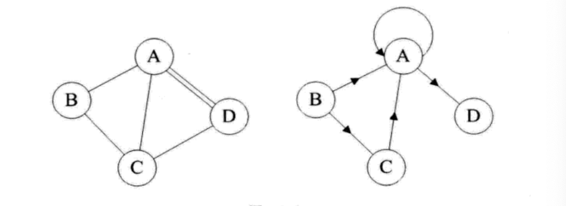
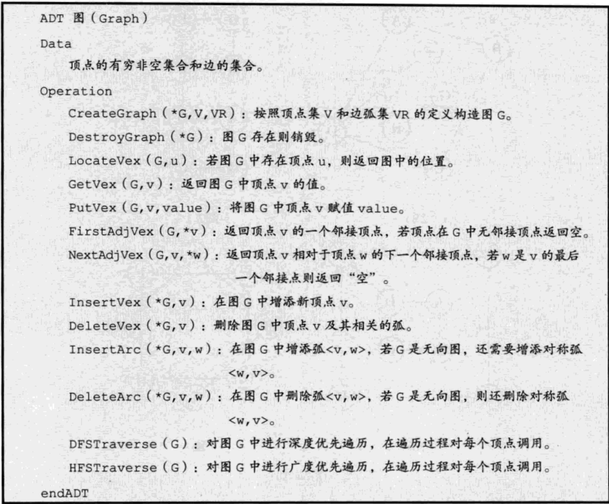
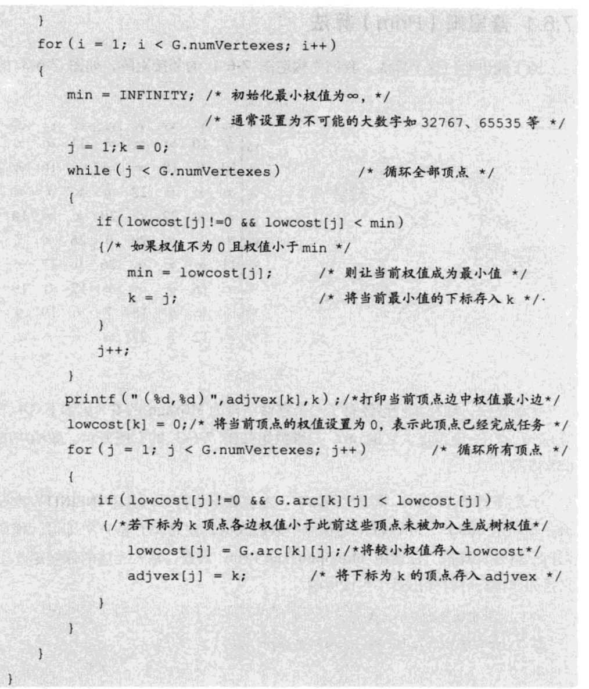
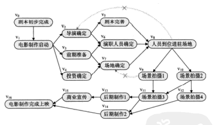

## 图

#### 图的定义

> __定义__:图(graph)是由顶点的有穷非空集合和顶点之间的边集合组成 G(V,E)其中G表示图,V是图G的顶点,E是图G中边缘集合
>
> > 不存在非空图 _强调顶点集合V有穷非空_

> 
>
> 无向边:使用无序偶对表示 ($v_i,v_j$)  无序对 (A,D) = (D,A)
>
> 有向边:使用有序偶对表示<$v_i,v_j$> 等价于j结点连向j结点
>
> - __无向图中,如果任意两个顶点之间存在边,则该图称为无向完全图,含有n个顶点则有$\frac{n\times(n-1)}{2}$条边__
> - __有向完全图: n$\times(n-1)$边__ 
> - __加权图__:
>
> ###### 图的顶点与边关系
>
> > 顶点V的度是和v相关的边数
> >
> > 路径长度是路径上的边或弧的数目
> >
> > 开始顶点与最后结束顶点一致的路径为回路/环
>
> ###### 连通图
>
> > 无向图中顶点v到顶点$v^,$存在路径,则v和$v^,$相通,如果对于任意两个顶点都是相通的,则G称为连通图

#### 图的抽象数据类型与存储结构

> 
>
> __存储结构__
>
> - 邻接矩阵
>
>   > _采用二维数组存储图_
>   >
>   >   
>   >
>   > __无向图的领接矩阵是一个对称矩阵__
>   >
>   > > 
>   >
>   > 网
>   >
>   > > 
>   > >
>   > > 
>   >
>   > 邻接矩阵逻辑代码
>   >
>   > ~~~c
>   > 参数定义
>   >   VertexType vexs [] 顶点表
>   >   EdgeType are [] [] 领接矩阵
>   >   int numVertexes, numEdges  当前顶点数和边数
>   > for vexs 获得顶点
>   >   for numVertexes ->i
>   >     for numVertexei->j
>   >       new are[i][j] 
>   > ~~~
>   >
>   > _邻接矩阵耗费空间大_
>
>   ###### 邻接表
>
>   > 采用数组与链表结合存储方式
>   >
>   > > _图G的顶点使用一个一维数组存储,每个数据元素存储指向第一个领接点的指针,便于查找顶点的边信息_
>   > >
>   > > _每个顶点$v_1$的所有邻接点构成一个线性表_
>   > >
>   > > 
>   > >
>   > > 图网存储结构
>   > >
>   > > 
>   >
>   > 有向图使用逆邻接表存储
>   >
>   > > __每个顶点$v_i$都建立一个链表为$v_i$弧头表__ (入度表)
>   > >
>   > > 
>   >
>   > 邻接表逻辑代码
>   >
>   > ~~~c
>   > typedef struct EdgeNode
>   > {
>   >  int adjvex;  // 相邻节点下标
>   >  EdgeType weight; //存储权值
>   >  struct EdgeNode *next; 
>   > }EdgeNode;
>   > 
>   > typedef struct VertexNode // 顶点表结点
>   > {
>   >   VertexType data; //顶点数据 
>   >   EdgeNode *firstedge;//边表指针
>   > }VertexNode,AdjList[MAXVEX] 
>   > ~~~
>   >
>   > 
>   >
>   > _邻接表对于有向图无法直接获取入度,必须遍历整个图才能获取_
>
>   ###### 十字链表
>
>   > 定义顶点表结构
>   >
>   > | data | firstin | firstout |
>   > | :--: | :-----: | :------: |
>   >
>   > 定义边表结点结构表
>   >
>   > | tailvex | headvex | headlink | taillink |
>   > | ------- | ------- | -------- | -------- |
>   >
>   > > firstin 表示入边表头指针
>   > >
>   > > firstout 表示出边表头指针
>   > >
>   > > tailvex 弧起点在顶点表下标
>   > >
>   > > headvex 弧终点订单表下标
>   > >
>   > > headlink入边表域指针域
>   >
>   > 
>
>   邻接多重表
>
>   边集数组

#### 图的遍历

> __深度优先遍历(Depth_First_Search)__
>
> > 从图G任意V结点出发,然后从V的未被访问的邻结点上出发深度遍历图,直到图中所有和V相关路径通路的结点都被访问到(向固定方向走,没路返回上一个结点选择)
> >
> > 
>
> __广度优先遍历 BFS__
>
> 
>
> __最小生成树__
>
> - __普里姆算法__
>
>   > 以顶点为主导 取图上任意顶点N,遍历与N相邻结点获取最小权值$N_1$,将N与$N_1$的值存入集合,下次查询以$N_1$开始遍历相邻顶点获取最小权值
>   >
>   > > 
>   > >
>   > > 
>
> - __克鲁斯卡尔算法__
>
>   > 以边为主导地址,始终选择当前可用最小边权的边,选出图上权值最小的边,存入集合,第二次获取第二小的边存入集合

#### 最短路径

> - __迪杰斯特拉算法__
>
>   - > 以起点为中心向外层扩展,直到终点为止,存在集合S与集合U,S记录求出最短路径顶点,U记录还未求出最短路径顶点
>     >
>     > _初始时，S中只有起点s；U中是除s之外的顶点，并且U中顶点的路径是"起点s到该顶点的路径"。然后，从U中找出路径最短的顶点，并将其加入到S中；接着，更新U中的顶点和顶点对应的路径。 然后，再从U中找出路径最短的顶点，并将其加入到S中；接着，更新U中的顶点和顶点对应的路径。 ... 重复该操作，直到遍历完所有顶点_
>
> - __弗洛伊德算法__
>

#### 拓扑排序

> __在一个表示工程的有向图中,用顶点表示活动,用弧表示活动之间优先关系,这样的图表示的活动网,称为AOV网(不存在环路的图)__
>
> 
>
> 拓扑序列(图中顶点存在顺序排列)

TODO

