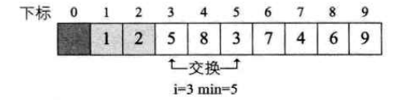
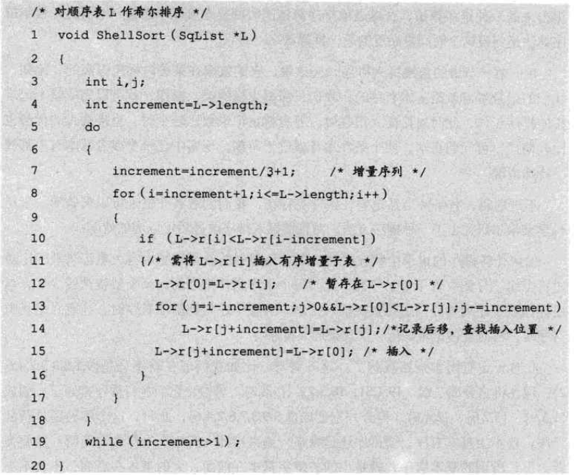
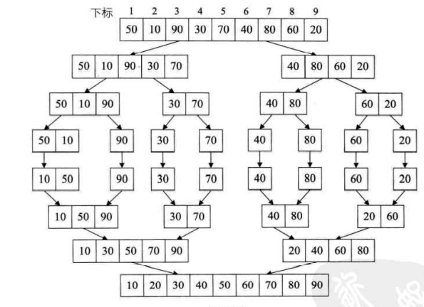
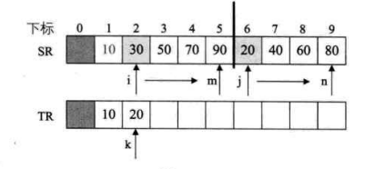
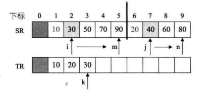
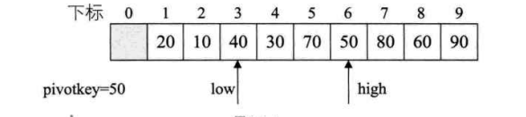
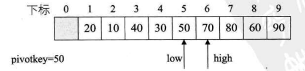
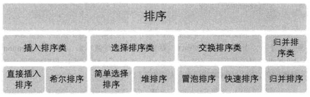

## 排序

> _内排序是在整个排序过程中,待排序的所有记录全部被放置在内存中,外排序是由于排序记录个数多,不能同时放在内存中,整个排序过程需要在内存外进行数据交换_
>
> > __排序算法性能影响__
> >
> > - 时间性能
> > - 辅助空间
> > - 算法复杂度
>
> #### 冒泡排序(交换排序)
>
> > __比较两两相邻的记录的关键字,如果反序则交换,直到没有反序记录为止__
> >
> > ~~~c
> > // 自后向前扫描的冒泡排序
> > void BubbleSort(SqList * L)
> > {
> >     int i,j;
> >     status flag = true;
> >     for (i=1;i<L->length && flag;i++) // 两两比较循环
> >     {
> >         flag = false;
> >         for(j=L->length-1;i>=i;j--) // 倒叙遍历比较
> >         {
> >          if(L->r[j]>L->r[j+1])
> >          {
> >              swap(L,j,j+1);
> >              flag =true;
> >          }
> >         }
> >     }
> > }
> > ~~~
>
> #### 选择排序(Simple Selection Sort)
>
> > __通过n-i次关键字比较,从n-i+1个记录中选出最小的记录,并和第i个记录交换__(从未排序的数列中遍历一位元素与已排序最大元素__比较交换位置__)
> >
> > ~~~c
> > void SelectSort(SqList *L)
> > {
> >     int i,j.min;
> >     for(i=1;i<L->length;i++) // 循环数组
> >     {
> >         min = i;            // 哨兵下标
> >         for(j=i+1;j<=L->length;j++)
> >         {
> >             if(L->r[min]>L->r[j])
> >                 min = j;
> >         }
> >         if(i!=min)
> >             swap(L,i,min);
> >     }
> > }
> > ~~~
> >
> >  
> >
> > 选择排序性能优于冒泡排序
>
> 
>
> #### 插入排序
>
> > __将一个接入插入到已经排好序的有序数列中,从而得到一个新的有序数列(相邻比较交换)__
> >
> > ~~~c
> > void InsertSort(SqList * L)
> > {
> >     int i,j;
> >     for(i=2;i<=L->length;i++)
> >     {
> >         if(L->r[i] < L->[i-1]) // 需将L->r[i]插入有序子表
> >         {
> >             L->r[0] = L->r[i]; // 设置哨兵
> >             for(j=i-1;L->r[j]>L->r[0];j--)
> >                 L->r[j+1]=L->r[j]; // 记录后移
> >             L->r[j+1]=L->r[0];  
> >         }
> >     }
> > }
> > ~~~
> >
> > > 性能优于选择排序
>
> #### 希尔排序(分组插入排序) TODO
>
> >  
>
> #### 堆排序
>
> > __堆排序(Heap Sort)将待排序的序列构成一个大顶堆,此时,序列的最大值是根结点,移走后,再次进行堆排序选出一个最大根结点取走__
> >
> > ~~~c
> > void HeapSort(SqList *L)
> > {
> >     int i;
> >     for(i=L->length/2;i>0;i--) // 把L中的r构成一个大顶堆
> >         HeapAdjust(L,i,L->length);
> >     for(i=L->length;i>1;i--)
> >     {
> >         swap(L,1,i); // 将堆顶记录和当前未排序子序列的最后一个记录交换
> >         HeapAdjust(L,1,i-1); // 将L->r[1...i-1]重新调整为一个大顶堆
> >     }
> > }
> > 
> > void HeapAdjust(SqList *L,int s,int m)
> > {
> >     int temp,j;
> >     temp = L->r[s];
> >     for(j=2*s;j<=m;j*=2)
> >     {
> >         if(j<m&&L->r[j]<L->r[j+1])
> >             ++j;
> >         if(temp>=L->r[j])
> >             break;
> >         L->r[s]=L->r[j];
> >         s=j;
> >     }
> >     L->r[s] = temp;
> > }
> > ~~~
> >
> > $\log_2n+1$
>
> #### 归并排序(merging Sort)
>
> > 
> >
> > ~~~ c
> > void MergerSort(SqList *L)
> > {
> >     MSort(L->r,L->r,1,L->length)
> > }
> > 
> > void MSort(int SR[],int TR1[],int s,int t)
> > {
> >     int m;
> >     int TR2[MAXSIZE+1];
> >     if(s==t) // s == t 判断是同一个值 递归终止
> >         TR1[s] = SR[s];
> >     else
> >     {
> >         m = (s+t) /2 ; // 将数组一分为2
> >         MSort(SR,TR2,s,m);//递归将SR[s..m]归并为有序的TR2[s..m]
> >         MSort(SR,TR2,m+1,t); //递归将SR[m+1..t]归并为有序的TR2[m+1...t]
> >         Merge(TR2,TR1,s,m,t); // 将TR2和TR2归并到TR1
> >     }
> > }
> > ~~~
> >
> >  
> >
> > ~~~c
> > // 将有序的SR[i..m]和SR[m+1..n]归并有序的TR[i..n]
> > //合并排序 ->首元素比较元素小的移动下标
> > void Merge(int SR[],int TR[],int i,int m,int n)
> > {
> >     int j,k,l;
> >     for(j=m+1,k=i;i<=m&&j<=n;k++)
> >     {
> >         if(SR[i]<SR[j])
> >             TR[k]=SR[i++];
> >         else
> >             TR[k]=SR[j++]
> >     }
> >     if(i<=m)
> >     {
> >         for(l=0;l<=m-i;l++)
> >             TR[k+1]=SR[i+1];
> >     }
> >     if(j<=n)
> >     {
> >         for(l=0;l<=n-j;l++)
> >             TR[k+1] = SR[j+1];
> >     }
> > }
> > ~~~
> >
> >   
> >
> > $n\log n$ 时间复杂度
>
> #### 快速排序(交换排序)
>
> > ~~~c
> > void QuickSort(SqList *L)
> > {
> >     QSort(L,1,L->length);
> > }
> > void QSort(SqList *L,int low,int high)
> > {
> >     int pivot;
> >     if(low<high)
> >     {
> >         pivot=Partition(L,low,high); //选出一个关键字,使其左边的值都比它小,右边值都比它大
> >         QSort(L,low,pivot-1);
> >         QSort(L,pivot+1,high);
> >     }
> > }
> > int Partition(SqList *L,int low,int high)
> > {
> >     int pivotkey;
> >     prvotkey = L->r[low];
> >     while(low<high)
> >     {
> >         while(low<high&&L->r[high]>=pivotkey) //最高位与最低位交换位置
> >             high--;
> >         swap(L,low,high);
> >         while(low<high&&L->r[low]<= privotkey)
> >             low++;
> >         swap(L,low,high)
> >     }
> > }
> > ~~~
> >
> >  
> >
> >  

