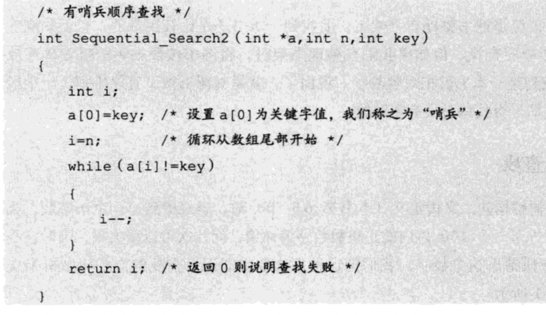
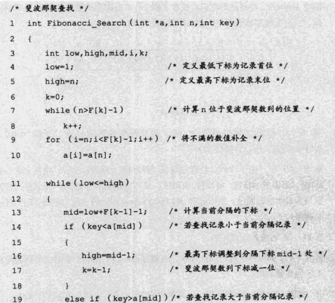
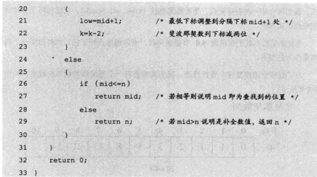
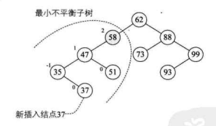
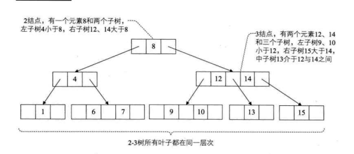
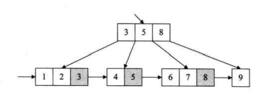

## 查找

> 平均查找长度 ASL 
>
> ASL= $\sum_{i=1}^nP_iC_i$  其中n为结点个数,$P_i$是查找第i结点的概率

#### 顺序表查找

> 顺序表是指线性顺序存储结构(结点排序)
>
> ~~~c
> typedef struct{
>   KeyType key;
>   InfoType data;
> }NodeType
> ~~~
>
> 哨兵顺序查找
>
> 
>
> 存取查找平均查找次数为 $ASL = \frac{(n+1)}{2}$

#### 二分法查找(Binary Search)

> 递归实现
>
> > ~~~c
> > int BinSearch(SeqList R,KeyType k,int low,int high)
> >  {
> >    int mid;
> >    if(low<=high){
> >      mid = (low + high) / 2 ;
> >      if(R[mid].key== k) return mid;
> >      if(R[mid].key >k) 
> >        return BinSearch(R,k,low,mid-1);
> >      else 
> >          return BinSearch(R,k,mid+1,higth);
> >   }
> >   else 
> >     return 0;
> > }
> > ~~~
>
> 非递归实现
>
> 
>
> > __差值查找__
> >
> > mid = $\frac{low+high}{2} = low + \frac{1}{2}(high-low)$  折半查找中间值
> >
> > $mid = low + \frac{key-a[low]}{a[high]-a[low]}(high-low)$  改进后的中间插入值
> >
> > __斐波那契查找__
> >
> > 
> >
> > 

#### 线性索引查找

> - 稠密索引
>
>   > 将数据集中每一条记录对应索引项(关键码与指针一一对应)
>
> - 分块索引
>
>   > 分块索引表  分块数据  (分块索引记录关键码,块长,块指针)
>
> - 倒排索引
>
>   > 记录次关键码
>   >
>   > 记录表号
>   >
>   > 其中记录号表存具有次关键字所有记录的记录号(通过属性描述查找记录,区别于通过唯一ID查找记录)

#### 二叉排序树(Binary Sort Tree  BST)

> > __左子树不为空,则左子树上的结点值小于它根结点值__
> >
> > __右子树不为空,则右子树上所有的结点值大于它根结点值__
> >
> > __左子树和右子树也分别是BST__
>
> > _构造BST主要目的是利于有序数据集插入和删除_
>
> > 二叉排序树查找
> >
> > ~~~c
> > // f指向T的双亲 
> > // 查找成功 指针指向p结点元素 否则p指向上一路径访问最后一个结点 返回True
> > Status SearchBST (BiTree T,int key , BiTree f, BiTree *p)
> > {
> >     if (!T) {   // 查找不成功
> >         *p = f;
> >         return FALSE ;
> >     }else if (Key == T->data){
> >         *p = T
> >         return TRUE;
> >     } else if (key< T->data){
> >         return SearchBST(T->lchild,key,T,p)
> >     }else{
> >         return SearchBST(T->rchild,key,T,p)
> >     }
> > }
> > ~~~
>
> > 二叉排序树插入操作
> >
> > TODO
>
> > BST删除操作
> >
> > > _叶子结点直接删除_
> > >
> > > _只存在一个子结点的子节点替代删除结点_
> > >
> > > _存在双结结点的中序变量后使用前序或后续替代删除结点_
> >
> > ~~~c
> > // 删除结点代码
> > 
> > Status DeleteBST (BiTree * T ,int key)
> > {
> >     if(!*T) return FALSE; //不存在关键字等于key的数据元素
> >     else
> >     {
> >         if(key == (*T)->data) // 找到删除元素
> >             return Delete(T)
> >         else if (key<(*T)->data)
> >             return DeleteBST(&(*T)->lchild,key);
> >             else 
> >               return DeleteBST(&(*T)->rchild,key);
> >     }
> > }
> > 
> > Status Delete(BiTree *p) // p为删除结点元素指针
> > {
> >     BiTree q,s;
> >     if((*p)->rchild == null)
> >     {
> >         q=*p; *p=(*p)->lchild; free(q);
> >     }else if((*p)->lchild == null)
> >     {
> >         q =*p; *p=(*p)->rchild; free(q);
> >     }else{ // 左右子树均不为空
> >       q=*p;s=(*p)->lchild; // 记录左指针
> >         while(s->rchild){ //循环右指针 s指向p中序遍历的前驱结点
> >             q = s; s=s->rchild;
> >         }
> >         (*p)->data = s->data  //指向被删除结点的直接前驱
> >         if(q!=*p)
> >              q->rchild=s->lchild 
> >          else
> >              q->lchild=s->lchild
> >              free(s);
> >     }
> >     return TRUE;
> > }
> > ~~~

#### AVL树(平衡二叉树)

> _每一个结点的左子树和右子树高度差至多等于1_
>
> _左子树深度减去右子树深度的值称为平衡因子BF_
>
> _距离插入结点最近,且平衡因子结对值大于1的结点为根的子树为最小不平衡子树_
>
> 
>
> 构造AVL树
>
> > 插入结点判断是否满足AVL树,不满足获取最小不平衡子树,其子根节点为正,将整个树进行右旋,为负数进行左旋(其子节点BF符号统一)
> >
> > TODO

#### 多路查找树(B树)

> > _每一个结点的子结点可以多于两个,且每个结点可以存储多个元素_
>
> __2-3树__
>
> _一个结点包含一个元素和两个或三个孩子结点(或没有孩子结点),与BST类似,左子树包含元素小于该元素,且所有叶子结点都在同一层_
>
> 
>
> 
>
> __B树(B-tree)平衡多路查找树,结点中最大的孩子数目称为B树的阶(order)__
>
> > 一个m阶的B树具有如下属性
> >
> > - 根节点不是叶子结点,则其至少有两个子树
> > - 每一个非根的分支结点都有k-1个元素和k个孩子 __其中[m/2]$\le k \le m$ 每一个叶子结点n都有k-1个元素 
> > - 所有叶子结点都在同一层
> > - 含有n个关键字的B树上查找时,从根节点到关键字结点路径上设计结点数不超过 $\log_\frac{m}{2}(\frac{n+1}{2})+1$
>
> ###### B+树(解决一个页块多次访问)
>
> > _m阶的B+树和m阶的B树差异在于:_
> >
> > - _有n棵子树的结点包含n个关键字_
> > - ___所有的叶子结点包含全部关键字的信息,及指向含这些关键字指针,叶子结点本身依据关键字大小顺序链接___
> > - ___所有分支结点可以看成索引,结点中仅含有其子树中最大(最小)关键字___
> >
> > 
> >
> > > B+树结构适合范围数据查找
>
>   

#### 散列表查找(哈希表)

> 存储位置 = f (关键字)
>
> > 散列技术时记录的存储位置和它关键字之间建立一个确定对应关系f,使得每个关键字key对应一个存储位置f(key)  f称为散列方式(Hash),采用散列技术将记录存在一块连续的存储空间中,称为散列表
>
> > 散列技术适合求解定值查找问题
> >
> > > 哈希冲突
> > >
> > > > $key_1 \ne key_2$ 但是存在$f(key_1) = f(key_2)$
> > > >
> > > > 哈希函数构造方法
> > > >
> > > > - 计算简单
> > > > - 散列地址分布均匀
> > > >
> > > > 直接定址法
> > > >
> > > > $f(key)=a\times key+b$ (a,b为常数)
> > > >
> > > > > _结构简单,均匀,不会发生冲突_
> > > >
> > > > 数学分析法
> > > >
> > > > > 抽取关键字作为hash中key值
> > > >
> > > > 平方取中法
> > > >
> > > > > 关键字平方 取中间数字
> > > >
> > > > 折叠
> > > >
> > > > > 折叠求和,将数字分组求和
> > > >
> > > > 

