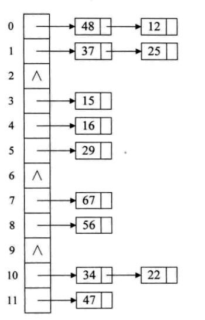

## 查找

> 平均查找长度 ASL 
>
> ASL= $\sum_{i=1}^nP_iC_i$  其中n为结点个数,$P_i$是查找第i结点的概率

#### 顺序表查找

> 顺序表是指线性顺序存储结构(结点排序)
>
> ~~~c
> typedef struct{
>   KeyType key;
>   InfoType data;
> }NodeType
> ~~~
>
> 哨兵顺序查找
>
> 
>
> 存取查找平均查找次数为 $ASL = \frac{(n+1)}{2}$

#### 二分法查找(Binary Search)

> 递归实现
>
> > ~~~c
> > int BinSearch(SeqList R,KeyType k,int low,int high)
> >  {
> >    int mid;
> >    if(low<=high){
> >      mid = (low + high) / 2 ;
> >      if(R[mid].key== k) return mid;
> >      if(R[mid].key >k) 
> >        return BinSearch(R,k,low,mid-1);
> >      else 
> >          return BinSearch(R,k,mid+1,higth);
> >   }
> >   else 
> >     return 0;
> > }
> > ~~~
>
> 非递归实现
>
> 
>
> > __差值查找__
> >
> > mid = $\frac{low+high}{2} = low + \frac{1}{2}(high-low)$  折半查找中间值
> >
> > $mid = low + \frac{key-a[low]}{a[high]-a[low]}(high-low)$  改进后的中间插入值
> >
> > __斐波那契查找__
> >
> >  
> >
> >  

#### 线性索引查找

> - 稠密索引
>
>   > 将数据集中每一条记录对应索引项(关键码与指针一一对应)
>
> - 分块索引
>
>   > 分块索引表  分块数据  (分块索引记录关键码,块长,块指针)
>
> - 倒排索引
>
>   > 记录次关键码
>   >
>   > 记录表号
>   >
>   > 其中记录号表存具有次关键字所有记录的记录号(通过属性描述查找记录,区别于通过唯一ID查找记录)

#### 二叉排序树(Binary Sort Tree  BST)

> 左节点值小于父节点，右节点值大于父节点
>
> 二叉排序树查找
>
> ~~~C
> // f指向T的双亲 
> // 查找成功 指针指向p结点元素 否则p指向上一路径访问最后一个结点 返回True
> Status SearchBST (BiTree T,int key , BiTree f, BiTree *p)
> {
>  if (!T) {   // 查找不成功
>      *p = f;
>      return FALSE ;
>  }else if (Key == T->data){
>      *p = T
>      return TRUE;
>  } else if (key< T->data){
>      return SearchBST(T->lchild,key,T,p)
>  }else{
>      return SearchBST(T->rchild,key,T,p)
>  }
> }
> ~~~
>
> 二叉树删除
>
> > 叶子结点直接删除
> >
> > 只存在一个子结点的子节点替代删除结点
> > 
> > 包含左右子节点的，中序遍历后找到删除节点**前序元素**或**后序元素**代替被删除的节点
> > 
> > ~~~c
> >// 删除结点代码
> > Status DeleteBST (BiTree * T ,int key)
> > {
> >     if(!*T) return FALSE; //不存在关键字等于key的数据元素
> >     else
> >     {
> >         if(key == (*T)->data) // 找到删除元素
> >             return Delete(T)
> >         else if (key<(*T)->data)
> >             return DeleteBST(&(*T)->lchild,key);
> >             else 
> >               return DeleteBST(&(*T)->rchild,key);
> >     }
> > }
> > 
> > Status Delete(BiTree *p) // p为删除结点元素指针
> > {
> >     BiTree q,s;
> >     if((*p)->rchild == null)
> >     {
> >         q=*p; *p=(*p)->lchild; free(q);
> >     }else if((*p)->lchild == null)
> >     {
> >         q =*p; *p=(*p)->rchild; free(q);
> >     }else{ // 左右子树均不为空
> >       q=*p;s=(*p)->lchild; // 记录左指针
> >         while(s->rchild){ //循环右指针 s指向p中序遍历的前驱结点
> >             q = s; s=s->rchild;
> >         }
> >         (*p)->data = s->data  //指向被删除结点的直接前驱
> >         if(q!=*p)
> >              q->rchild=s->lchild 
> >          else
> >              q->lchild=s->lchild
> >              free(s);
> >     }
> >     return TRUE;
> > }
> > ~~~

#### 多路查找树(B树)

> > _每一个结点的子结点可以多于两个,且每个结点可以存储多个元素_
>
> __2-3树__
>
> _一个结点包含一个元素和两个或三个孩子结点(或没有孩子结点),与BST类似,左子树包含元素小于该元素,且所有叶子结点都在同一层_
>
> 
>
> 
>
> __B树(B-tree)平衡多路查找树,结点中最大的孩子数目称为B树的阶(order)__
>
> > 一个m阶的B树具有如下属性
> >
> > - 根节点不是叶子结点,则其至少有两个子树
> > - 每一个非根的分支结点都有k-1个元素和k个孩子 __其中[m/2]$\le k \le m$ 每一个叶子结点n都有k-1个元素 
> > - 所有叶子结点都在同一层
> > - 含有n个关键字的B树上查找时,从根节点到关键字结点路径上设计结点数不超过 $\log_\frac{m}{2}(\frac{n+1}{2})+1$
>
> ###### B+树(解决一个页块多次访问)
>
> > _m阶的B+树和m阶的B树差异在于:_
> >
> > - _有n棵子树的结点包含n个关键字_
> > - ___所有的叶子结点包含全部关键字的信息,及指向含这些关键字指针,叶子结点本身依据关键字大小顺序链接___
> > - ___所有分支结点可以看成索引,结点中仅含有其子树中最大(最小)关键字___
> >
> > 
> >
> > > B+树结构适合范围数据查找
>
>   

#### 散列表查找(哈希表)

> - 散列技术时记录的存储位置和它关键字之间建立一个确定对应关系f,使得每个关键字key对应一个存储位置f(key)  f称为散列方式(Hash),采用散列技术将记录存在一块连续的存储空间中,称为散列表
>
> - 哈希函数：简单，散列地址分布均匀
>
> - 常见哈希函数
>
>   > 直接定址法：$f(key)=a\times key+b$ (a,b为常数)
>   >
>   > 数学分析法：抽取关键字作为hash中key值
>   >
>   > 平方取中法：关键字平方取中间数字
>   >
>   > 折叠：折叠求和,将数字分组求和
>   >
>   > 除留余数法：f(key) = key mod p (p<=m)
>   >
>   > 随机数法
>  
> - 哈希冲突
>
>   > 开放定址法：寻找下一个空的散列地址,线性探测法
>   >
>   > $f_1(key) = (f(key)+d_i) MOD m  (d_i=1,2,3,m-1)$ 
>   >
>   > 再散列函数：多次计算散列
>   >
>   > 链接地址法：将哈希冲突数据放在链表上,散列表存储同义词的表头指针
>   >
>   >  
>   >
>   >  公共溢出区法：使用溢出表存储哈希冲突数据
> 

