## 树和二叉树

> - 树的定义
>
>   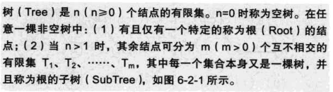
>
> - 树的基本术语
>
>   > - 一个结点拥有的子树称为该结点的度(Degree)
>   > - 树中结点最大的度为该树的度
>   > - 度数为零的结点为叶子(Left)
>   > - 该结点的子结点称为双亲或父结点
>   > - 树中最大的层级为树的深度(高度)
>   > - 森林(没有根结点的树)
>
> - 树的抽象数据类型
>
>   > 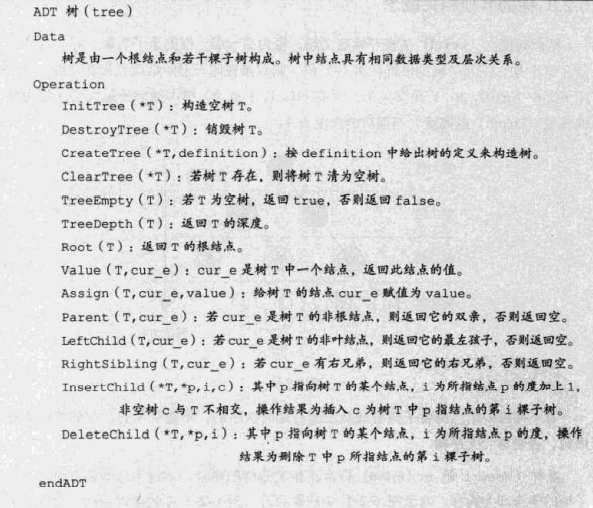 
>   >
>   > 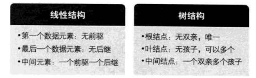 
>
> **树的存储结构**
>
> > 双亲表示法(子结点存储父结点指针) 
> >
> > 孩子表示法(把每个结点孩子指针用链表存储起来)
> >
> > 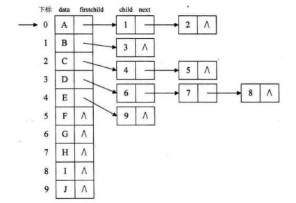 
> >
> > 孩子兄弟表示法(二叉树实现)
> >
> > data | firstChild | rigthChild
> >
> > firstChild  存储第一个孩子结点指针
> >
> > rigth 存储该结点右兄弟结点指针
> >
> > 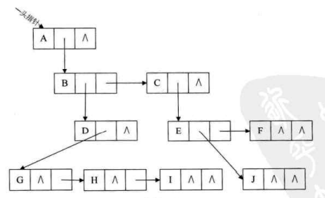 
> >
> > 
>
> #### 二叉树(Binary Tree)
>
> > 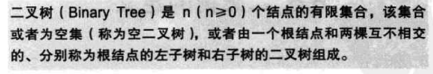 
> >
> > __二叉树不存在结点大于2的度__
>
> ###### 二叉树性质
>
> > 1. 在二叉树的第i层最多有$2^{i-1}$个结点(i>=1)
> > 2. 深度为k的二叉树至多有$2^k-1$个结点
> > 3. 存在任意二叉树T,其叶子结点数为$n_0$,度为2的结点数为$n_2$ 则$n_0=n_2+1$
> > 4. 具有n个结点的__完全二叉树__的深度为$\log_2n+1$
>
> ###### 二叉树的存储结构
>
> > - 顺序存储结构
> >
> >   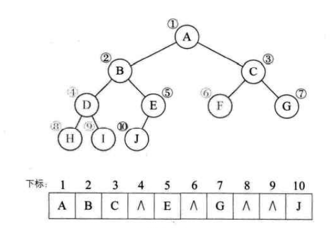  
> >
> > - 二叉链表
> >
> >   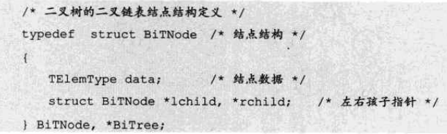 
> >
> >   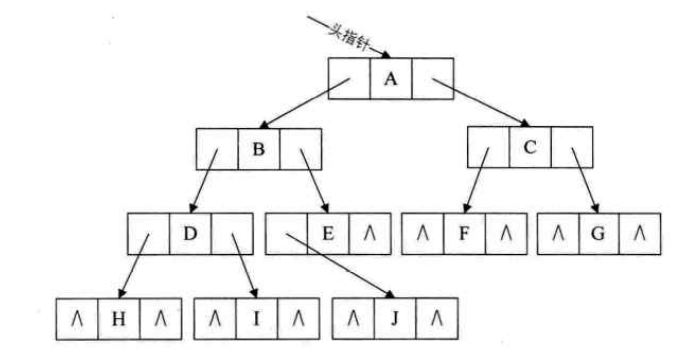
> >
>
> **遍历二叉树**
>
> - __前序遍历__
>
>   > 访问根结点->前序遍历左子树->前序遍历右子树
>   >
>   > ~~~c
>   > T->data;
>   > PreOrderTraveres(T->lchild);
>   > PreOrderTraverse(T->rchild);
>   > ~~~
>
> - __中序遍历__
>
>   > 中序遍历左子树->访问根结点->中序遍历右子树
>   >
>   > ~~~c
>   > PreOrderTraveres(T->lchild);
>   > T->data;
>   > PreOrderTraverse(T->rchild);
>   > ~~~
>
> - __后序遍历__
>
>   > 后序遍历左子树->后序遍历右子树->访问根结点
>   >
>   > ~~~c
>   > PreOrderTraveres(T->lchild);
>   > PreOrderTraverse(T->rchild);
>   > T->data;
>   > ~~~
>
> 非递归遍历算法
>
> > ~~~c
> > void Inorder(BinTree bt)
> > {
> >  SeqStack S; BInTNode *p;
> >  InitStack(&S);Push(&S,bt);
> >  while(!StackEmpty(&S)){
> >      while(GetTop(&S))
> >      Push(&S,GetTop(&S)->data);
> >      p=Pop(&S);
> >      if(!StackEmpty(&S)){
> >          GetTop(&S->data);
> >          p = Pop(&S);
> >          Push(&S,p->rchild);
> >      }
> >  }
> > }
> > ~~~
> >
> > 已知**前序遍历序列和中序遍历序列**,可以确定唯一一个二叉树
> >
> > 已知**后序遍历和中序遍历序列**,可以确定唯一一个二叉树
>
> #### 线索二叉树(解决空间利用问题)
>
> >  _指向前驱和后继的指针称为线索,加上线索的二叉树链表称为线索链表_
> >
> > 使用中序遍历出序列将对应的空指针域指向前驱和后继
> >
> > __H D I B J E A F C G __ 中序遍历
> >
> > 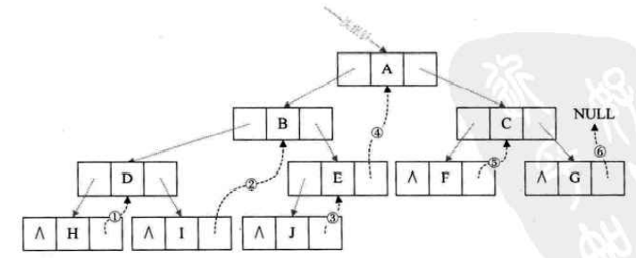 
> >
> > 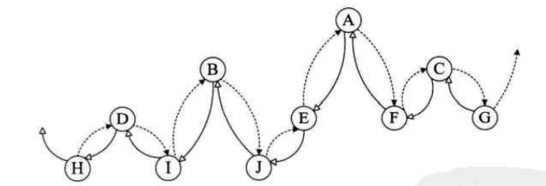 
> >
> >  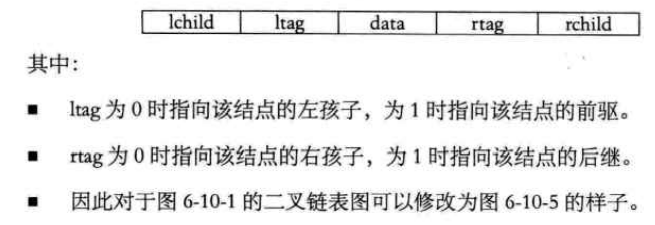 
> >
> > 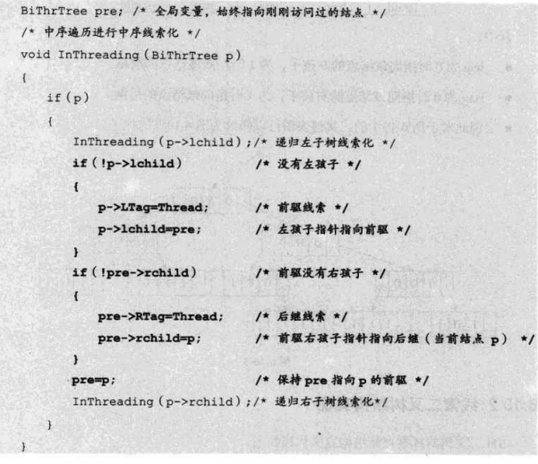 
>
> ####  **查找树**：
>
> > **BST：二叉排序树**
> >
> > - 左结点值小于父结点，右结点值大于父结点
> > - 极小值：二叉树最左端的结点（**叶结点或者只包含一个子结点的父结点**）
> > - 极大值：二叉树最右端的结点（**叶结点或者只包含一个子结点的父结点**）
> > - 插入：**新插入的结点一定是个叶子结点**（存在相同值不插入）
> > - 删除
> >   1. 叶子结点：直接删除
> >   2. 非叶子结点
> >      - 只包含一个子结点的，使用子结点代替删除结点
> >      - 包含左右子结点的，中序遍历后找到删除结点**前序元素**或**后序元素**代替被删除的结点
> >
> > **AVL：平衡二叉树（解决BST退化成线性表问题）**
> >
> > - |BF|<=1 的二叉排序树（BF：平衡因子，同层左树深度减去右树深度）
> >
> > - 插入：插入的父结点不可能失衡，**其祖父结点可能存在失衡情况**
> >
> >   > 失衡调节操作
> >   >
> >   > 1. LL： 左失衡（最大层失衡点左侧路径）执行右旋操作
> >   > 2. RR：右失衡，执行左旋操作
> >   > 3. RL：右左失衡（最大层失衡点到新增结点路径）：右旋转为RR，在进行左旋恢复平衡
> >   > 4. LR：左右失衡，先左旋，后右旋
> >   >
> >   > **右旋操作步骤：**
> >   >
> >   > - 失衡点的左子结点代替失衡点
> >   >
> >   > - 左子结点的右结点使用失衡点代替
> >   >
> >   > - 原先右子结点作为失衡结点的左子结点
> >   >
> >   >   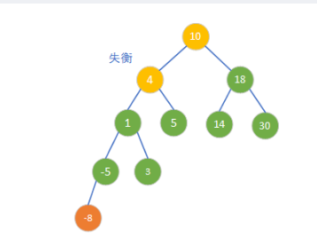  
> >   >
> >   >   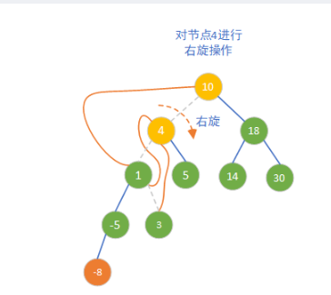  
> >   >
> >   >   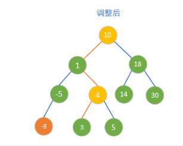 
> >   >
> >   >    
> >
> > **B树：多路查找树**
> >
> > - **每个结点至少存在两个子结点**
> >
> > - 每个结点存储的数据份数等于其度数减一
> >
> > - **每个结点中存储数据从小到大排序**
> >
> > - **所有叶子结点都在同一层**
> >
> > - 2-3树 ：结点最大度为3的B树
> >
> >   > 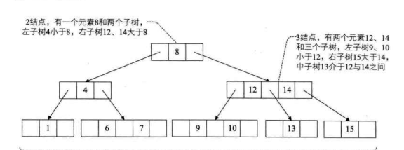 
> >
> > - 2-3-4树：自平衡树（非叶子结点最大度为4的B树）
> >
> >   > 插入：叶子结点插入
> >   >
> >   > - 升元：将插入结点有2升级为3，或由3升级到4结点
> >   > - 选元：将中间元素提升到父结点（递归）
> >
> > - 红黑树：(使用AVL与红黑颜色实现2-3-4树，接近AVL树)
> >
> >   > 1. 根结点黑色
> >   > 2. **叶子结点不存储数据，且颜色为黑色**
> >   > 3. **子结点与父结点颜色相反（每个红结点下面都是黑结点）**
> >   > 4. 从根结点到任意叶子结点经过的黑色路径相等
> >   > 5. 红黑树最大高度$2log_2(n+1)$
> >   >
> >   > **红黑树转2-3-4树**：将所有红色结点移动到其父类上，则构成2-3-4树，
> >   >
> >   > **2-3-4树转红黑树**：
> >   >
> >   > - 4结点拆分1个黑色结点和两个红色结点(中间对应黑色结点)
> >   > - 3结点拆分1个黑色结点和1个红色结点，先插入的键对应节点为黑色
> >   > - 2结点全部转为黑色结点
> >   >
> >   > 插入：新加入结点为红色
> >   >
> >   > 1. 若父结点为黑色，无需调整（平衡状态）
> >   > 1. 父结点和叔节点为红色，向上判断其祖父结点
> >   > 1. 父结点为红色，叔节点为黑色，最多两次旋转恢复平衡
> >   >
> >   > [删除](https://zhuanlan.zhihu.com/p/476335458)
> >
> > - **B+树：**
> >
> >   > 叶子结点包含所有的数据，且排序
> >
>
> ####  树与森林与二叉树转换
>
> ###### 树转二叉树
>
> > 1. 兄弟结点连线
> > 2. 树中结点只保留与它第一个孩子结点连线(__兄弟结点变成右子结点__)
> >
> >  
>
> ###### 森林转为二叉树
>
> > 1. 将森林中每棵树转为二叉树
> > 2. 第一个二叉树不动,依次把二叉树的根结点作为前一个二叉树根结点的右孩子
> >
> > 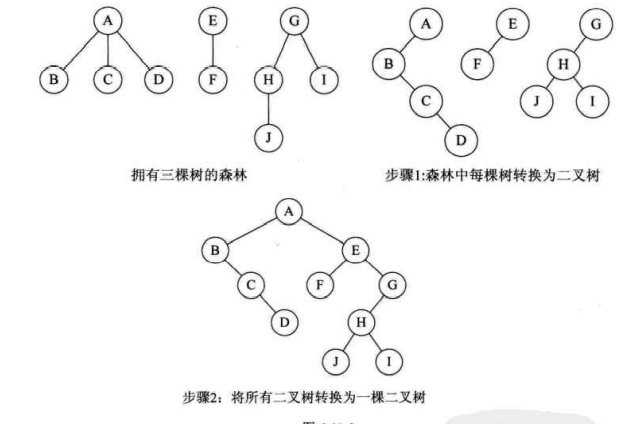 
>
> ###### 二叉树转为树
>
> > 1. 将每一层右子结点与父结点相连
> > 2. 去掉右子结点连线
> >
> > 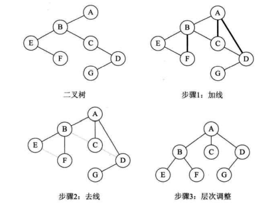 
>
> ###### 二叉树转为森林
>
> > 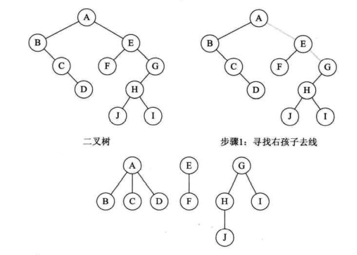 
>
> #### 赫夫曼树及其应用
>
> > 从树中一个结点到另一个结点之间的分支构成两个结点之间的路径,路径上的分支数目称作路径长度.树的路径长度就是从根结点到每个结点路径长度之和
> >
> > WPL:__带权路径长度WPL最小的二叉树称为赫夫曼树__
> >
> > ###### 构造赫夫曼树
> >
> > > 1. 将叶子结点顺序排列数列
> > > 2. 取两个最小权值结点构造成一个新结点$N_1$代入步骤1中数列
> > > 3. 重复1,2步骤
> > >
> > > eg: 存在数列 __A5, E10, B15, D30, C40__构造赫夫曼树
> > >
> > > 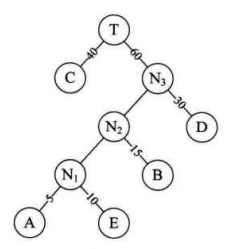 
> > >
> > > WPL = $40\times 1 + 30\times 2+15\times3+10\times4+5\times4$ = 205
> >
> > ###### 赫夫曼编码
> >
> > >构建赫夫曼树,使用0,1字符代替左子树和右子树经过路径,构成编码表
> > >
> > > 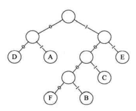 
> > >
> > >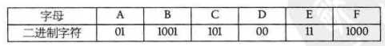 
> > >

