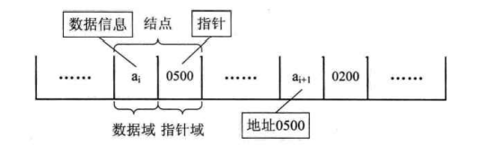
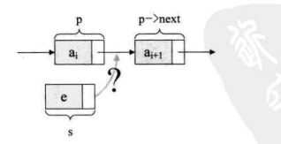
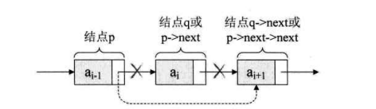
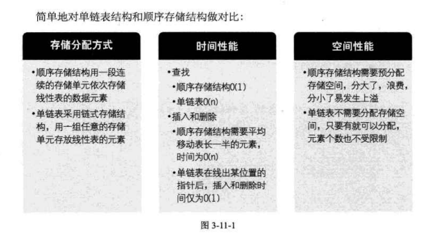
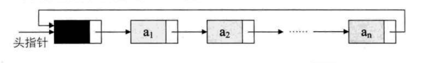
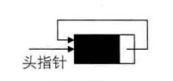
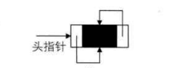
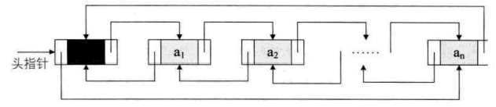
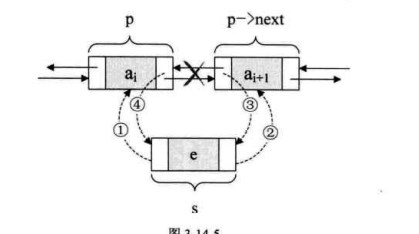
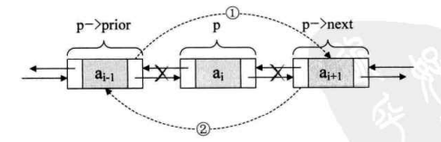

## 线性表

#### 线性表定义

> __线性表(List):零个或者多个数据元素有限序列__
>
> ___若元素存在多个,则第一个元素无前驱,最后一个无后驱,其他元素存在唯一的前驱,和后驱___

#### 线性表的顺序存储结构

> $LOC(a_{i}) = LOC(a_1) +(i-1)*d$
>
> > _$a_i$为线性表上第i个元素, $a_1$为线性表示上第一个元素,d为每个元素所占长度_
>
> ###### 线性表插入操作
>
> ~~~c
> //在顺序表L中第i个位置前插入一个新元素x
> for(j= L->length-1; j>= i-1;j--)
> {
>     L->data[j+1] = L->data[j]; // 从最后一个元素开始往前移动
> } 
>     L->data[i-1] = x 
>     L->length++; 
> 
> // i为插入位置下标,x插入数据,L线性表
> ~~~
>
> 等概率下顺序线性表插入平均移动次数为 $E_{is}(n) = \sum_{i=1}^{n+1}P_i(n-i+1) = \frac{n}{2}$
>
> ###### 线性表删除操作
>
> ~~~c
> x = L->data[i]
> for(j=i,j<=L->length;j++)
> {
>     L->data[j-1] = L->data[j];
> }
>     L->length--;
>     return x;
> // i 删除位置  x为删除元素 
> 
> ~~~

#### 线性表的链式存储结构

> 
>
> > 单链表  head头指针(一般采用变量名字地址设定) tail尾指针指向NULL
> >
> > _头指针指向链表第一个结点指针,头指针具有标识作用,无论链表是否为空,头指针均不为空_
>
> ###### 单链表
>
> > - 头插法
> >
> >   > 将插入的结点放到当前表头上
> >   >
> >   > ~~~c
> >   > // 申请新结点p
> >   > p = (ListNode*)malloc(sizeof(ListNode));
> >   > p->data = x;
> >   > //将头指针指向新结点指针域
> >   > p->next = head;
> >   > //将p结点指针指向赋值头指针
> >   > head = p
> >   > return head;
> >   > ~~~
> >   >
> >   > 
> >
> > - 尾插法
> >
> >   > 输入与输出内容一致使用插尾法,将新结点插入当前链表的表尾
> >   >
> >   > ~~~c
> >   > r = head;
> >   > p = (ListNode *) malloc(sizeof(ListNode));
> >   > p -> data = ch;
> >   > r -> next = p; // 将头结点指针域指向下一结点
> >   > r = p;        //
> >   > r->next = null;
> >   > return head;
> >   > ~~~
> >
> > - 单链表插入
> >
> >   > 
> >   >
> >   > s->next = p -> next ;  p->next = s;
> >   >
> >   > 将p的后继结点改为s的后继结点, p的下一结点指向s
> >   >
> >   > ~~~c
> >   > void InsertList (LinkList head, int i,DataType x)
> >   > {
> >   >     ListNode *p,*s; int j;
> >   >     p = head; j=0;
> >   >     while(p && j<i-1) // 寻找第i-1个结点
> >   >     {
> >   >         p = p->next;
> >   >         ++j;
> >   >     }
> >   >     if(p==null)
> >   >       return ;
> >   >     else{
> >   >         s = (ListNode *)malloc(sizeof(ListNode));
> >   >         s->data = x ; s->next=p->next;
> >   >         p->next = s;
> >   >     }
> >   > ~~~
> >
> > - 单链表删除
> >
> >   > 
> >   >
> >   > q=p->next; p->next=q->next;
> >   >
> >   > q为删除结点,p为q前驱结点
> >   >
> >   > 或
> >   >
> >   > p->next = p->next->next
> >
> > 
> >
> > 
> >
> ###### 循环链表
>
> > __单链表中终端结点指针指向头指针,使整个单链表成为一个环,首尾衔接的单链表为循环链表__
> >
> > 
> >
> > 
> >
> > __对比单链表,循环链表的判断条件是时候等于头指针__
> >
> > ~~~c
> > void InsertList(LinkList L,int x)
> > {
> >     ListNode *s,*p,*q;
> >     s=(ListNode *)malloc(sizeof(ListNode));
> >     s->data=x; p=L;
> >     q=p->next;
> >     while(q->data>x && q!=null){ //有序性插入
> >         p=p->next;
> >         q=p->next;
> >     }
> >     p->next = s;
> >     s->next= q;
> > }
> > ~~~
>
> ###### 双向链表
>
> > 双向链表结构
> >
> > ~~~c
> > typedef struct DulNode
> > {
> >     ElemType data;
> >     struct DulNode *prior; // 直接前驱指针
> >     struct DulNode *next;  // 直接后继指针
> > } DulNode,*DuLinkList;
> > ~~~
> >
> > 
> >
> > 
> >
> > - 双向链表插入
> >
> >   
> >
> > ~~~c
> > DlNode  *s = (DLNode *)malloc(sizeof(DLNode));
> > s->prior = p;
> > s->next = p->next;
> > p->next ->prior = s;
> > p->next = s;
> > ~~~
>
> - 双向链删除
>
> > 
> >
> > p->prior->next=p->next;
> >
> > p->next->prior = p->prior;
> >
> > 
>
> 
>
> 

