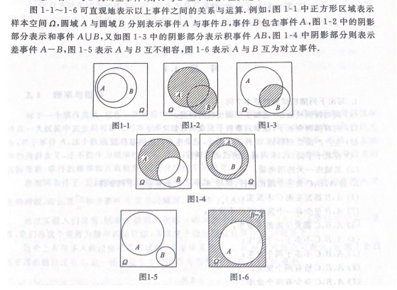

## 随机事件与概率

> 随机事件：在一次试验中可能出现也可能不出现的事件
>
> 基本事件：样本空间$\Omega$的仅包含一个样本点w的单点子集{w}
>
> 必然事件：每次试验中总是发生
>
> 不可能事件：试验结果不存在的事件

- #### **随机事件的关系运算**

  > 1. **事件包含与相等** （设A，B为两个事件，若A发生必然导致B发生，则称事件B中包含事件A，记为 A$\subset$B）
  >2. **和事件** （称事件A，B中至少有一个发生，记作 A $\cup$ B）
  > 3. **积事件**（A事件与B事件同时发生，记为A$\cap$B或 AB)
  >4. **差事件**（A发生且B不发生的事件 记为 A - B)
  > 5. **互斥事件**（A事件与B事件不能同时发生 AB=$\emptyset$）
  >6. **对立事件**（A事件不发生为事件A的逆事件，记为 $\overline{A}$)
  > 
  > 

  #### **概率**

  > 在相同情况下进行n次实验，事件发生的次数$n_A$称为事件发生频数，$\frac{n_a}{n}$ 称为事件A发生的频率，随着实验次数n的大量增加，频率会逐渐稳定于某一常数，这个稳定值就是概率P(A)
  >
  > 
  >
  > - **古典概型**（基本事件有限，基本事件发生可能性相同）
  >
  >   > 1. 排列：从n个不同元素中，任取m(m≤n,m与n均为自然数,下同）个不同的元素按照一定的顺序排成一列，叫做从n个不同元素中取出m个元素的一个排列
  >   >
  >   >    > $A^m_n= n(n-1)(n-2)...(n-m+1) = \frac{n!}{(n-m)!}$
  >   >
  >   > 2. 组合：从n个不同元素中，任取m(m≤n）个元素并成一组，叫做从n个不同元素中取出m个元素的一个组合
  >   >
  >   >    > $C^m_n = \frac{A^m_n}{m!} = \frac{n!}{m!(n-m)!}$
  >   >
  >   > 3. 可重复排序
  >   >
  >   >    > 从n个**不同元素**中每次取出 r 个元素，并且允许元素重复出现的[排列](https://baike.baidu.com/item/排列/7804523)叫做允许重复的排列，即**重复排列**，其排列总数记作$U^r_n$  
  >   >    >
  >   >    > $U^r_n = n^r$
  >
  > - **概念定义与性质**
  >
  >   > 1. P(A) >= 0
  >   > 2. $P(\Omega)$ = 1
  >   > 3. 设$A_1,A_2,A_3,...A_m$是一列互不相容的事件，则有 $\sum^{\infty}_{k=1}P(A_k)$
  >   > 4. **对于任意事件A,B有 $P(A\cup B) = P(A) + P(B) - P(AB) $**
  >   > 6. **P(B-A) = P(B) - P(AB)**
  >

- #### **条件概率**

  > - 设A,B是两个事件，且P(B) > 0 称 $P(A|B) = \frac{P(AB)}{P(B)}$ 为在**事件B发生条件下事件A发生的条件概率**
  >
  > - **概率乘法公式**
  >   $$
  >   P(A) > 0 \ 则 \  P(AB)=P(A)P(B|A) \\
  >   P(B) > 0 \ 则  \ P(AB)=P(B)P(A|B)\\
  >   P(AB) > 0 \ 则 \ P(ABC) = P(A)P(B|A)P(C|AB)\\
  >   $$
  >
  > - **全概率公式与贝叶斯公式**
  >
  >   > **全概率公式**：设随机试验对应的样本空间为$\Omega$，设$A_1,A_2，A_3，...A_n$是样本空间$\Omega$的一个划分，B是任意事件，则
  >   > $$
  >   > P(B)= \sum^{n}_{i=1}P(A_i)P(B|A_i) \\
  >   > P(B) = P(A)P(B|A)+P(\overline{A})P(B|\overline{A})
  >   > $$
  >   > **贝叶斯公式：** 设$A_1,A_2,A_3,...A_n$是样本空间的一个划分，B是任意一事件，且P(B）>0，则
  >   > $$
  >   > P(A_i|B)=\frac {P(A_i)P(B|A_i)}{P(B)}
  >   > $$
  
- #### **事件独立性**
  
  > 若P(AB) = P(A）P(B）则称A与B相互独立
  >
  > - 若A与B相互独立，则$\overline{A}与\overline{B}，\overline{A}与B ，A与\overline{B}$都相互独立
  > - 
  
    

