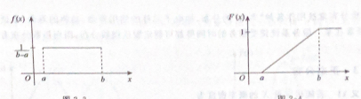

## 随机变量及其概率分布

> **随机变量：** 设E是随机试验，样本空间$\Omega$，如果对于每一个结果 w 属于$\Omega$，都有一个实数X(w)与之对应，这样就得到一个定义在$\Omega$上的实值函数 X = X(w),这个实数X称为随机变量。_随机变量由随机试验结果决定_
>
> **离散型随机变量：** 若随机变量X**只取有限个**或**可列无限多个值**，则称X为离散型随机变量
>
> **分布率：** 离散型随机变量X对应的概率x按一定顺序排列
> $$
> P\{X=x_k\} = p_k \ , k=1,2,...
> $$
>
> > 分布率$p_k$具有下列性质
> >
> > 1. $p_k \geqslant 0 \ , k=1,2...$
> > 2. $\sum^{\infty}_{k=1} = 1$
>
> **0-1分布：**若随机变量只取两个可能值，0，1 且 P{X=1} = p ，P{X=0} = q  （n重伯努利试验）
>
> **二项分布：**若随机变量X可能取的值为0,1，...n，n为正整数，而**X的分布律**为
> $$
> P\{X=k\} = P_n(k) = C^k_np^kq^{n-k}
> $$
> 其中0<p<1,p+q = 1,则称X服从参数n，p的二项分布，简称 X~B(n,p)
>
> > ---
> >
> > *二项分布应用：从一批产品的不合格率为p，检查n件产品，n件产品中不合格数X服从二项分布*
>
> **泊松分布：**设$\gamma > 0$是常数，n是任意正整数，在n重伯利试验中，计事件A在一次试验中发生概率为$p_n$，当$p\to +\infty时，有np_n \to \gamma$则对于任意取定的非负整数k有
> $$
> \lim_{n\rightarrow\infty} C^k_np^k_n(1-p_n)^{n-k} = \frac{{\lambda}^k}{k!}e^{-\lambda} \\
> 泊松分布： \\
>  p_k = P\{X=k\} =  \frac{{\lambda}^k}{k!}e^{-\lambda} 其中\lambda >0,则称X服从参数\lambda的泊松分布，简称为X~P(\lambda)
> $$
>  

- #### **随机变量的分布函数**

  > **非离散随机变量的概率分布存在函数关系**
  >
  > 
  >
  > **分布函数：**F(x) = P{X<= x}  $x\in (-\infty,+\infty)$  **P为概率值**
  >
  > *随机分布函数包含离散变量的分布*
  >
  > ---
  >
  > **分布函数性质**
  >
  > 1. 0 <= F(x) <= 1
  > 2. F(x)**不是减函数**，即对于任意的$x_1<x_2$都有$F(x_1) <= F(x_2)$
  > 3. $F(-\infty) = 0 ,F(+\infty)=1,即 \lim_{x\to-\infty}F(x)= 0 ,\lim_{x\to+\infty}F(x)= 1 $
  > 3. F(X)右连续，即$F(x+0)=\lim_{\Delta_x \to 0^+ }F(x+\Delta x) = F(x)$
  >
  > ---
  >
  > 已知X的分布律函数F(x)
  >
  > 1. P{X<=b}= F(b)
  > 2. P{a<X<=b} = F(b) - F(a)
  > 3. P(X>b) = 1 - F(b)
  >
  >  

- #### **连续型随机变量及其概率密度**

  > **概率密度：** 
  > $$
  > 若对于随机变量X的分布函数F(X)，存在非负数函数f(x),使得对任意实数x有\\
  > F(x) = 
  >  \begin{cases}
  >   \int^{x}_{-\infty}f(t)dt
  >   \end{cases} \\
  >   则称X为连续型随机变量，并称f(x)为X的概率密度函数，简称概率密度
  > $$
  >
  > > 连续型随机变量在某一指定点取值的概率为0
  > >
  > > ---
  > >
  > > 概率密度性质
  > >
  > > 1. f(x) >= 0
  > > 2. $\int_{-\infty}^{+\infty}f(x)dx = 1$
  > > 3. P{a<X<=b} = F(b) - F(a) = $\int^b_af(x)dx \ \ a<= b$
  > > 4. 设x为f(x)的连续点，则$F(x)^`$存在且 $F(x)^` = f(x)$
  
- #### **均匀分布与指数分布**

  > 若随机变量X的概率密度为
  > $$
  > f(x) = \begin{cases}
  > \frac{1}{b-a}  ,\ a<=x<=b \\ 
  > 0 \ \ 其他
  > \end{cases}
  > $$
  > 则称X服从区间[a,b]上的**均匀分布**，布简称X~U(a，b)
  >
  > **均匀分布：**随机变量X落在区间[a,b]内长度相等子区间的**概率都是相等的**
  >
  >  
  >
  > ---
  >
  > **指数分布：**
  >
  > 若随机变量X的概率密度为
  > $$
  > f(x)= \begin{cases}
  > \lambda e^{-\lambda x}  \ x >0\\
  > 0 \ x<= 0
  > \end{cases}
  > 其中\lambda > 0 为常数，则称X服从参数\lambda的指数分布  简称 X ~ E(\lambda)
  > $$
  > **指数分布：**用于各种寿命的分布，电子元件，动物寿命，与时间相关的概率
  >
  > ---
  >
  > **正态分布：**
  >
  > 若随机变量X的**概率密度** 
  > $$
  > f(x) = \frac{1}{\sqrt{2\pi\sigma}}e^{-\frac{(x-u)^2}{2\sigma^2}}
  > $$
  > 其中u，$\sigma ^2$为常数，X服从参数为u，$\sigma ^2$的正态分布，简称为X~N（u，$\sigma ^2$）
  >
  > ---
  >
  > **正态分布性质**
  >
  > 1. P{u -h < X <=  u} = P{u< X <= u + h}
  > 2. 当x=u时取到最大值 $f(u) = \frac {1}{\sqrt{2\pi\sigma}}$
  
- #### **随机变量函数的概率分布**

  > 通过已知**随机变量的概率分布**去其他函数的概率分布（复合随机变量函数)
  >
  > 

  

