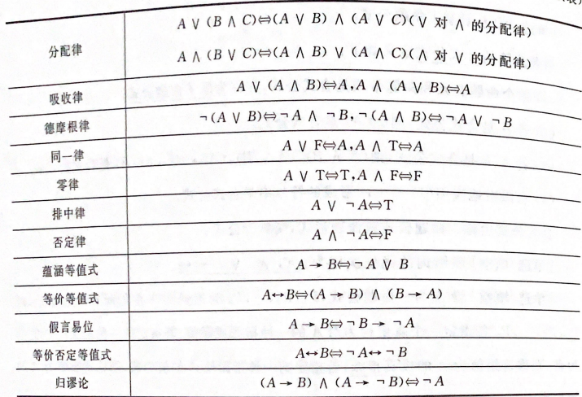
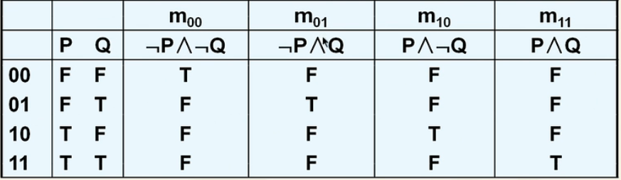
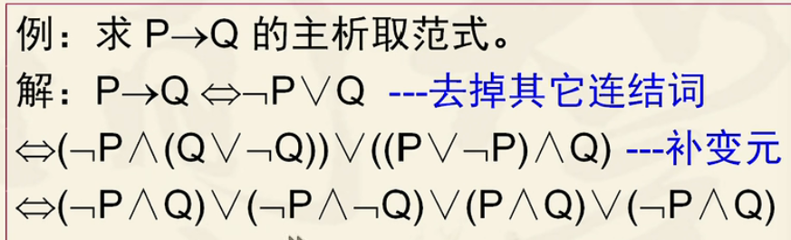
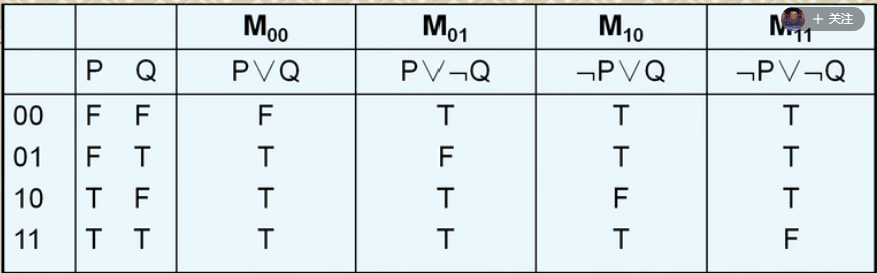
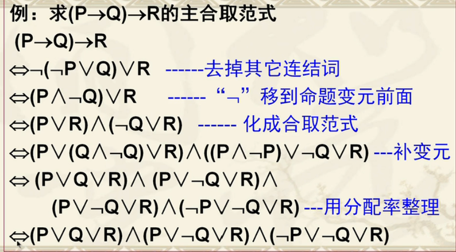

## 命题逻辑(proposition logic)

> **命题：具有真假意义的陈述语句均为命题**（唯一真值的陈述句，不能在某些条件下，出现即为真又为假的结果）
>
> 论证：用证据证明论题的真实性
>
> 驳论：别人提出观点，用论证反驳它，这种论证叫驳论
>
> **悖论：一个论点通过理性推理否定了自身**  _eg：“这句话是假的”如过这句话是真的，那么通过这句话我们可以得知这句话是假的，因为一句话不可能又真又假，所以这是个悖论_
>
> **悖论不是命题**
>
> **结论：从一定的前提推论得到的结果，对命题做出总结性的判断**
>
> 
 #### **复合命题与联结词**
>
>- $\lnot$   否定
>- $\land$ 合取  P$\land$Q 当且仅当P，Q为T时 则为T 否则都为F 
>- $\lor$ 析取   P$\lor$Q 当且仅当 P  Q 为F时 为F    **异或(P,Q之间具有相斥性) ** $(P\land\,\lnot Q)\lor(\lnot P\land Q)$
>- $\to$  条件  P$\to$Q 当且仅当P为真，Q为F时，  P$\to$Q 为F
>- $\leftrightarrow$ 双条件  当P与Q同时为真时  P$\leftrightarrow$ Q真
>- **联合词的执行顺序   $\lnot$   $\land$  $\lor$  $\to$  $\leftrightarrow$** 
>
#### **命题公式**
>命题公式中三种数据类型
>
>1. 命题常项
>
>2. 常值命题
>
>3. 命题变元（没有命题指派下，不是命题)
>
>---
>
>- 单个命题变元和常项是原子命题公式
>- 真值表  (P$\land$Q)$\to$R   真值表的条数是$2^n$种 n表示元命题个数
>- 命题符号化
>
>	1. 将语句分解成原子命题
>	2. 将大写字母赋值命题
>	3. 使用逻辑联结词连接原子命题
>
>|  P   |  Q   |  R   | P$\land$Q | (P$\land$Q)$\to$R |
>| :--: | :--: | :--: | :-------: | :---------------: |
>|  F   |  F   |  F   |     F     |         T         |
>|  F   |  F   |  T   |     F     |         T         |
>|  F   |  T   |  F   |     F     |         T         |
>|  F   |  T   |  T   |     F     |         T         |
>|  T   |  F   |  F   |     F     |         T         |
>|  T   |  F   |  T   |     F     |         T         |
>|  T   |  T   |  F   |     T     |         T         |
>|  T   |  T   |  T   |     T     |         T         |
>
>-  **如果命题A真言表结果都为真，则A为重言式，永真式，反之为矛盾式或永假式**
>-  **可满足式**：对于命题公式A，若A不是[矛盾式](https://baike.baidu.com/item/矛盾式)，则称A是可满足式。                                                                                                                                                                                                                                                                                                                                                                                                                                                                                                                                                                                                                                                                                                                                                                                                                                                                                                                                                                                                                                                                                                                                                                                                                                                                                                                                                                                                                                                                                                                                                                                                                                                                                                                                                                                                                                                                                                                                                                                                                                                                                                                                                                                                                                                                                                                                                                                                                                                                                                                                                                                                                                                                                                                                                                                                                                                                                                                                                                                                                                                                                                                                                                                                                                                                                                                                                                                                                                                                                                                                                                                                                                                                                                                                                                                                                                                                                                                                                                                                                                                                                                                                                                                                                                                                                                                                                                                                                                                                                                                      
>- $\Leftrightarrow$等价命题   命题的真值表相同则为等价命题 （P $\Leftrightarrow$ Q 则 P$\leftrightarrow$Q是重言式）
>
>**等价公式**
>
> 
>
> 
>$$
>P \to Q \Leftrightarrow \lnot P \lor Q \Leftrightarrow \lnot Q \to \lnot P
>$$
>**蕴含公式**
>
>当且仅当P $\to$ Q是永真式时，则P蕴含Q 记作 P$\Rightarrow$Q
>
> 

#### **命题逻辑推理**

> **简单合取式，析取式不包含其他联结词的公式**
>
> *简单析取式是重言式：当且仅当它同时含某个命题变元及它的否定式*
>
> *简单合取式是永假式：当且仅当它同时含某个命题变元及它的否定式*
>
> ---
>
> **对于任何一个公式都存在与之等值的合取公式或析取公式**
>
> 1. 任何公式都可以由联结词{$\lnot ， \land,\lor$}表示
>
> 2. $$
>    A \leftrightarrow B ⇔(A→B)∧(B→A) ⇔ (\lnot A \lor B) \land(A\lor \lnot B) ⇔ (A \land B)\lor(\lnot A\land \lnot B) \\
>    $$
>
> ---
>
> - **主析取范式：**所有真值为T的指派所对应的**小项的析取**，构成该公式的主析取范式
>
>   > **小项：** n个命题变元的**简单合取式**($\land 和 \lnot$ 联结词组成的公式,**且每个变元的符号只能出现一次**)
>   >
>   > > 1. 小项编码 $m_{101} ⇔ P \land \lnot Q \land R$
>   > > 2. **小项赋值与编码相同时，为永真式，编码不同时为永假式**
>   > > 3.  **全体小项的析取式为重言式**
>   > > 4.  
>   > > 5.  
>
> - **主合取范式：**所有真值为T的指派所对应的**大项的合取**，构成该公式的主析取范 
>
>   > **大项：**  n个命题变元的**简单析取式**($\lor 和 \lnot$ 联结词组成的公式,**且每个变元的符号只能出现一次**)
>   >
>   > > 1. 大项编码 $m_{010} ⇔ P \lor \lnot Q \lor R$
>   > > 2. **大项赋值与编码相同时，为永真式，编码不同时为永假式**
>   > > 3.  **全体大项的析合式为永假式**
>   > > 4.  
>   > > 5. 
>   
>   
>
#### **自然推理系统**
>判断有效结论的过程就是论证过程，采用真值表法，主范式，推理法
>
>
>
> 
>
>

 
