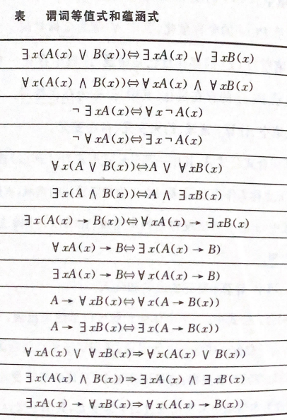

## 谓词逻辑

> *谓词逻辑是将命题逻辑表达不出来的逻辑继续细化。*
>
> **谓词：**指明个体的性质或个体之间关系，常用大写字母表示，一个谓词，一些个体变量组成的表达式为谓词变项或**命题函数**
>
> eg： A表示 “是大学生” ，$w$表示“王强” 则王强是大学生 可以用A(w)表示该语句
>
> - 由一**个谓词**，**一些个体变量**组成的**表达式**称为谓词变项或者命题函数**（命题函数不是命题）**
>
>   - 命题函数中个体变量具有指定事物时，才是命题
>
>   eg：使用谓词表达下述命题
>
>   ~~~
>    小张年龄超过18岁，身体健康，具有大学本科学历，则可以参加飞行员招录考试
>    设：小张表示a，A(x)：x超过18岁，B(x)：x身体健康，C(x)：x大学毕业，E(x)：x参加飞行员考试
>    题目代表的命题为 A(a) && B(a) && C(a) -> E(a)
>   ~~~
>     
>   
>
#### **量词与合式公式**
>**量词：描述个体项与变量项之间的数量关系** （_对命题函数进行量化_）
>
>- **全称量词：**P(x)对x在其论域的所有值都为真。记为 $\forall xP(x)$ ，（_在平常使用一切，任意，所有，凡是等词对应为全称量词_）
>
>- **存在量词：**P(x)对x在其论域中存在一个元素使其P(x)为真，记为$\exists xP(x)$，（_存在，有一个，至少一个_）
>
>- **复合谓词公式：** 由多个原子谓词公式及**联结词**组成的表达式
>
>  > 复合公式中变元与作用域
>  >
>  > 1. $\forall x A(x)\ \ x称为变元，A(x)称为作用域$
>  > 2. x的一切出现为约束出现，A(x) 去x出现的命题为自由出现
>  >
>  > ---
>  >
>  > 约束变元规则
>  >
>  > 1. 将量词辖域内的变元改为公式中为使用过的个体变元
>
>  
>
#### **谓词等价式与蕴函式**
>
>$$
>x\in \{ a_1,a_2,a_3,a_4 \} \\
>\forall xA(x) \Leftrightarrow A(a_1) \land A(a_2) \land A(a_3)\land A(a_4) \\
>∃xA(x) \Leftrightarrow A(a_1) \or A(a_2) \or A(a_3)\lor A(a_4)
>$$
>
> 

#### **前束范式**

>**前束范式：**以量词开头，它的作用域延伸到整个公式，该公式称为前束范式
>
>- **任何一个谓语公式都存在与之等价的前束公式**
>
> 谓语公式转为前束公式
>
> 1. 不同辖域同名变元进行换名
>2. 使用等价公式进行替代提取量词
> 3. 量词前置
>
>
>
>**谓语演算推理**
>
>- 全称量词消去规则（记为$\forall -$)
>$$
> P是谓词，c是论域中任意一个个体，论域中全部个体都有P(x)，那么对某个个体的c亦有P(x)，可以得到结论P(c)\\
> \frac{∀xP(x)}{\therefore P(c)}
>$$
>
>- 全称量词引入规则(记为$\forall +$)
>
>$$
> \frac{P(x)}{\therefore\forall xP(x)}
>$$
>

