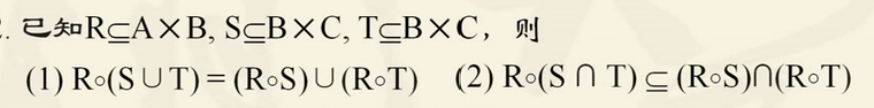
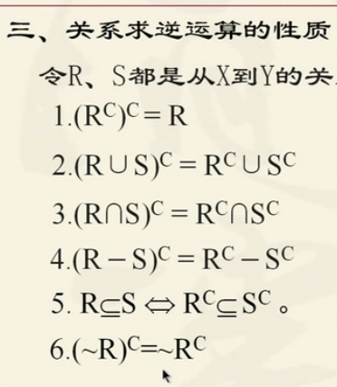
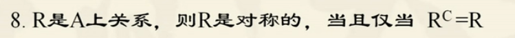
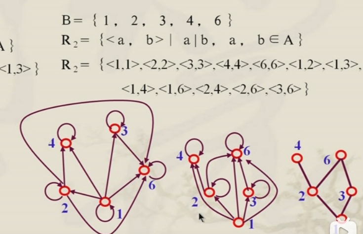
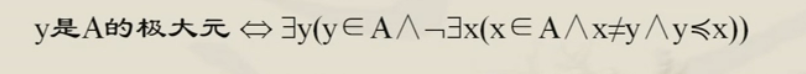
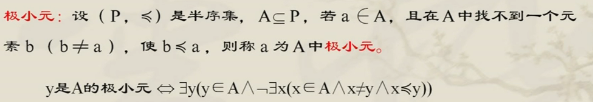
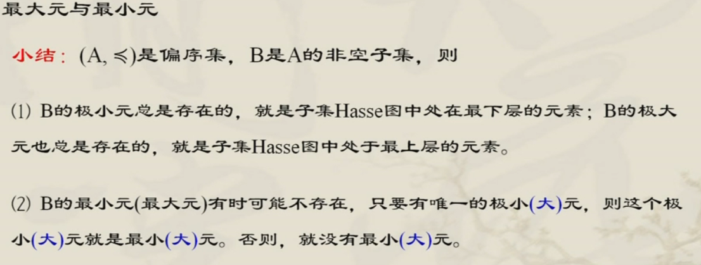

## 关系与函数

> - **有序二元组**
>
>   > 由两个对象x，y组成的序列称为有序二元组，记作<x,y>,x，y分布为二元组的第一，第二元素
>
> - **集合**
>
>   > {x,y}：元素x与y的次序无关
>   >
>   > ---
>   >
>   > **集合的笛卡尔积**
>   >
>   > A $\times $ B = {<x,y>| x$\in A \land y \in B$}  $A\times B \neq B \times A$

- #### **关系及表示方式**

  > 相关：按照规则，确定两个及以上对象有关系，称这些对象相关
  >
  > 
  >
  > **关系定义：** 设A，B两个集合，如果$R\sube A\times B$，则称R是一个从A到B的二元关系，如果$R\sube A \times A$，则称R是A上的二元关系，任何二元组的集合，都称为一个二元关系。记为$<x,y> \Leftrightarrow xRy$ 称为x与y有R关系
  >
  > 
  >
  > **关系定义域（domain）：** 所有$<x,y> \in R$的第一个元素组成的集合，称为R的定义域，记作dom R
  >
  > **关系值域（range）：**所有$<x,y> \in R$的第二个元素组成的集合，称为R的值域，记作ranR
  >
  > 
  >
  > **关系的表示方法**
  >
  > > 1. 枚举
  > >
  > > 2. 谓词公式
  > >
  > > 3. 有向图
  > >
  > >    >  
  > >
  > > 4. 矩阵
  > >
  > >    > $$
  > >    > r_{ij} = \begin{cases} 
  > >    >   1, 当 <x_i,y_j> \in R, \\
  > >    >   0, 当 <x_i,y_j>  \notin R
  > >    >   \end {cases} \\ \\
  > >    >   M_{LE_A} = \left[
  > >    >    \matrix{
  > >    >     1 & 1& 1& 1\\
  > >    >     0&1&1&1\\
  > >    >     0&0&1&1\\
  > >    >     0&0&0&1
  > >    >    }
  > >    >   \right]  关系矩阵
  > >    > $$
  >
  > **特殊关系**
  >
  > > 1. 空关系（与空集关系） 
  > > 2. $E_A$  完全关系（全域关系，第一元素与第二元素都属于A集合，共有$n^2$对） 
  > > 3. $I_A$   恒等关系（$ I_A\sube A\times A \ \ \ I_A=\{<x,y> | x\in A\}$，x与y相等)
  > > 

- #### 关系性质（集合A上的关系，即R是A到A的关系 )

  > - **自反性：**对于任意$x\in A$**都有**$<x,x> \in R (xRx)$则称R是A中的自反关系 (R存在**所有**<x,x>的序列对)
  >
  >   > 有向图每个结点都有指向自己的环
  >   >
  >   > 关系矩阵主对角线都为1
  >
  > - **反自反性：**对于任意$x\in A$都有$<x,x> \notin R (xRx)$则称R是A中的反自反关系 (**R不存在<x,x>的序列对**)
  >
  >   > 与自反性对立
  >   >
  >   > **空关系是反自反性**
  >
  > - **对称性：** 若对任何x，y$\in A$，如果有xRy，必有yRx，则称R为A中的对称关系
  >
  >   > 有向图存在两条相反的边
  >   >
  >   > 以主对角线为对称的矩阵
  >   >
  >   > **空关系是对称关系**
  >
  > - **反对称性：** 若对任何$x,y \in A$，如果有xRy 和 yRx，则有x=y 则R为A中反对称关系
  >
  >   > 有向图的两个不同节点最多只有一条边
  >   >
  >   > 矩阵图：以主对角线为对称的两个元素中最多有一个1
  >   >
  >   > **空关系是对称关系**
  >
  > - **传递性**
  >
  >   > 对于任何的$x,y,z \in A$如果有xRy和yRz就有xRz，则称R为A中传递关系

- #### **关系复合运算**

  > 设R是从X到Y的关系，S是从Y到Z的关系，则R和S的复合关系是从X到Z的关系，记为 $R \circ S$
  >
  >   
  >
  >  
  >
  > ---
  >
  > **关系复合运算性质**
  >
  > - (F $\circ$ G) $\circ$ H=F$\circ$(G $\circ$ H)
  >
  > - $(F \circ G)^{-1} = (F^{-1} \circ G^{-1})$ 
  >
  > - **关系矩阵的布尔运算**
  >
  >   - $M_{R_1\cup R_2}[i,j] = M_{R_1}[i,j] \lor M_{R_2}[i,j]$
  >
  >   - $M_{R_1\cap R_2}[i,j] = M_{R_1}[i,j] \land M_{R_2}[i,j]$
  >
  >   - 布尔乘法（矩阵乘法，使用合取代替乘法，使用析取代替加法）
  >
  >     > 第一矩阵列数等于第二个矩阵行数
  >     >
  >     >  
  >
  > -  
  > -  
  > - m,n为非负整数，则有 $R^m \circ R^n = R^{m+n}$ 
  > - m,n为非负整数，则有 $(R^m)^n = R^m \circ R^n$ 
  > -  
  > -  

- #### **关系的闭包运算**

  > ***关系的闭包是通过关系的复合和求逆运算构成一个新的关系，新的关系满足某些特性（自反，对称，传递）***
  >
  > 
  >
  > **关系闭包运算定义**
  >
  > 设R是非空集合A上的二元关系，若关系$R^`$ 满足一下条件
  >
  > 1. $R^`$是自反（对称或传递）
  > 2. $R\sube R^`$ 
  > 3. 对于A上任何包含R的自反（对称或传递）关系$R^{``}$ 有$R^{'} \sube R^{''}$ 
  >
  > 则称$R^{'}为R的闭包$记作  r(R) ，s(R)，t(R)  
  >
  >  *A上关系集合(自反，对称，传递）$R^{''}$ 包含闭包集合$R^{'}$  且闭包集合包含关系集合R*
  >
  > ---
  >
  > **关系闭包计算方法** 
  >
  > $I_A$ ：集合A上恒等关系
  >
  > $E_A$：集合A上全域关系
  >
  > r(R)：R关系的自反闭包
  >
  > s(R)：R关系的对称闭包
  >
  > t(R)：R关系的传递闭包
  >
  > - 给定A中关系R，则 r(R) = $R\cup I_A$
  > - s(R) = R $\cup R^{-1}$
  > - t(R) = $R\cup R^2 \cup ... R^n$
  
- #### **等价关系与序关系**

  > **等价关系：** 设R是A上的关系，若R是**自反，对称，传递，**则称R是A上的等价关系
  >
  > 
  >
  > **相容关系：**设R是A上的关系，若R是**自反，对称，**则称R是A上的相容关系
  >
  > ---
  >
  > 等价关系有向图由若干个独立子图构成，**每个独立子图都是完全关系图**
  >
  >  
  >
  > ---
  >
  > **序关系**
  >
  > > **偏序关系**：R是A上的具有**自反**，**反对称**和**传递性**的关系，则称R是A上的偏序关系，记作$\prec$，集合A和A上的偏序关系$\prec$ 一起称为偏序集，记为<A，$\prec$ >
  > >
  > > ---
  > >
  > > *集合A上的恒等关系$I_A$* 和空关系都是A上的偏序关系，整数集合上小于等于关系$LE_A$也是偏序关系
  > >
  > > 
  > >
  > > **偏序关系有向图**
  > >
  > >   
  > >
  > >  
  >
  > **偏序关系Hasse图 (简化有向图环和箭头)**
  >
  > > 1. 自反性：每个顶点环省略
  > >
  > > 2. 反对称性：**第一元素在左，或在下**，**第二元素在右或在上**,并省略箭头
  > >
  > > 3. 传递性：省略传递性边
  > >
  > > 4. COVA = {<a,b> | a $\in$ A $\land$ b $\in$ A$\land$b 覆盖 a } 
  > >
  > >      
  >
  > **全序关系**
  >
  > > 集合A上半序关系R，如果$\forall a,b \in A 都有a\prec b 或 b\prec  a $则称为R上A的全序关系（集合上元素都可以相互比较）
  > >
  > > **全序与半序含义**
  > >
  > > 如果R是A上的全序关系，那么就是说**A中任意两个元素具有R关系**，
  > >
  > > 如果R是A上的半序关系，那么A中的部分元素具有R关系
  >
  > **偏序集中重要元素**
  >
  > > **极大元：**设(P,$\prec$) 是半序集，$A\sube P,若a \in A,$且在A中找不到一个元素b（b$\ne$ a) 使$a\prec b$ ，则称a为A中的极大元（**存在关系序列中最大的元素，可能有多个或者没有**）
  > >
  > >  
  > >
  > >  
  > >
  > > **最大元：**若$\forall x（x \in B \to y \prec x）$成立，则y为B的最小元 （**存在关系的元素中最大的元素，只存在一个或没有**）
  > >
  > >  
  > >
  > > 
  > >
  > > **上界：**   存在两个集合，其中A集合中每个元素都小于等于B集合内的某个元素，该元素称为A集合的上界（**A**
  > > **集合内的所有元素都要和上界元素满足偏序关系，上界元素在其他集合中**）
  > >
  > > 
  > >
  > > **上确界：**存在集合A的上界集合，其中最小的元素为该集合的上确界（可能没有或只有一个）
  >
  
- #### **函数**

  > 设集合X，Y，f是从X到Y的关系，如果对于**任意$x\in X$**，**都存在唯一**的$y\in Y,使得<x,y>\in f$，则f是X到Y的函数；记作$f:X\to Y$
  >
  > ---
  >
  > 函数的表示方法
  >
  > 1. 枚举
  > 2. 有向图
  > 3. 矩阵（每行有且仅有一个1）
  > 4. 谓词描述
  >
  > ---
  >
  > 从X到Y**的函数集合**$Y^X$ 表示为$Y^X = \{f | f:X\to Y\}$
  >
  > - 当|X| = m，|Y| = n，可以构成$n^m$个不同的函数 
  >
  > **特殊函数：**
  >
  > 1. 常值函数：函数$f:X\to Y$ 如果**任意x**（x属于X）有$f(x) = y_0$，即$ran f=\{y_0\}$,称f是常值函数
  > 2. 恒等函数：恒等关系$I_X$是X到X函数，即$I_X:X\to X$，称之为恒等函数 即$f(x) =x $
  >
  > ---
  >
  > 函数相等充分必要条件：
  >
  > 1. 定义与域相等
  > 2. 值域相等
  > 3. 对应规律相同
  >
  > ---
  >
  > 函数类型：
  >
  > 1. 满射函数（每个值域元素都有对应的参数）
  > 2. 映类函数（值域包含函数所有值）
  > 3. 单射函数（值域只有一个或没有所对应值）
  > 4. 双射方式（单射函数+满射函数）
  >
  > ---
  >
  > **函数复合运算**
  >
  > -  枚举法
  > - 有向图法
  > - 谓词公式  
  >
  > **逆函数与逆运算**
  >
  > ​	**逆函数：** R是A到B的关系，其逆关系$R^C$ 是B到A的**关系（不一定是函数）**
  >
  > ​    
  >
  > 

