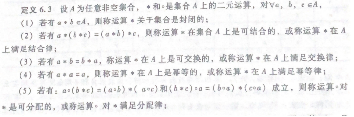

## 代数系统

-  设A为任意集合，一个从$A^n$ 到B的映射，称为集合A上的一个n元运算，如果$B\sube A$，则称为该运算是封闭的

-  运算定义：设X是集合，$f:X^n \to Y$ 是一个映射，则称f是**X上的n元运算**

- 一个非空集合A，连同若干个定义在该集合上的运算$f_1 f_2,...f_k$所组成的系统称为代数系统

- **运算性质**

  1. 封闭性（结果集依然在定义的集合中）
  2. 结合律  $a * (b * c) = (a*b)*c$ 
  3. 交换律  $a * b = b * a$
  4. 等幂性  $a * a = a$
  5. 分配律  $a\circ(b*c) = (a\circ b) * (a\circ c)  和 (b * c) \circ a = (b\circ a)*(c\circ a)$ 则称运算$\circ$对 * 是可分配的
  6. 吸收律 $a(a*b) = a $和 $a*(a\circ b) = a$

  *普通加法和乘法在自然数集N，整数集Z，有理数集Q及实数集R上都是可结合，可交换的*

   

- **二元运算中特殊值**

  1. 幂等元：设 $\bigstar$是X上的二元运算，如果有$a\in X$，满足 $a\bigstar a = a$，则a是X上关于$\bigstar $运算的幂等元

  2. 幺元：设$\bigstar$是X上的二元运算，$e_L\in X$，使得任意x$\in$X，均有$e_L \bigstar x = x$，则称$e_L是相对\bigstar的左幺元$，反之为右幺元，两边同时为左右幺元，则称为相对幺元

  ​       *定义在X上的二元运算，如果存在左幺元和右幺元，则左幺元等于右幺元，并且幺元唯一*

  3. 零元：设$\bigstar$是X上的二元运算，如果有$\theta \in X$ ，使得对任何$x\in X$,有${\theta}_L \bigstar x = \theta_L$ 

  ​       *存在集合X上的二元运算，且|X| > 1，如果该运算在X中存在幺元e和零元$\theta$，则$\theta \neq e$*

  4. 逆元：$X_L^{-1} \in X$ , 存在$X_L^{-1} \bigstar x = e$  e为X上的幺元，则$X_L^{-1}$是x相对$\bigstar $的左逆元

       *在二元运算中，存在$x\in X$ x的左右逆元都存在，则相等唯一*

#### **群与半群**

>  
>
> - **半群：**设S是非空集合，$\bigstar $是S上的二元运算，如果$\bigstar $在S上满足**封闭性**，**可结合性**，则称<S，$\bigstar $>是半群
> - **独异点：**<S，$\bigstar $>是半群，且存在一个幺元，<S，$\bigstar $>为独异点
> - **子半群：**<S，$\bigstar $>是个半群，$B\sube S$，如果$\bigstar $在B上封闭，则称<B,$\bigstar$>是<S，$\bigstar $>的子半群
> - **子独立点：**<M，$\bigstar $>是个独立点，$B\sube M$，如果$\bigstar $在B上封闭，且幺元e属于B，则称<B,$\bigstar$>是<M，$\bigstar $>的子独立点
>
> ---
>
> **群：** 设<G,*>是一个独异点，其中G是非空集合，`*`是G上一个二元运算，**对于$\forall x \in G 都有逆元x^{-1}$的存在**，则<G,`*`>是群
>
> **Abel群：** 设<G,`*`>是一个群，若运算`*`在G上满足交换律，则该群为交换群或Abel群
>
> **群的定律**
>
> 1. 阶数：G集合中元素个数，记为  |G|，若 |G| = 1 则该群为平凡群
> 2. 在<G,`*`>群中，存在一个唯一的等幂元
> 3. <G,`*`>为非平凡群，群中不存在零元
> 4. 设<G,`*`>为群，对于$\forall a,b \in G$ 必存在唯一的元素$x \in G$ 使得$a * x =b$ 
> 5. 设<G,`*`>为群，H是G的非空子集，则H$<=$G当且仅当下面条件成立
>    1. $\forall a,b \in H 有 a * b \in H$
>    2. $\forall a \in H 有 a^{-1} \in H$
>

#### **环与域**

> **环：**给定代数系统<A,+,->, +和-是A上二元运算，若满足以下条件：
>
> 1. <A,+>是交换群(满足封闭性，结合律，交换律，存在逆元)
> 2. <A,->是半群（满足封闭性，结合律）
> 3. -对+可分配，即对任意a，b，c $\in$ A，有 a-(b+c) = (a-b) + (a-c) 及（a+b)-c = (a-c)+(b-c)
>
> **环性质**
>
> - 设<A,+,->是环，任意a，b，c $\in$ A
>  -   
> 
>**零因子：**设<A,+,->是环，有a，b$\in$A，使得$a\neq 0 \land b \neq b $但a-b = 0，则·称a，b是零因子
> 
>  
> 

#### **格与布尔代数**

>  
>
>   
>
> ---
>
>     
>
>  
>
> **格的定义：**<A,$\prec$>是偏序集，如果任何a，b$\in $A，使得{a，b}都有**下确界和上确界**，则称<A,$\prec$>是格
>
> ---
>
> 
>

  

