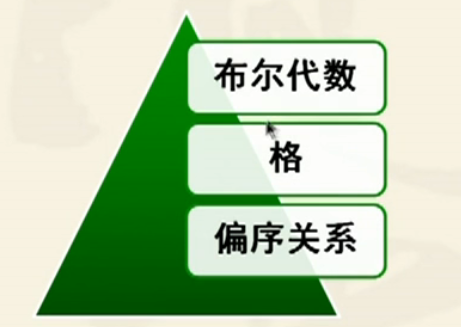

## 代数系统

> 一个非空集合A，若干个定义在集合上的运算组成的系统，称为代数系统，标记为 <A,$f_1,f_2,f_3...f_n$>
>
> - 运算性质
>
>   > 1. 封闭性（结果集依然在定义的集合中）
>   > 2. 交换
>   > 3. 结合
>   > 4. 等幂
>   > 5. 分配
>   > 6. 吸收
>
> - **运算中特殊值**
>
>   > - 幺元：（集合中任何元素与幺元运算结果等于该元素，eg：集合交运算中空集，算术运算乘法中自然数 1）
>   > - 零元：（集合中任意元素与零元运算结果等于零元）
>   > - 逆元：集合运算中存在幺元，存在元素运算等于幺元
>   >
>   > 如果存在幺元或零元则一定是唯一的

#### **群与半群**

>  
>
> - **半群：**运算满足封闭性，结合律，则该代数系统为半群
>
>   > 独异点：<S，$\bigstar $>是半群，存在幺元，<S，$\bigstar $>为独异点
>   >
>   
> - **群：**运算存在封闭性，结合律，幺元，每个元素都存在逆元。
>
>   > **Abel群：** 设<G,`*`>是一个群，若运算`*`在G上满足**交换律**，则该群为交换群或Abel群
>   >
>   > **群的性质**
>   >
>   > 1. 群的阶数：群中元素个数
>   >
>   > 2. **元素的阶数**：设G是群，元素x属于G，**使其等式$x^k = e (幺元) $成立**，则最小正整数k为元素x的阶，记为 |x| = k，称x为k阶元，**（所有群幺元的阶都为1）**
>   >
>   > 3. 群元素运算存在唯一解
>
> - **子群：**设G是群，存在H是G的非空子集，且H满足G中的运算，则H是G的子群记为 H $\le$ G
>
>   > 子群判断：x，y属于H群元素，存在 $xy^1 \in H （x与y做运算其结果在H中，取y的逆运算结果属于H中$   )
>   >
>   > 生成子群：令 H = {$a^k | k \in Z$}
>
>   
>

#### **格与布尔代数**

>  
>
>  
>
>  
>
>  
>
>  **格的定义：**<A,$\prec$>是偏序集，如果任何a，b$\in $A，使得{a，b}都有**下确界和上确界**，则称<A,$\prec$>是格
>
> **格的性质：**
>
> 1. 充分条件（集合运算满足交换，结合，吸收则一定是格）
>
> **分配格**：满足分配律运算的格
>
> > 分配格判断：不包含砖石格或五角格同构的子格
>
> **有界格：**
>
> > 设L是格，a属于L，L中所有元素都小于等于a，则a称为为L的**全下界**
> >
> > 格L存在全下界或全上界则为有界格（全下界与全上界唯一）
> >
> > 记为$<L,\and,\or,0,1>$，0和1表示全下界与全上界元素
>
> **有补格：** 在有界格的基础上，**存在格内元素满足  $a\and b = 0, a\or b = 1，a与b的全下界和全上界同为一个$ 则 a与b互为补元**
>
> 
>
> **分配格+有补格=布尔代数**
>
> - 

  

