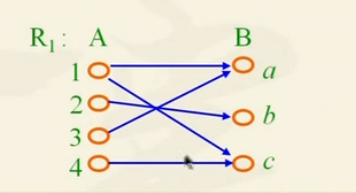
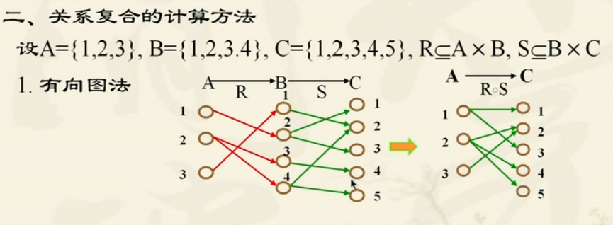
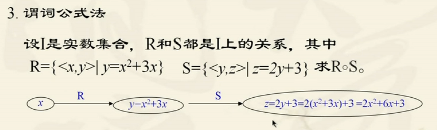

## 关系与函数

> - **有序二元组**
>
>   > 由两个对象x，y组成的序列称为有序二元组，记作<x,y>,x，y分布为二元组的第一，第二元素
>
> - **集合**
>
>   > {x,y}：元素x与y的次序无关
>   >
>   > ---
>   >
>   > **集合的笛卡尔积**
>   >
>   > A $\times $ B = {<x,y>| x$\in A \land y \in B$}  $A\times B \neq B \times A$

- #### **关系及表示方式**

  > 相关：按照规则，确定两个及以上对象有关系，称这些对象相关
  >
  > 
  >
  > **关系定义：** 设A，B两个集合，如果$R\sube A\times B$，则称R是一个从A到B的二元关系，如果$R\sube A \times A$，则称R是A上的二元关系，任何二元组的集合，都称为一个二元关系。记为$<x,y> \Leftrightarrow xRy$ 称为x与y有R关系
  >
  > 
  >
  > **关系定义域（domain）：** 所有$<x,y> \in R$的第一个元素组成的集合，称为R的定义域，记作dom R
  >
  > **关系值域（range）：**所有$<x,y> \in R$的第二个元素组成的集合，称为R的值域，记作ranR
  >
  > 
  >
  > **关系的表示方法**
  >
  > > 1. 枚举
  > >
  > > 2. 谓词公式
  > >
  > > 3. 有向图
  > >
  > >    >  
  > >
  > > 4. 矩阵
  > >
  > >    > $$
  > >    > r_{ij} = \begin{cases} 
  > >    >   1, 当 <x_i,y_j> \in R, \\
  > >    >   0, 当 <x_i,y_j>  \notin R
  > >    >   \end {cases} \\ \\
  > >    >   M_{LE_A} = \left[
  > >    >    \matrix{
  > >    >     1 & 1& 1& 1\\
  > >    >     0&1&1&1\\
  > >    >     0&0&1&1\\
  > >    >     0&0&0&1
  > >    >    }
  > >    >   \right]  关系矩阵
  > >    > $$
  >
  > **特殊关系**
  >
  > > 1. 空关系（与空集关系）
  > > 2. 完全关系（全域关系）
  > > 3. 恒等关系（$ I_A\sube A\times A \ \ \ I_A=\{<x,y> | x\in A\}$，x与y相等)
  > > 

- #### 关系性质（集合A上的关系，即R是A到A的关系 )

  > - **自反性：**对于任意$x\in A$都有$<x,x> \in R (xRx)$则称R是A中的自反关系 (R存在所有<x,x>的序列对)
  >
  >   > 有向图每个结点都有指向自己的环
  >   >
  >   > 关系矩阵主对角线都为1
  >
  > - **反自反性：**对于任意$x\in A$都有$<x,x> \notin R (xRx)$则称R是A中的反自反关系 (R不存在<x,x>的序列对)
  >
  >   > 与自反性对立
  >   >
  >   > **空关系是反自反性**
  >
  > - **对称性：** 若对任何x，y$\in A$，如果有xRy，必有yRx，则称R为A中的对称关系
  >
  >   > 有向图存在两条相反的边
  >   >
  >   > 以主对角线为对称的矩阵
  >   >
  >   > **空关系是对称关系**
  >
  > - **反对称性：** 若对任何$x,y \in A$，如果有xRy 和 yRx，则有x=y 则R为A中反对称关系
  >
  >   > 有向图的两个不同节点最多只有一条边
  >   >
  >   > 矩阵图：以主对角线为对称的两个元素中最多有一个1
  >   >
  >   > **空关系是对称关系**
  >
  > - **传递性**
  >
  >   > 对于任何的$x,y,z \in A$如果有xRy和yRz就有xRz，则称R为A中传递关系

- #### **关系复合运算**

  > 设R是从X到Y的关系，S是从Y到Z的关系，则R和S的复合关系时从X到Z的关系，记为 $R \circ S$
  >
  >   
  >
  >  
  >
  > ---
  >
  > **关系复合运算性质**
  >
  >  
  >
  >  
  >
  >  
  >
  > ---
  >
  > **关系求逆运算：**R是从A到B的关系，如果将R中的所有有序对的两个元素互换位置，得到一个从B到A的关系，称为R的逆关系，记为$R^{-1}$
  >
  >  
  >
  >  
  >
  >  

- #### **关系的闭包运算**

  > 关系的闭包是通过关系的复合和求逆运算构成一个新的关系，新的关系满足某些特性（自反，对称，传递）
  >
  > 

